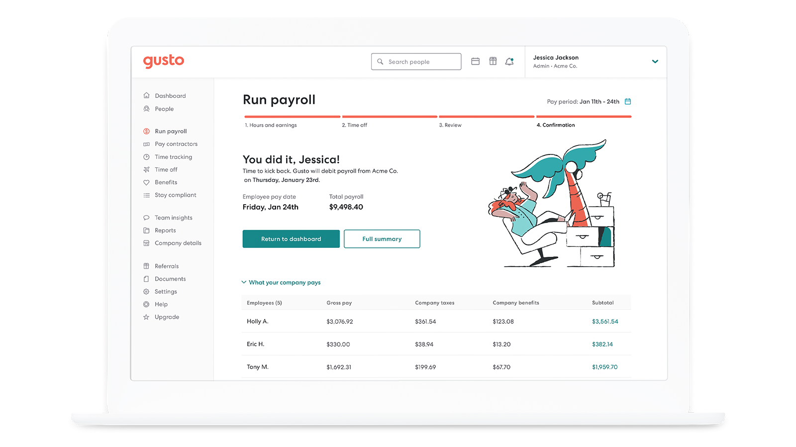

<div align="center">

[](https://gusto.com)

# [Gusto](https://gusto.com)<a id="gusto"></a>

Welcome to Gusto's Embedded Payroll API documentation!

</div>

## Table of Contents<a id="table-of-contents"></a>

<!-- toc -->

  * [Installation](#installation)
  * [Getting Started](#getting-started)
  * [Reference](#reference)
    + [`gustoembeddedpayroll.achTransactions.getAllForCompany`](#gustoembeddedpayrollachtransactionsgetallforcompany)
    + [`gustoembeddedpayroll.bankAccounts.createFromPlaidToken`](#gustoembeddedpayrollbankaccountscreatefromplaidtoken)
    + [`gustoembeddedpayroll.bankAccounts.createVerificationDeposits`](#gustoembeddedpayrollbankaccountscreateverificationdeposits)
    + [`gustoembeddedpayroll.bankAccounts.listCompanyBankAccounts`](#gustoembeddedpayrollbankaccountslistcompanybankaccounts)
    + [`gustoembeddedpayroll.bankAccounts.verifyMicroDeposits`](#gustoembeddedpayrollbankaccountsverifymicrodeposits)
    + [Bank account verification in demo](#bank-account-verification-in-demo)
    + [`gustoembeddedpayroll.companies.acceptTermsOfService`](#gustoembeddedpayrollcompaniesaccepttermsofservice)
    + [`gustoembeddedpayroll.companies.createAdmin`](#gustoembeddedpayrollcompaniescreateadmin)
    + [`gustoembeddedpayroll.companies.createPartnerManagedCompany`](#gustoembeddedpayrollcompaniescreatepartnermanagedcompany)
    + [`gustoembeddedpayroll.companies.finishOnboarding`](#gustoembeddedpayrollcompaniesfinishonboarding)
    + [Approve a company in demo](#approve-a-company-in-demo)
    + [`gustoembeddedpayroll.companies.getAllAdmins`](#gustoembeddedpayrollcompaniesgetalladmins)
    + [`gustoembeddedpayroll.companies.getCompany`](#gustoembeddedpayrollcompaniesgetcompany)
    + [`gustoembeddedpayroll.companies.getCustomFields`](#gustoembeddedpayrollcompaniesgetcustomfields)
    + [`gustoembeddedpayroll.companies.getOnboardingStatus`](#gustoembeddedpayrollcompaniesgetonboardingstatus)
    + [`gustoembeddedpayroll.companies.getTermsOfServiceStatus`](#gustoembeddedpayrollcompaniesgettermsofservicestatus)
    + [`gustoembeddedpayroll.companies.migrateToEmbeddedPayroll`](#gustoembeddedpayrollcompaniesmigratetoembeddedpayroll)
    + [`gustoembeddedpayroll.companyBenefits.createBenefit`](#gustoembeddedpayrollcompanybenefitscreatebenefit)
    + [`gustoembeddedpayroll.companyBenefits.deleteBenefit`](#gustoembeddedpayrollcompanybenefitsdeletebenefit)
    + [`gustoembeddedpayroll.companyBenefits.getBenefitById`](#gustoembeddedpayrollcompanybenefitsgetbenefitbyid)
    + [`gustoembeddedpayroll.companyBenefits.getBenefitFieldsRequirementsById`](#gustoembeddedpayrollcompanybenefitsgetbenefitfieldsrequirementsbyid)
    + [`gustoembeddedpayroll.companyBenefits.getBenefitSummaryById`](#gustoembeddedpayrollcompanybenefitsgetbenefitsummarybyid)
    + [`gustoembeddedpayroll.companyBenefits.getBenefitsForCompany`](#gustoembeddedpayrollcompanybenefitsgetbenefitsforcompany)
    + [`gustoembeddedpayroll.companyBenefits.getSupportedBenefitById`](#gustoembeddedpayrollcompanybenefitsgetsupportedbenefitbyid)
    + [`gustoembeddedpayroll.companyBenefits.listSupportedBenefits`](#gustoembeddedpayrollcompanybenefitslistsupportedbenefits)
    + [`gustoembeddedpayroll.companyBenefits.updateBenefit`](#gustoembeddedpayrollcompanybenefitsupdatebenefit)
    + [`gustoembeddedpayroll.companyForms.getAllForms`](#gustoembeddedpayrollcompanyformsgetallforms)
    + [`gustoembeddedpayroll.companyForms.getFormById`](#gustoembeddedpayrollcompanyformsgetformbyid)
    + [`gustoembeddedpayroll.companyForms.getPdfLink`](#gustoembeddedpayrollcompanyformsgetpdflink)
    + [`gustoembeddedpayroll.companyForms.signForm`](#gustoembeddedpayrollcompanyformssignform)
    + [`gustoembeddedpayroll.contractorForms.create1099Form`](#gustoembeddedpayrollcontractorformscreate1099form)
    + [`gustoembeddedpayroll.contractorForms.getByIdForm`](#gustoembeddedpayrollcontractorformsgetbyidform)
    + [`gustoembeddedpayroll.contractorForms.getPdfLink`](#gustoembeddedpayrollcontractorformsgetpdflink)
    + [`gustoembeddedpayroll.contractorForms.listAll`](#gustoembeddedpayrollcontractorformslistall)
    + [`gustoembeddedpayroll.contractorPaymentMethod.createBankAccount`](#gustoembeddedpayrollcontractorpaymentmethodcreatebankaccount)
    + [`gustoembeddedpayroll.contractorPaymentMethod.getContractorPaymentMethod`](#gustoembeddedpayrollcontractorpaymentmethodgetcontractorpaymentmethod)
    + [`gustoembeddedpayroll.contractorPaymentMethod.listBankAccounts`](#gustoembeddedpayrollcontractorpaymentmethodlistbankaccounts)
    + [`gustoembeddedpayroll.contractorPaymentMethod.updateBankAccount`](#gustoembeddedpayrollcontractorpaymentmethodupdatebankaccount)
    + [`gustoembeddedpayroll.contractorPayments.cancelPayment`](#gustoembeddedpayrollcontractorpaymentscancelpayment)
    + [`gustoembeddedpayroll.contractorPayments.createPayment`](#gustoembeddedpayrollcontractorpaymentscreatepayment)
    + [`gustoembeddedpayroll.contractorPayments.fundContractorPayment`](#gustoembeddedpayrollcontractorpaymentsfundcontractorpayment)
    + [`gustoembeddedpayroll.contractorPayments.getSinglePayment`](#gustoembeddedpayrollcontractorpaymentsgetsinglepayment)
    + [`gustoembeddedpayroll.contractorPayments.getSingleReceipt`](#gustoembeddedpayrollcontractorpaymentsgetsinglereceipt)
    + [`gustoembeddedpayroll.contractorPayments.getWithinTimePeriodTotals`](#gustoembeddedpayrollcontractorpaymentsgetwithintimeperiodtotals)
    + [`gustoembeddedpayroll.contractorPayments.previewDebitDate`](#gustoembeddedpayrollcontractorpaymentspreviewdebitdate)
    + [`gustoembeddedpayroll.contractors.changeOnboardingStatus`](#gustoembeddedpayrollcontractorschangeonboardingstatus)
    + [`gustoembeddedpayroll.contractors.createNewContractor`](#gustoembeddedpayrollcontractorscreatenewcontractor)
    + [`gustoembeddedpayroll.contractors.deleteContractor`](#gustoembeddedpayrollcontractorsdeletecontractor)
    + [`gustoembeddedpayroll.contractors.getAddress`](#gustoembeddedpayrollcontractorsgetaddress)
    + [`gustoembeddedpayroll.contractors.getById`](#gustoembeddedpayrollcontractorsgetbyid)
    + [`gustoembeddedpayroll.contractors.getCompanyContractors`](#gustoembeddedpayrollcontractorsgetcompanycontractors)
    + [`gustoembeddedpayroll.contractors.getOnboardingStatus`](#gustoembeddedpayrollcontractorsgetonboardingstatus)
  * [onboarding_status](#onboarding_status)
    + [Admin-facilitated onboarding](#admin-facilitated-onboarding)
    + [Contractor self-onboarding](#contractor-self-onboarding)
  * [onboarding_steps](#onboarding_steps)
    + [`gustoembeddedpayroll.contractors.updateAddress`](#gustoembeddedpayrollcontractorsupdateaddress)
    + [`gustoembeddedpayroll.contractors.updateContractor`](#gustoembeddedpayrollcontractorsupdatecontractor)
    + [`gustoembeddedpayroll.departments.addPeopleToDepartment`](#gustoembeddedpayrolldepartmentsaddpeopletodepartment)
    + [`gustoembeddedpayroll.departments.createDepartment`](#gustoembeddedpayrolldepartmentscreatedepartment)
    + [`gustoembeddedpayroll.departments.deleteDepartment`](#gustoembeddedpayrolldepartmentsdeletedepartment)
    + [`gustoembeddedpayroll.departments.getAllWithEmployees`](#gustoembeddedpayrolldepartmentsgetallwithemployees)
    + [`gustoembeddedpayroll.departments.getDepartmentByUuid`](#gustoembeddedpayrolldepartmentsgetdepartmentbyuuid)
    + [`gustoembeddedpayroll.departments.removePeopleFromDepartment`](#gustoembeddedpayrolldepartmentsremovepeoplefromdepartment)
    + [`gustoembeddedpayroll.departments.updateDepartment`](#gustoembeddedpayrolldepartmentsupdatedepartment)
    + [`gustoembeddedpayroll.earningTypes.createCustomEarningType`](#gustoembeddedpayrollearningtypescreatecustomearningtype)
    + [`gustoembeddedpayroll.earningTypes.deactivateType`](#gustoembeddedpayrollearningtypesdeactivatetype)
    + [`gustoembeddedpayroll.earningTypes.getAll`](#gustoembeddedpayrollearningtypesgetall)
    + [`gustoembeddedpayroll.earningTypes.updateType`](#gustoembeddedpayrollearningtypesupdatetype)
    + [`gustoembeddedpayroll.employeeAddresses.createHomeAddress`](#gustoembeddedpayrollemployeeaddressescreatehomeaddress)
    + [`gustoembeddedpayroll.employeeAddresses.createWorkAddress`](#gustoembeddedpayrollemployeeaddressescreateworkaddress)
    + [`gustoembeddedpayroll.employeeAddresses.deleteHome`](#gustoembeddedpayrollemployeeaddressesdeletehome)
    + [`gustoembeddedpayroll.employeeAddresses.deleteWorkAddress`](#gustoembeddedpayrollemployeeaddressesdeleteworkaddress)
    + [`gustoembeddedpayroll.employeeAddresses.getHomeAddress`](#gustoembeddedpayrollemployeeaddressesgethomeaddress)
    + [`gustoembeddedpayroll.employeeAddresses.getHomeAddresses`](#gustoembeddedpayrollemployeeaddressesgethomeaddresses)
    + [`gustoembeddedpayroll.employeeAddresses.getWorkAddress`](#gustoembeddedpayrollemployeeaddressesgetworkaddress)
    + [`gustoembeddedpayroll.employeeAddresses.listWorkAddresses`](#gustoembeddedpayrollemployeeaddresseslistworkaddresses)
    + [`gustoembeddedpayroll.employeeAddresses.updateHomeAddress`](#gustoembeddedpayrollemployeeaddressesupdatehomeaddress)
    + [`gustoembeddedpayroll.employeeAddresses.updateWorkAddress`](#gustoembeddedpayrollemployeeaddressesupdateworkaddress)
    + [`gustoembeddedpayroll.employeeBenefits.createBenefitRecord`](#gustoembeddedpayrollemployeebenefitscreatebenefitrecord)
    + [`gustoembeddedpayroll.employeeBenefits.createYtdBenefitAmountsFromDifferentCompany`](#gustoembeddedpayrollemployeebenefitscreateytdbenefitamountsfromdifferentcompany)
    + [`gustoembeddedpayroll.employeeBenefits.deleteById`](#gustoembeddedpayrollemployeebenefitsdeletebyid)
    + [`gustoembeddedpayroll.employeeBenefits.getAllForEmployee`](#gustoembeddedpayrollemployeebenefitsgetallforemployee)
    + [`gustoembeddedpayroll.employeeBenefits.getEmployeeBenefitById`](#gustoembeddedpayrollemployeebenefitsgetemployeebenefitbyid)
    + [`gustoembeddedpayroll.employeeBenefits.updateBenefitRecord`](#gustoembeddedpayrollemployeebenefitsupdatebenefitrecord)
    + [`gustoembeddedpayroll.employeeEmployments.createRehire`](#gustoembeddedpayrollemployeeemploymentscreaterehire)
    + [`gustoembeddedpayroll.employeeEmployments.createTermination`](#gustoembeddedpayrollemployeeemploymentscreatetermination)
    + [`gustoembeddedpayroll.employeeEmployments.deleteTermination`](#gustoembeddedpayrollemployeeemploymentsdeletetermination)
    + [`gustoembeddedpayroll.employeeEmployments.getHistory`](#gustoembeddedpayrollemployeeemploymentsgethistory)
    + [`gustoembeddedpayroll.employeeEmployments.getRehire`](#gustoembeddedpayrollemployeeemploymentsgetrehire)
    + [`gustoembeddedpayroll.employeeEmployments.listEmployeeTerminations`](#gustoembeddedpayrollemployeeemploymentslistemployeeterminations)
    + [`gustoembeddedpayroll.employeeEmployments.removeRehire`](#gustoembeddedpayrollemployeeemploymentsremoverehire)
    + [`gustoembeddedpayroll.employeeEmployments.updateRehire`](#gustoembeddedpayrollemployeeemploymentsupdaterehire)
    + [`gustoembeddedpayroll.employeeEmployments.updateTermination`](#gustoembeddedpayrollemployeeemploymentsupdatetermination)
    + [`gustoembeddedpayroll.employeeForms.generateW2Document`](#gustoembeddedpayrollemployeeformsgeneratew2document)
    + [`gustoembeddedpayroll.employeeForms.getAllEmployeeForms`](#gustoembeddedpayrollemployeeformsgetallemployeeforms)
    + [`gustoembeddedpayroll.employeeForms.getFormById`](#gustoembeddedpayrollemployeeformsgetformbyid)
    + [`gustoembeddedpayroll.employeeForms.getPdfLink`](#gustoembeddedpayrollemployeeformsgetpdflink)
    + [`gustoembeddedpayroll.employeeForms.signForm`](#gustoembeddedpayrollemployeeformssignform)
    + [`gustoembeddedpayroll.employeePaymentMethod.createBankAccount`](#gustoembeddedpayrollemployeepaymentmethodcreatebankaccount)
    + [`gustoembeddedpayroll.employeePaymentMethod.deleteBankAccount`](#gustoembeddedpayrollemployeepaymentmethoddeletebankaccount)
    + [`gustoembeddedpayroll.employeePaymentMethod.getBankAccounts`](#gustoembeddedpayrollemployeepaymentmethodgetbankaccounts)
    + [`gustoembeddedpayroll.employeePaymentMethod.listBankAccounts`](#gustoembeddedpayrollemployeepaymentmethodlistbankaccounts)
    + [`gustoembeddedpayroll.employeePaymentMethod.updatePaymentMethod`](#gustoembeddedpayrollemployeepaymentmethodupdatepaymentmethod)
    + [`gustoembeddedpayroll.employeeTaxSetup.getFederalTaxesById`](#gustoembeddedpayrollemployeetaxsetupgetfederaltaxesbyid)
    + [`gustoembeddedpayroll.employeeTaxSetup.getStateTaxes`](#gustoembeddedpayrollemployeetaxsetupgetstatetaxes)
  * [About filing new hire reports](#about-filing-new-hire-reports)
    + [`gustoembeddedpayroll.employeeTaxSetup.updateFederalTaxes`](#gustoembeddedpayrollemployeetaxsetupupdatefederaltaxes)
    + [`gustoembeddedpayroll.employeeTaxSetup.updateStateTaxes`](#gustoembeddedpayrollemployeetaxsetupupdatestatetaxes)
    + [`gustoembeddedpayroll.employees.completeOnboarding`](#gustoembeddedpayrollemployeescompleteonboarding)
    + [`gustoembeddedpayroll.employees.createEmployee`](#gustoembeddedpayrollemployeescreateemployee)
    + [`gustoembeddedpayroll.employees.deleteOnboardingEmployee`](#gustoembeddedpayrollemployeesdeleteonboardingemployee)
    + [`gustoembeddedpayroll.employees.getCustomFields`](#gustoembeddedpayrollemployeesgetcustomfields)
    + [`gustoembeddedpayroll.employees.getEmployeeById`](#gustoembeddedpayrollemployeesgetemployeebyid)
    + [`gustoembeddedpayroll.employees.getOnboardingStatus`](#gustoembeddedpayrollemployeesgetonboardingstatus)
- [Description](#description)
  * [onboarding_status](#onboarding_status-1)
    + [Admin-facilitated onboarding](#admin-facilitated-onboarding-1)
    + [Employee self-onboarding](#employee-self-onboarding)
  * [onboarding_steps](#onboarding_steps-1)
    + [`gustoembeddedpayroll.employees.getTimeOffActivities`](#gustoembeddedpayrollemployeesgettimeoffactivities)
    + [`gustoembeddedpayroll.employees.listCompanyEmployees`](#gustoembeddedpayrollemployeeslistcompanyemployees)
    + [`gustoembeddedpayroll.employees.updateEmployee`](#gustoembeddedpayrollemployeesupdateemployee)
    + [`gustoembeddedpayroll.employees.updateOnboardingStatus`](#gustoembeddedpayrollemployeesupdateonboardingstatus)
    + [`gustoembeddedpayroll.events.get30DayEvents`](#gustoembeddedpayrolleventsget30dayevents)
    + [`gustoembeddedpayroll.externalPayrolls.createNewPayroll`](#gustoembeddedpayrollexternalpayrollscreatenewpayroll)
    + [`gustoembeddedpayroll.externalPayrolls.deletePayroll`](#gustoembeddedpayrollexternalpayrollsdeletepayroll)
    + [`gustoembeddedpayroll.externalPayrolls.finalizeTaxLiabilities`](#gustoembeddedpayrollexternalpayrollsfinalizetaxliabilities)
    + [`gustoembeddedpayroll.externalPayrolls.getById`](#gustoembeddedpayrollexternalpayrollsgetbyid)
    + [`gustoembeddedpayroll.externalPayrolls.getTaxLiabilities`](#gustoembeddedpayrollexternalpayrollsgettaxliabilities)
    + [`gustoembeddedpayroll.externalPayrolls.getTaxSuggestions`](#gustoembeddedpayrollexternalpayrollsgettaxsuggestions)
    + [`gustoembeddedpayroll.externalPayrolls.listForCompany`](#gustoembeddedpayrollexternalpayrollslistforcompany)
    + [`gustoembeddedpayroll.externalPayrolls.updatePayrollItems`](#gustoembeddedpayrollexternalpayrollsupdatepayrollitems)
    + [`gustoembeddedpayroll.externalPayrolls.updateTaxLiabilities`](#gustoembeddedpayrollexternalpayrollsupdatetaxliabilities)
    + [`gustoembeddedpayroll.federalTaxDetails.getAttributes`](#gustoembeddedpayrollfederaltaxdetailsgetattributes)
    + [`gustoembeddedpayroll.federalTaxDetails.updateAttributes`](#gustoembeddedpayrollfederaltaxdetailsupdateattributes)
    + [`gustoembeddedpayroll.flows.generateLink`](#gustoembeddedpayrollflowsgeneratelink)
    + [`gustoembeddedpayroll.garnishments.createGarnishment`](#gustoembeddedpayrollgarnishmentscreategarnishment)
    + [`gustoembeddedpayroll.garnishments.getEmployeeGarnishments`](#gustoembeddedpayrollgarnishmentsgetemployeegarnishments)
    + [`gustoembeddedpayroll.garnishments.getGarnishment`](#gustoembeddedpayrollgarnishmentsgetgarnishment)
    + [`gustoembeddedpayroll.garnishments.updateGarnishment`](#gustoembeddedpayrollgarnishmentsupdategarnishment)
    + [`gustoembeddedpayroll.generatedDocuments.getDocumentByRequestUuid`](#gustoembeddedpayrollgenerateddocumentsgetdocumentbyrequestuuid)
    + [`gustoembeddedpayroll.holidayPayPolicies.addEmployeesToPolicy`](#gustoembeddedpayrollholidaypaypoliciesaddemployeestopolicy)
    + [`gustoembeddedpayroll.holidayPayPolicies.createCompanyPolicy`](#gustoembeddedpayrollholidaypaypoliciescreatecompanypolicy)
    + [`gustoembeddedpayroll.holidayPayPolicies.deletePolicy`](#gustoembeddedpayrollholidaypaypoliciesdeletepolicy)
    + [`gustoembeddedpayroll.holidayPayPolicies.getCompanyPolicy`](#gustoembeddedpayrollholidaypaypoliciesgetcompanypolicy)
    + [`gustoembeddedpayroll.holidayPayPolicies.previewCompanyPaidHolidays`](#gustoembeddedpayrollholidaypaypoliciespreviewcompanypaidholidays)
    + [`gustoembeddedpayroll.holidayPayPolicies.removeEmployees`](#gustoembeddedpayrollholidaypaypoliciesremoveemployees)
    + [`gustoembeddedpayroll.holidayPayPolicies.updatePolicy`](#gustoembeddedpayrollholidaypaypoliciesupdatepolicy)
    + [`gustoembeddedpayroll.industrySelection.getCompanyIndustrySelection`](#gustoembeddedpayrollindustryselectiongetcompanyindustryselection)
    + [`gustoembeddedpayroll.industrySelection.updateCompanyIndustrySelection`](#gustoembeddedpayrollindustryselectionupdatecompanyindustryselection)
    + [`gustoembeddedpayroll.introspection.exchangeRefreshToken`](#gustoembeddedpayrollintrospectionexchangerefreshtoken)
    + [`gustoembeddedpayroll.introspection.getCurrentAccessTokenInfo`](#gustoembeddedpayrollintrospectiongetcurrentaccesstokeninfo)
    + [`gustoembeddedpayroll.invoices.getInvoicingDataForCompanies`](#gustoembeddedpayrollinvoicesgetinvoicingdataforcompanies)
    + [`gustoembeddedpayroll.jobsAndCompensations.createCompensation`](#gustoembeddedpayrolljobsandcompensationscreatecompensation)
    + [`gustoembeddedpayroll.jobsAndCompensations.createJob`](#gustoembeddedpayrolljobsandcompensationscreatejob)
    + [`gustoembeddedpayroll.jobsAndCompensations.deleteJobById`](#gustoembeddedpayrolljobsandcompensationsdeletejobbyid)
    + [`gustoembeddedpayroll.jobsAndCompensations.getCompensationById`](#gustoembeddedpayrolljobsandcompensationsgetcompensationbyid)
    + [`gustoembeddedpayroll.jobsAndCompensations.getEmployeeJobs`](#gustoembeddedpayrolljobsandcompensationsgetemployeejobs)
    + [`gustoembeddedpayroll.jobsAndCompensations.getJobCompensations`](#gustoembeddedpayrolljobsandcompensationsgetjobcompensations)
    + [`gustoembeddedpayroll.jobsAndCompensations.getJobDetails`](#gustoembeddedpayrolljobsandcompensationsgetjobdetails)
    + [`gustoembeddedpayroll.jobsAndCompensations.removeCompensation`](#gustoembeddedpayrolljobsandcompensationsremovecompensation)
    + [`gustoembeddedpayroll.jobsAndCompensations.updateCompensation`](#gustoembeddedpayrolljobsandcompensationsupdatecompensation)
    + [`gustoembeddedpayroll.jobsAndCompensations.updateJob`](#gustoembeddedpayrolljobsandcompensationsupdatejob)
    + [`gustoembeddedpayroll.locations.createCompanyLocation`](#gustoembeddedpayrolllocationscreatecompanylocation)
    + [`gustoembeddedpayroll.locations.getById`](#gustoembeddedpayrolllocationsgetbyid)
    + [`gustoembeddedpayroll.locations.getCompanyLocations`](#gustoembeddedpayrolllocationsgetcompanylocations)
    + [`gustoembeddedpayroll.locations.getMinimumWages`](#gustoembeddedpayrolllocationsgetminimumwages)
    + [`gustoembeddedpayroll.locations.updateLocation`](#gustoembeddedpayrolllocationsupdatelocation)
    + [`gustoembeddedpayroll.notifications.getDetails`](#gustoembeddedpayrollnotificationsgetdetails)
    + [`gustoembeddedpayroll.paySchedules.assignEmployeesToSchedules`](#gustoembeddedpayrollpayschedulesassignemployeestoschedules)
    + [`gustoembeddedpayroll.paySchedules.createNew`](#gustoembeddedpayrollpayschedulescreatenew)
    + [`gustoembeddedpayroll.paySchedules.getAssignments`](#gustoembeddedpayrollpayschedulesgetassignments)
    + [`gustoembeddedpayroll.paySchedules.getDetails`](#gustoembeddedpayrollpayschedulesgetdetails)
    + [`gustoembeddedpayroll.paySchedules.getPayPeriods`](#gustoembeddedpayrollpayschedulesgetpayperiods)
    + [`gustoembeddedpayroll.paySchedules.getUnprocessedTerminationPayPeriods`](#gustoembeddedpayrollpayschedulesgetunprocessedterminationpayperiods)
    + [`gustoembeddedpayroll.paySchedules.listForCompany`](#gustoembeddedpayrollpayscheduleslistforcompany)
    + [`gustoembeddedpayroll.paySchedules.previewAssignmentsForCompany`](#gustoembeddedpayrollpayschedulespreviewassignmentsforcompany)
    + [`gustoembeddedpayroll.paySchedules.previewPayScheduleDates`](#gustoembeddedpayrollpayschedulespreviewpayscheduledates)
    + [`gustoembeddedpayroll.paySchedules.updatePaySchedule`](#gustoembeddedpayrollpayschedulesupdatepayschedule)
    + [`gustoembeddedpayroll.paymentConfigs.getCompanyPaymentConfigs`](#gustoembeddedpayrollpaymentconfigsgetcompanypaymentconfigs)
    + [`gustoembeddedpayroll.paymentConfigs.updateCompanyPaymentConfigs`](#gustoembeddedpayrollpaymentconfigsupdatecompanypaymentconfigs)
    + [`gustoembeddedpayroll.payrolls.approvedReversals`](#gustoembeddedpayrollpayrollsapprovedreversals)
    + [`gustoembeddedpayroll.payrolls.calculateGrossUp`](#gustoembeddedpayrollpayrollscalculategrossup)
    + [`gustoembeddedpayroll.payrolls.calculateGrossUp_0`](#gustoembeddedpayrollpayrollscalculategrossup_0)
    + [`gustoembeddedpayroll.payrolls.cancelPayrollTransition`](#gustoembeddedpayrollpayrollscancelpayrolltransition)
    + [`gustoembeddedpayroll.payrolls.createOffCyclePayroll`](#gustoembeddedpayrollpayrollscreateoffcyclepayroll)
  * [`off_cycle_reason`](#off_cycle_reason)
    + [`gustoembeddedpayroll.payrolls.deleteUnprocessedPayroll`](#gustoembeddedpayrollpayrollsdeleteunprocessedpayroll)
    + [`gustoembeddedpayroll.payrolls.generatePrintableChecks`](#gustoembeddedpayrollpayrollsgenerateprintablechecks)
    + [`gustoembeddedpayroll.payrolls.getAllPayrollBlockers`](#gustoembeddedpayrollpayrollsgetallpayrollblockers)
    + [`gustoembeddedpayroll.payrolls.getCompanyPayrolls`](#gustoembeddedpayrollpayrollsgetcompanypayrolls)
    + [`gustoembeddedpayroll.payrolls.getEmployeePayStub`](#gustoembeddedpayrollpayrollsgetemployeepaystub)
    + [`gustoembeddedpayroll.payrolls.getEmployeePayStubs`](#gustoembeddedpayrollpayrollsgetemployeepaystubs)
    + [`gustoembeddedpayroll.payrolls.getSinglePayroll`](#gustoembeddedpayrollpayrollsgetsinglepayroll)
    + [`gustoembeddedpayroll.payrolls.getSingleReceipt`](#gustoembeddedpayrollpayrollsgetsinglereceipt)
    + [`gustoembeddedpayroll.payrolls.prepareForUpdate`](#gustoembeddedpayrollpayrollsprepareforupdate)
    + [`gustoembeddedpayroll.payrolls.skipPayroll`](#gustoembeddedpayrollpayrollsskippayroll)
    + [`gustoembeddedpayroll.payrolls.submitPayroll`](#gustoembeddedpayrollpayrollssubmitpayroll)
    + [`gustoembeddedpayroll.payrolls.updatePayrollById`](#gustoembeddedpayrollpayrollsupdatepayrollbyid)
    + [`gustoembeddedpayroll.recoveryCases.initiateRedebit`](#gustoembeddedpayrollrecoverycasesinitiateredebit)
    + [`gustoembeddedpayroll.recoveryCases.listForCompany`](#gustoembeddedpayrollrecoverycaseslistforcompany)
    + [`gustoembeddedpayroll.signatories.createInvite`](#gustoembeddedpayrollsignatoriescreateinvite)
    + [`gustoembeddedpayroll.signatories.createSignatoryWithCompleteInformation`](#gustoembeddedpayrollsignatoriescreatesignatorywithcompleteinformation)
    + [`gustoembeddedpayroll.signatories.deleteSignatory`](#gustoembeddedpayrollsignatoriesdeletesignatory)
    + [`gustoembeddedpayroll.signatories.getCompanySignatories`](#gustoembeddedpayrollsignatoriesgetcompanysignatories)
    + [`gustoembeddedpayroll.signatories.update`](#gustoembeddedpayrollsignatoriesupdate)
    + [`gustoembeddedpayroll.taxRequirements.getStateRequirements`](#gustoembeddedpayrolltaxrequirementsgetstaterequirements)
    + [Metadata Examples](#metadata-examples)
    + [`gustoembeddedpayroll.taxRequirements.getStates`](#gustoembeddedpayrolltaxrequirementsgetstates)
    + [`gustoembeddedpayroll.taxRequirements.updateStateTaxes`](#gustoembeddedpayrolltaxrequirementsupdatestatetaxes)
    + [`gustoembeddedpayroll.timeOffPolicies.addEmployeesToPolicy`](#gustoembeddedpayrolltimeoffpoliciesaddemployeestopolicy)
    + [`gustoembeddedpayroll.timeOffPolicies.calculateAccruingTimeOffHours`](#gustoembeddedpayrolltimeoffpoliciescalculateaccruingtimeoffhours)
    + [`gustoembeddedpayroll.timeOffPolicies.createPolicy`](#gustoembeddedpayrolltimeoffpoliciescreatepolicy)
    + [`gustoembeddedpayroll.timeOffPolicies.deactivatePolicy`](#gustoembeddedpayrolltimeoffpoliciesdeactivatepolicy)
    + [`gustoembeddedpayroll.timeOffPolicies.getAllPolicies`](#gustoembeddedpayrolltimeoffpoliciesgetallpolicies)
    + [`gustoembeddedpayroll.timeOffPolicies.getPolicy`](#gustoembeddedpayrolltimeoffpoliciesgetpolicy)
    + [`gustoembeddedpayroll.timeOffPolicies.removeEmployees`](#gustoembeddedpayrolltimeoffpoliciesremoveemployees)
    + [`gustoembeddedpayroll.timeOffPolicies.updateEmployeeBalance`](#gustoembeddedpayrolltimeoffpoliciesupdateemployeebalance)
    + [`gustoembeddedpayroll.timeOffPolicies.updatePolicy`](#gustoembeddedpayrolltimeoffpoliciesupdatepolicy)
    + [`gustoembeddedpayroll.webhooks.createSubscription`](#gustoembeddedpayrollwebhookscreatesubscription)
    + [`gustoembeddedpayroll.webhooks.deleteSubscriptionByUuid`](#gustoembeddedpayrollwebhooksdeletesubscriptionbyuuid)
    + [`gustoembeddedpayroll.webhooks.getSubscription`](#gustoembeddedpayrollwebhooksgetsubscription)
    + [`gustoembeddedpayroll.webhooks.listSubscriptions`](#gustoembeddedpayrollwebhookslistsubscriptions)
    + [`gustoembeddedpayroll.webhooks.requestVerificationToken`](#gustoembeddedpayrollwebhooksrequestverificationtoken)
    + [`gustoembeddedpayroll.webhooks.updateSubscription`](#gustoembeddedpayrollwebhooksupdatesubscription)
    + [`gustoembeddedpayroll.webhooks.verifySubscriptionToken`](#gustoembeddedpayrollwebhooksverifysubscriptiontoken)

<!-- tocstop -->

## Installation<a id="installation"></a>
<div align="center">
  <a href="https://konfigthis.com/sdk-sign-up?company=Gusto&serviceName=Embedded%20Payroll&language=TypeScript">
    
  </a>
</div>

## Getting Started<a id="getting-started"></a>

```typescript
import { GustoEmbeddedPayroll } from "gusto-embedded-payroll-typescript-sdk";

const gustoembeddedpayroll = new GustoEmbeddedPayroll({
  // Defining the base path is optional and defaults to https://api.gusto-demo.com
  // basePath: "https://api.gusto-demo.com",
  apiKey: "API_KEY",
  accessToken: "ACCESS_TOKEN",
});

const getAllForCompanyResponse =
  await gustoembeddedpayroll.achTransactions.getAllForCompany({
    companyUuid: "companyUuid_example",
    xGustoApiVersion: "2024-03-01",
  });

console.log(getAllForCompanyResponse);
```

## Reference<a id="reference"></a>


### `gustoembeddedpayroll.achTransactions.getAllForCompany`<a id="gustoembeddedpayrollachtransactionsgetallforcompany"></a>

Fetches all ACH transactions for a company.

scope: `ach_transactions:read`

#### 🛠️ Usage<a id="🛠️-usage"></a>

```typescript
const getAllForCompanyResponse =
  await gustoembeddedpayroll.achTransactions.getAllForCompany({
    companyUuid: "companyUuid_example",
    xGustoApiVersion: "2024-03-01",
  });
```

#### ⚙️ Parameters<a id="⚙️-parameters"></a>

##### companyUuid: `string`<a id="companyuuid-string"></a>

The UUID of the company

##### contractorPaymentUuid: `string`<a id="contractorpaymentuuid-string"></a>

The UUID of the contractor payment

##### payrollUuid: `string`<a id="payrolluuid-string"></a>

The UUID of the payroll

##### transactionType: `string`<a id="transactiontype-string"></a>

Used to filter the ACH transactions to only include those with a specific transaction type, such as \"Credit employee pay\".

##### paymentDirection: `string`<a id="paymentdirection-string"></a>

Used to filter the ACH transactions to only include those with a specific payment direction, either \"credit\" or \"debit\".

##### xGustoApiVersion: `'2024-03-01'`<a id="xgustoapiversion-2024-03-01"></a>

Determines the date-based API version associated with your API call. If none is provided, your application\'s [minimum API version](https://docs.gusto.com/embedded-payroll/docs/api-versioning#minimum-api-version) is used.

#### 🔄 Return<a id="🔄-return"></a>

[AchTransaction](./models/ach-transaction.ts)

#### 🌐 Endpoint<a id="🌐-endpoint"></a>

`/v1/companies/{company_uuid}/ach_transactions` `GET`

[🔙 **Back to Table of Contents**](#table-of-contents)

---


### `gustoembeddedpayroll.bankAccounts.createFromPlaidToken`<a id="gustoembeddedpayrollbankaccountscreatefromplaidtoken"></a>

This endpoint creates a new **verified** bank account by using a plaid processor token to retrieve its information.

scope: `plaid_processor:write`

> 📘
> To create a token please use the [plaid api](https://plaid.com/docs/api/processors/#processortokencreate) and select "gusto" as processor.

> 🚧 Warning - Company Bank Accounts
>
> If a default company bank account exists, it will be disabled and the new bank account will replace it as the company's default funding method.

#### 🛠️ Usage<a id="🛠️-usage"></a>

```typescript
const createFromPlaidTokenResponse =
  await gustoembeddedpayroll.bankAccounts.createFromPlaidToken({
    xGustoApiVersion: "2024-03-01",
    owner_type: "Company",
    owner_id: "owner_id_example",
    processor_token: "processor_token_example",
  });
```

#### ⚙️ Parameters<a id="⚙️-parameters"></a>

##### owner_type: `string`<a id="owner_type-string"></a>

The owner type of the bank account

##### owner_id: `string`<a id="owner_id-string"></a>

The owner uuid of the bank account

##### processor_token: `string`<a id="processor_token-string"></a>

The Plaid processor token

##### xGustoApiVersion: `'2024-03-01'`<a id="xgustoapiversion-2024-03-01"></a>

Determines the date-based API version associated with your API call. If none is provided, your application\'s [minimum API version](https://docs.gusto.com/embedded-payroll/docs/api-versioning#minimum-api-version) is used.

#### 🔄 Return<a id="🔄-return"></a>

[BankAccountsCreateFromPlaidTokenResponse](./models/bank-accounts-create-from-plaid-token-response.ts)

#### 🌐 Endpoint<a id="🌐-endpoint"></a>

`/v1/plaid/processor_token` `POST`

[🔙 **Back to Table of Contents**](#table-of-contents)

---


### `gustoembeddedpayroll.bankAccounts.createVerificationDeposits`<a id="gustoembeddedpayrollbankaccountscreateverificationdeposits"></a>

This endpoint creates a new company bank account.

Upon being created, two verification deposits are automatically sent to the bank account, and the bank account's verification_status is 'awaiting_deposits'. 

When the deposits are successfully transferred, the verification_status changes to 'ready_for_verification', at which point the verify endpoint can be used to verify the bank account.
After successful verification, the bank account's verification_status is 'verified'.

scope: `company_bank_accounts:write`

> 🚧 Warning
>
> If a default bank account exists, it will be disabled and the new bank account will replace it as the company's default funding method.

#### 🛠️ Usage<a id="🛠️-usage"></a>

```typescript
const createVerificationDepositsResponse =
  await gustoembeddedpayroll.bankAccounts.createVerificationDeposits({
    companyId: "companyId_example",
    xGustoApiVersion: "2024-03-01",
    account_type: "Checking",
  });
```

#### ⚙️ Parameters<a id="⚙️-parameters"></a>

##### companyId: `string`<a id="companyid-string"></a>

The UUID of the company

##### routing_number: `string`<a id="routing_number-string"></a>

The bank routing number

##### account_number: `string`<a id="account_number-string"></a>

The bank account number

##### account_type: `string`<a id="account_type-string"></a>

The bank account type

##### xGustoApiVersion: `'2024-03-01'`<a id="xgustoapiversion-2024-03-01"></a>

Determines the date-based API version associated with your API call. If none is provided, your application\'s [minimum API version](https://docs.gusto.com/embedded-payroll/docs/api-versioning#minimum-api-version) is used.

#### 🔄 Return<a id="🔄-return"></a>

[CompanyBankAccount](./models/company-bank-account.ts)

#### 🌐 Endpoint<a id="🌐-endpoint"></a>

`/v1/companies/{company_id}/bank_accounts` `POST`

[🔙 **Back to Table of Contents**](#table-of-contents)

---


### `gustoembeddedpayroll.bankAccounts.listCompanyBankAccounts`<a id="gustoembeddedpayrollbankaccountslistcompanybankaccounts"></a>

Returns company bank accounts. Currently, we only support a single default bank account per company.

scope: `company_bank_accounts:read`

#### 🛠️ Usage<a id="🛠️-usage"></a>

```typescript
const listCompanyBankAccountsResponse =
  await gustoembeddedpayroll.bankAccounts.listCompanyBankAccounts({
    companyId: "companyId_example",
    xGustoApiVersion: "2024-03-01",
  });
```

#### ⚙️ Parameters<a id="⚙️-parameters"></a>

##### companyId: `string`<a id="companyid-string"></a>

The UUID of the company

##### xGustoApiVersion: `'2024-03-01'`<a id="xgustoapiversion-2024-03-01"></a>

Determines the date-based API version associated with your API call. If none is provided, your application\'s [minimum API version](https://docs.gusto.com/embedded-payroll/docs/api-versioning#minimum-api-version) is used.

#### 🔄 Return<a id="🔄-return"></a>

[CompanyBankAccount](./models/company-bank-account.ts)

#### 🌐 Endpoint<a id="🌐-endpoint"></a>

`/v1/companies/{company_id}/bank_accounts` `GET`

[🔙 **Back to Table of Contents**](#table-of-contents)

---


### `gustoembeddedpayroll.bankAccounts.verifyMicroDeposits`<a id="gustoembeddedpayrollbankaccountsverifymicrodeposits"></a>

Verify a company bank account by confirming the two micro-deposits sent to the bank account. Note that the order of the two deposits specified in request parameters does not matter. There's a maximum of 5 verification attempts, after which we will automatically initiate a new set of micro-deposits and require the bank account to be verified with the new micro-deposits.

### Bank account verification in demo<a id="bank-account-verification-in-demo"></a>

We provide the endpoint `POST '/v1/companies/{company_id}/bank_accounts/{bank_account_uuid}/send_test_deposits'` to facilitate bank account verification in the demo environment. This endpoint simulates the micro-deposits transfer and returns them in the response. You can call this endpoint as many times as you wish to retrieve the values of the two micro deposits.

```
  POST '/v1/companies/89771af8-b964-472e-8064-554dfbcb56d9/bank_accounts/ade55e57-4800-4059-9ecd-fa29cfeb6dd2/send_test_deposits'

  {
    "deposit_1": 0.02,
    "deposit_2": 0.42
  }
```

scope: `company_bank_accounts:write`

#### 🛠️ Usage<a id="🛠️-usage"></a>

```typescript
const verifyMicroDepositsResponse =
  await gustoembeddedpayroll.bankAccounts.verifyMicroDeposits({
    bankAccountUuid: "bankAccountUuid_example",
    companyId: "companyId_example",
    xGustoApiVersion: "2024-03-01",
  });
```

#### ⚙️ Parameters<a id="⚙️-parameters"></a>

##### bankAccountUuid: `string`<a id="bankaccountuuid-string"></a>

The UUID of the bank account

##### companyId: `string`<a id="companyid-string"></a>

The UUID of the company

##### deposit_1: `number`<a id="deposit_1-number"></a>

The dollar amount of the first micro-deposit

##### deposit_2: `number`<a id="deposit_2-number"></a>

The dollar amount of the second micro-deposit

##### xGustoApiVersion: `'2024-03-01'`<a id="xgustoapiversion-2024-03-01"></a>

Determines the date-based API version associated with your API call. If none is provided, your application\'s [minimum API version](https://docs.gusto.com/embedded-payroll/docs/api-versioning#minimum-api-version) is used.

#### 🔄 Return<a id="🔄-return"></a>

[CompanyBankAccount](./models/company-bank-account.ts)

#### 🌐 Endpoint<a id="🌐-endpoint"></a>

`/v1/companies/{company_id}/bank_accounts/{bank_account_uuid}/verify` `PUT`

[🔙 **Back to Table of Contents**](#table-of-contents)

---


### `gustoembeddedpayroll.companies.acceptTermsOfService`<a id="gustoembeddedpayrollcompaniesaccepttermsofservice"></a>

Accept the Gusto Embedded Payroll's [Terms of Service](https://flows.gusto.com/terms).
The user must have a role in the company in order to accept the Terms of Service.

scope: `terms_of_services:write`

#### 🛠️ Usage<a id="🛠️-usage"></a>

```typescript
const acceptTermsOfServiceResponse =
  await gustoembeddedpayroll.companies.acceptTermsOfService({
    companyUuid: "companyUuid_example",
    xGustoApiVersion: "2024-03-01",
    email: "email_example",
    ip_address: "ip_address_example",
    external_user_id: "external_user_id_example",
  });
```

#### ⚙️ Parameters<a id="⚙️-parameters"></a>

##### email: `string`<a id="email-string"></a>

The user\\\'s email address on Gusto. You can retrieve the user\\\'s email via company\\\'s `/admins`, `/employees`, `/signatories`, and `/contractors` endpoints.

##### ip_address: `string`<a id="ip_address-string"></a>

The IP address of the user who viewed and accepted the Terms of Service.

##### external_user_id: `string`<a id="external_user_id-string"></a>

The user ID on your platform.

##### companyUuid: `string`<a id="companyuuid-string"></a>

The UUID of the company

##### xGustoApiVersion: `'2024-03-01'`<a id="xgustoapiversion-2024-03-01"></a>

Determines the date-based API version associated with your API call. If none is provided, your application\'s [minimum API version](https://docs.gusto.com/embedded-payroll/docs/api-versioning#minimum-api-version) is used.

#### 🔄 Return<a id="🔄-return"></a>

[CompaniesAcceptTermsOfServiceResponse](./models/companies-accept-terms-of-service-response.ts)

#### 🌐 Endpoint<a id="🌐-endpoint"></a>

`/v1/partner_managed_companies/{company_uuid}/accept_terms_of_service` `POST`

[🔙 **Back to Table of Contents**](#table-of-contents)

---


### `gustoembeddedpayroll.companies.createAdmin`<a id="gustoembeddedpayrollcompaniescreateadmin"></a>

Creates a new admin for a company.
If the email matches an existing user, this will create an admin account for the current user. Otherwise, this will create a new user.

scope: `company_admin:write`

#### 🛠️ Usage<a id="🛠️-usage"></a>

```typescript
const createAdminResponse = await gustoembeddedpayroll.companies.createAdmin({
  companyId: "companyId_example",
  xGustoApiVersion: "2024-03-01",
  first_name: "first_name_example",
  last_name: "last_name_example",
  email: "email_example",
});
```

#### ⚙️ Parameters<a id="⚙️-parameters"></a>

##### first_name: `string`<a id="first_name-string"></a>

The first name of the admin.

##### last_name: `string`<a id="last_name-string"></a>

The last name of the admin.

##### email: `string`<a id="email-string"></a>

The email of the admin for Gusto\\\'s system. If the email matches an existing user, this will create an admin account for them.

##### companyId: `string`<a id="companyid-string"></a>

The UUID of the company

##### xGustoApiVersion: `'2024-03-01'`<a id="xgustoapiversion-2024-03-01"></a>

Determines the date-based API version associated with your API call. If none is provided, your application\'s [minimum API version](https://docs.gusto.com/embedded-payroll/docs/api-versioning#minimum-api-version) is used.

#### 🔄 Return<a id="🔄-return"></a>

[Admin](./models/admin.ts)

#### 🌐 Endpoint<a id="🌐-endpoint"></a>

`/v1/companies/{company_id}/admins` `POST`

[🔙 **Back to Table of Contents**](#table-of-contents)

---


### `gustoembeddedpayroll.companies.createPartnerManagedCompany`<a id="gustoembeddedpayrollcompaniescreatepartnermanagedcompany"></a>

Create a partner managed company. When you successfully call the API, it does the following:
* Creates a new company in Gusto
* Creates a new user using the provided email if the user does not already exist.
* Makes the user the primary payroll administrator of the new company.

In response, you will receive oauth access tokens for the created company.

IMPORTANT: the returned access and refresh tokens are reserved for this company only. They cannot be used to access other companies AND previously granted tokens cannot be used to access this company.

> 📘 Token Authentication
>
> this endpoint uses the [organization level api token and the Token scheme with HTTP Authorization header](https://docs.gusto.com/embedded-payroll/docs/authentication#retrieving-access-tokens)

#### 🛠️ Usage<a id="🛠️-usage"></a>

```typescript
const createPartnerManagedCompanyResponse =
  await gustoembeddedpayroll.companies.createPartnerManagedCompany({
    xGustoApiVersion: "2024-03-01",
    user: {
      first_name: "first_name_example",
      last_name: "last_name_example",
      email: "email_example",
    },
    company: {
      name: "name_example",
    },
  });
```

#### ⚙️ Parameters<a id="⚙️-parameters"></a>

##### user: [`CompaniesCreatePartnerManagedCompanyRequestUser`](./models/companies-create-partner-managed-company-request-user.ts)<a id="user-companiescreatepartnermanagedcompanyrequestusermodelscompanies-create-partner-managed-company-request-userts"></a>

##### company: [`CompaniesCreatePartnerManagedCompanyRequestCompany`](./models/companies-create-partner-managed-company-request-company.ts)<a id="company-companiescreatepartnermanagedcompanyrequestcompanymodelscompanies-create-partner-managed-company-request-companyts"></a>

##### xGustoApiVersion: `'2024-03-01'`<a id="xgustoapiversion-2024-03-01"></a>

Determines the date-based API version associated with your API call. If none is provided, your application\'s [minimum API version](https://docs.gusto.com/embedded-payroll/docs/api-versioning#minimum-api-version) is used.

#### 🔄 Return<a id="🔄-return"></a>

[CompaniesCreatePartnerManagedCompanyResponse](./models/companies-create-partner-managed-company-response.ts)

#### 🌐 Endpoint<a id="🌐-endpoint"></a>

`/v1/partner_managed_companies` `POST`

[🔙 **Back to Table of Contents**](#table-of-contents)

---


### `gustoembeddedpayroll.companies.finishOnboarding`<a id="gustoembeddedpayrollcompaniesfinishonboarding"></a>

Finalize a given company's onboarding process.

### Approve a company in demo<a id="approve-a-company-in-demo"></a>
After a company is finished onboarding, Gusto requires an additional step to review and approve that company.
In production environments, this step is required for risk-analysis purposes.

We provide the endpoint `PUT '/v1/companies/{company_uuid}/approve'` to facilitate company approvals in the demo environment.

```shell
PUT '/v1/companies/89771af8-b964-472e-8064-554dfbcb56d9/approve'

# Response: Company object, with company_status: 'Approved'
```

scope: `companies:write`

#### 🛠️ Usage<a id="🛠️-usage"></a>

```typescript
const finishOnboardingResponse =
  await gustoembeddedpayroll.companies.finishOnboarding({
    companyUuid: "companyUuid_example",
    xGustoApiVersion: "2024-03-01",
  });
```

#### ⚙️ Parameters<a id="⚙️-parameters"></a>

##### companyUuid: `string`<a id="companyuuid-string"></a>

The UUID of the company

##### xGustoApiVersion: `'2024-03-01'`<a id="xgustoapiversion-2024-03-01"></a>

Determines the date-based API version associated with your API call. If none is provided, your application\'s [minimum API version](https://docs.gusto.com/embedded-payroll/docs/api-versioning#minimum-api-version) is used.

#### 🔄 Return<a id="🔄-return"></a>

[CompanyOnboardingStatus](./models/company-onboarding-status.ts)

#### 🌐 Endpoint<a id="🌐-endpoint"></a>

`/v1/companies/{company_uuid}/finish_onboarding` `PUT`

[🔙 **Back to Table of Contents**](#table-of-contents)

---


### `gustoembeddedpayroll.companies.getAllAdmins`<a id="gustoembeddedpayrollcompaniesgetalladmins"></a>

Returns a list of all the admins at a company

scope: `company_admin:read`

#### 🛠️ Usage<a id="🛠️-usage"></a>

```typescript
const getAllAdminsResponse = await gustoembeddedpayroll.companies.getAllAdmins({
  companyId: "companyId_example",
  xGustoApiVersion: "2024-03-01",
});
```

#### ⚙️ Parameters<a id="⚙️-parameters"></a>

##### companyId: `string`<a id="companyid-string"></a>

The UUID of the company

##### page: `number`<a id="page-number"></a>

The page that is requested. When unspecified, will load all objects unless endpoint forces pagination.

##### per: `number`<a id="per-number"></a>

Number of objects per page. For majority of endpoints will default to 25

##### xGustoApiVersion: `'2024-03-01'`<a id="xgustoapiversion-2024-03-01"></a>

Determines the date-based API version associated with your API call. If none is provided, your application\'s [minimum API version](https://docs.gusto.com/embedded-payroll/docs/api-versioning#minimum-api-version) is used.

#### 🔄 Return<a id="🔄-return"></a>

[Admin](./models/admin.ts)

#### 🌐 Endpoint<a id="🌐-endpoint"></a>

`/v1/companies/{company_id}/admins` `GET`

[🔙 **Back to Table of Contents**](#table-of-contents)

---


### `gustoembeddedpayroll.companies.getCompany`<a id="gustoembeddedpayrollcompaniesgetcompany"></a>

Get a company.         
The employees:read scope is required to return home_address and non-work locations.         
The company_admin:read scope is required to return primary_payroll_admin.         
The signatories:read scope is required to return primary_signatory.         

scope: `companies:read`

#### 🛠️ Usage<a id="🛠️-usage"></a>

```typescript
const getCompanyResponse = await gustoembeddedpayroll.companies.getCompany({
  companyId: "companyId_example",
  xGustoApiVersion: "2024-03-01",
});
```

#### ⚙️ Parameters<a id="⚙️-parameters"></a>

##### companyId: `string`<a id="companyid-string"></a>

The UUID of the company

##### xGustoApiVersion: `'2024-03-01'`<a id="xgustoapiversion-2024-03-01"></a>

Determines the date-based API version associated with your API call. If none is provided, your application\'s [minimum API version](https://docs.gusto.com/embedded-payroll/docs/api-versioning#minimum-api-version) is used.

#### 🔄 Return<a id="🔄-return"></a>

[Company](./models/company.ts)

#### 🌐 Endpoint<a id="🌐-endpoint"></a>

`/v1/companies/{company_id}` `GET`

[🔙 **Back to Table of Contents**](#table-of-contents)

---


### `gustoembeddedpayroll.companies.getCustomFields`<a id="gustoembeddedpayrollcompaniesgetcustomfields"></a>

Returns a list of the custom fields of the company. Useful when you need to know the schema of custom fields for an entire company

scope: `companies:read`

#### 🛠️ Usage<a id="🛠️-usage"></a>

```typescript
const getCustomFieldsResponse =
  await gustoembeddedpayroll.companies.getCustomFields({
    companyId: "companyId_example",
    xGustoApiVersion: "2024-03-01",
  });
```

#### ⚙️ Parameters<a id="⚙️-parameters"></a>

##### companyId: `string`<a id="companyid-string"></a>

The UUID of the company

##### page: `number`<a id="page-number"></a>

The page that is requested. When unspecified, will load all objects unless endpoint forces pagination.

##### per: `number`<a id="per-number"></a>

Number of objects per page. For majority of endpoints will default to 25

##### xGustoApiVersion: `'2024-03-01'`<a id="xgustoapiversion-2024-03-01"></a>

Determines the date-based API version associated with your API call. If none is provided, your application\'s [minimum API version](https://docs.gusto.com/embedded-payroll/docs/api-versioning#minimum-api-version) is used.

#### 🔄 Return<a id="🔄-return"></a>

[CompaniesGetCustomFieldsResponse](./models/companies-get-custom-fields-response.ts)

#### 🌐 Endpoint<a id="🌐-endpoint"></a>

`/v1/companies/{company_id}/custom_fields` `GET`

[🔙 **Back to Table of Contents**](#table-of-contents)

---


### `gustoembeddedpayroll.companies.getOnboardingStatus`<a id="gustoembeddedpayrollcompaniesgetonboardingstatus"></a>

Get company's onboarding status.
The data returned helps inform the required onboarding steps and respective completion status.

scope: `company_onboarding_status:read`

#### 🛠️ Usage<a id="🛠️-usage"></a>

```typescript
const getOnboardingStatusResponse =
  await gustoembeddedpayroll.companies.getOnboardingStatus({
    companyUuid: "companyUuid_example",
    xGustoApiVersion: "2024-03-01",
  });
```

#### ⚙️ Parameters<a id="⚙️-parameters"></a>

##### companyUuid: `string`<a id="companyuuid-string"></a>

The UUID of the company

##### xGustoApiVersion: `'2024-03-01'`<a id="xgustoapiversion-2024-03-01"></a>

Determines the date-based API version associated with your API call. If none is provided, your application\'s [minimum API version](https://docs.gusto.com/embedded-payroll/docs/api-versioning#minimum-api-version) is used.

#### 🔄 Return<a id="🔄-return"></a>

[CompanyOnboardingStatus](./models/company-onboarding-status.ts)

#### 🌐 Endpoint<a id="🌐-endpoint"></a>

`/v1/companies/{company_uuid}/onboarding_status` `GET`

[🔙 **Back to Table of Contents**](#table-of-contents)

---


### `gustoembeddedpayroll.companies.getTermsOfServiceStatus`<a id="gustoembeddedpayrollcompaniesgettermsofservicestatus"></a>

Retrieve the user acceptance status of the Gusto Embedded Payroll's [Terms of Service](https://flows.gusto.com/terms).

scope: `terms_of_services:read`

#### 🛠️ Usage<a id="🛠️-usage"></a>

```typescript
const getTermsOfServiceStatusResponse =
  await gustoembeddedpayroll.companies.getTermsOfServiceStatus({
    companyUuid: "companyUuid_example",
    xGustoApiVersion: "2024-03-01",
    email: "email_example",
  });
```

#### ⚙️ Parameters<a id="⚙️-parameters"></a>

##### email: `string`<a id="email-string"></a>

The user\\\'s email address on Gusto. You can retrieve the user\\\'s email via company\\\'s `/admins`, `/employees`, `/signatories`, and `/contractors` endpoints.

##### companyUuid: `string`<a id="companyuuid-string"></a>

The UUID of the company

##### xGustoApiVersion: `'2024-03-01'`<a id="xgustoapiversion-2024-03-01"></a>

Determines the date-based API version associated with your API call. If none is provided, your application\'s [minimum API version](https://docs.gusto.com/embedded-payroll/docs/api-versioning#minimum-api-version) is used.

#### 🔄 Return<a id="🔄-return"></a>

[CompaniesGetTermsOfServiceStatusResponse](./models/companies-get-terms-of-service-status-response.ts)

#### 🌐 Endpoint<a id="🌐-endpoint"></a>

`/v1/partner_managed_companies/{company_uuid}/retrieve_terms_of_service` `POST`

[🔙 **Back to Table of Contents**](#table-of-contents)

---


### `gustoembeddedpayroll.companies.migrateToEmbeddedPayroll`<a id="gustoembeddedpayrollcompaniesmigratetoembeddedpayroll"></a>

Migrate an existing Gusto customer to your embedded payroll product.

To use this endpoint, the customer will need to connect their Gusto account to your application using [OAuth2](https://docs.gusto.com/embedded-payroll/docs/oauth2) then view and [accept the Embedded Payroll Terms of Service](https://docs.gusto.com/embedded-payroll/reference/post-partner-managed-companies-company_uuid-accept_terms_of_service).

scope: `partner_managed_companies:write`

#### 🛠️ Usage<a id="🛠️-usage"></a>

```typescript
const migrateToEmbeddedPayrollResponse =
  await gustoembeddedpayroll.companies.migrateToEmbeddedPayroll({
    companyUuid: "companyUuid_example",
    xGustoApiVersion: "2024-03-01",
    email: "email_example",
    ip_address: "ip_address_example",
    external_user_id: "external_user_id_example",
  });
```

#### ⚙️ Parameters<a id="⚙️-parameters"></a>

##### email: `string`<a id="email-string"></a>

Email of the company signatory who is authorized to accept our [Terms of Service](https://flows.gusto.com/terms) and migration decision. You can retrieve the signatory email from the `GET /v/1/companies/{company_id}/signatories` endpoint.

##### ip_address: `string`<a id="ip_address-string"></a>

The IP address of the signatory who viewed and accepted the Terms of Service.

##### external_user_id: `string`<a id="external_user_id-string"></a>

The signatory\\\'s user ID on your platform.

##### companyUuid: `string`<a id="companyuuid-string"></a>

The UUID of the company

##### xGustoApiVersion: `'2024-03-01'`<a id="xgustoapiversion-2024-03-01"></a>

Determines the date-based API version associated with your API call. If none is provided, your application\'s [minimum API version](https://docs.gusto.com/embedded-payroll/docs/api-versioning#minimum-api-version) is used.

#### 🔄 Return<a id="🔄-return"></a>

[CompaniesMigrateToEmbeddedPayrollResponse](./models/companies-migrate-to-embedded-payroll-response.ts)

#### 🌐 Endpoint<a id="🌐-endpoint"></a>

`/v1/partner_managed_companies/{company_uuid}/migrate` `PUT`

[🔙 **Back to Table of Contents**](#table-of-contents)

---


### `gustoembeddedpayroll.companyBenefits.createBenefit`<a id="gustoembeddedpayrollcompanybenefitscreatebenefit"></a>

Company benefits represent the benefits that a company is offering to employees. This ties together a particular supported benefit with the company-specific information for the offering of that benefit.

Note that company benefits can be deactivated only when no employees are enrolled.

scope: `company_benefits:write`

#### 🛠️ Usage<a id="🛠️-usage"></a>

```typescript
const createBenefitResponse =
  await gustoembeddedpayroll.companyBenefits.createBenefit({
    companyId: "companyId_example",
    xGustoApiVersion: "2024-03-01",
    description: "description_example",
    active: true,
  });
```

#### ⚙️ Parameters<a id="⚙️-parameters"></a>

##### description: `string`<a id="description-string"></a>

The description of the company benefit.For example, a company may offer multiple benefits with an ID of 1 (for Medical Insurance). The description would show something more specific like “Kaiser Permanente” or “Blue Cross/ Blue Shield”.

##### companyId: `string`<a id="companyid-string"></a>

The UUID of the company

##### benefit_type: `number`<a id="benefit_type-number"></a>

The ID of the benefit to which the company benefit belongs.

##### active: `boolean`<a id="active-boolean"></a>

Whether this benefit is active for employee participation.

##### responsible_for_employer_taxes: `boolean`<a id="responsible_for_employer_taxes-boolean"></a>

Whether the employer is subject to pay employer taxes when an employee is on leave. Only applicable to third party sick pay benefits.

##### responsible_for_employee_w2: `boolean`<a id="responsible_for_employee_w2-boolean"></a>

Whether the employer is subject to file W-2 forms for an employee on leave. Only applicable to third party sick pay benefits.

##### xGustoApiVersion: `'2024-03-01'`<a id="xgustoapiversion-2024-03-01"></a>

Determines the date-based API version associated with your API call. If none is provided, your application\'s [minimum API version](https://docs.gusto.com/embedded-payroll/docs/api-versioning#minimum-api-version) is used.

#### 🔄 Return<a id="🔄-return"></a>

[CompanyBenefit](./models/company-benefit.ts)

#### 🌐 Endpoint<a id="🌐-endpoint"></a>

`/v1/companies/{company_id}/company_benefits` `POST`

[🔙 **Back to Table of Contents**](#table-of-contents)

---


### `gustoembeddedpayroll.companyBenefits.deleteBenefit`<a id="gustoembeddedpayrollcompanybenefitsdeletebenefit"></a>

The following must be true in order to delete a company benefit
  - There are no employee benefits associated with the company benefit
  - There are no payroll items associated with the company benefit
  - The benefit is not managed by a Partner or by Gusto (type must be 'External')

scope: `company_benefits:write`

#### 🛠️ Usage<a id="🛠️-usage"></a>

```typescript
const deleteBenefitResponse =
  await gustoembeddedpayroll.companyBenefits.deleteBenefit({
    companyBenefitId: "companyBenefitId_example",
    xGustoApiVersion: "2024-03-01",
  });
```

#### ⚙️ Parameters<a id="⚙️-parameters"></a>

##### companyBenefitId: `string`<a id="companybenefitid-string"></a>

The UUID of the company benefit

##### xGustoApiVersion: `'2024-03-01'`<a id="xgustoapiversion-2024-03-01"></a>

Determines the date-based API version associated with your API call. If none is provided, your application\'s [minimum API version](https://docs.gusto.com/embedded-payroll/docs/api-versioning#minimum-api-version) is used.

#### 🌐 Endpoint<a id="🌐-endpoint"></a>

`/v1/company_benefits/{company_benefit_id}` `DELETE`

[🔙 **Back to Table of Contents**](#table-of-contents)

---


### `gustoembeddedpayroll.companyBenefits.getBenefitById`<a id="gustoembeddedpayrollcompanybenefitsgetbenefitbyid"></a>

Company benefits represent the benefits that a company is offering to employees. This ties together a particular supported benefit with the company-specific information for the offering of that benefit.

Note that company benefits can be deactivated only when no employees are enrolled.

When with_employee_benefits parameter with true value is passed, employee_benefits:read scope is required to return employee_benefits.

scope: `company_benefits:read`

#### 🛠️ Usage<a id="🛠️-usage"></a>

```typescript
const getBenefitByIdResponse =
  await gustoembeddedpayroll.companyBenefits.getBenefitById({
    companyBenefitId: "companyBenefitId_example",
    xGustoApiVersion: "2024-03-01",
  });
```

#### ⚙️ Parameters<a id="⚙️-parameters"></a>

##### companyBenefitId: `string`<a id="companybenefitid-string"></a>

The UUID of the company benefit

##### withEmployeeBenefits: `boolean`<a id="withemployeebenefits-boolean"></a>

Whether to return employee benefits associated with the benefit

##### xGustoApiVersion: `'2024-03-01'`<a id="xgustoapiversion-2024-03-01"></a>

Determines the date-based API version associated with your API call. If none is provided, your application\'s [minimum API version](https://docs.gusto.com/embedded-payroll/docs/api-versioning#minimum-api-version) is used.

#### 🔄 Return<a id="🔄-return"></a>

[CompanyBenefitWithEmployeeBenefits](./models/company-benefit-with-employee-benefits.ts)

#### 🌐 Endpoint<a id="🌐-endpoint"></a>

`/v1/company_benefits/{company_benefit_id}` `GET`

[🔙 **Back to Table of Contents**](#table-of-contents)

---


### `gustoembeddedpayroll.companyBenefits.getBenefitFieldsRequirementsById`<a id="gustoembeddedpayrollcompanybenefitsgetbenefitfieldsrequirementsbyid"></a>

Returns field requirements for the requested benefit type.

scope: `benefits:read`

#### 🛠️ Usage<a id="🛠️-usage"></a>

```typescript
const getBenefitFieldsRequirementsByIdResponse =
  await gustoembeddedpayroll.companyBenefits.getBenefitFieldsRequirementsById({
    benefitId: "benefitId_example",
    xGustoApiVersion: "2024-03-01",
  });
```

#### ⚙️ Parameters<a id="⚙️-parameters"></a>

##### benefitId: `string`<a id="benefitid-string"></a>

The benefit type in Gusto.

##### xGustoApiVersion: `'2024-03-01'`<a id="xgustoapiversion-2024-03-01"></a>

Determines the date-based API version associated with your API call. If none is provided, your application\'s [minimum API version](https://docs.gusto.com/embedded-payroll/docs/api-versioning#minimum-api-version) is used.

#### 🔄 Return<a id="🔄-return"></a>

[BenefitTypeRequirements](./models/benefit-type-requirements.ts)

#### 🌐 Endpoint<a id="🌐-endpoint"></a>

`/v1/benefits/{benefit_id}/requirements` `GET`

[🔙 **Back to Table of Contents**](#table-of-contents)

---


### `gustoembeddedpayroll.companyBenefits.getBenefitSummaryById`<a id="gustoembeddedpayrollcompanybenefitsgetbenefitsummarybyid"></a>

Returns summary benefit data for the requested company benefit id.

Benefits containing PHI are only visible to applications with the `company_benefits:read:phi` scope.

scope: `company_benefits:read`

#### 🛠️ Usage<a id="🛠️-usage"></a>

```typescript
const getBenefitSummaryByIdResponse =
  await gustoembeddedpayroll.companyBenefits.getBenefitSummaryById({
    companyBenefitId: "companyBenefitId_example",
    startDate: "2022-01-01",
    endDate: "2022-12-31",
    xGustoApiVersion: "2024-03-01",
  });
```

#### ⚙️ Parameters<a id="⚙️-parameters"></a>

##### companyBenefitId: `string`<a id="companybenefitid-string"></a>

The UUID of the company benefit

##### startDate: `string`<a id="startdate-string"></a>

The start date for which to retrieve company benefit summary

##### endDate: `string`<a id="enddate-string"></a>

The end date for which to retrieve company benefit summary

##### detailed: `boolean`<a id="detailed-boolean"></a>

Display employee payroll item summary

##### xGustoApiVersion: `'2024-03-01'`<a id="xgustoapiversion-2024-03-01"></a>

Determines the date-based API version associated with your API call. If none is provided, your application\'s [minimum API version](https://docs.gusto.com/embedded-payroll/docs/api-versioning#minimum-api-version) is used.

#### 🔄 Return<a id="🔄-return"></a>

[BenefitSummary](./models/benefit-summary.ts)

#### 🌐 Endpoint<a id="🌐-endpoint"></a>

`/v1/company_benefits/{company_benefit_id}/summary` `GET`

[🔙 **Back to Table of Contents**](#table-of-contents)

---


### `gustoembeddedpayroll.companyBenefits.getBenefitsForCompany`<a id="gustoembeddedpayrollcompanybenefitsgetbenefitsforcompany"></a>

Company benefits represent the benefits that a company is offering to employees. This ties together a particular supported benefit with the company-specific information for the offering of that benefit.

Note that company benefits can be deactivated only when no employees are enrolled.

Benefits containing PHI are only visible to applications with the `company_benefits:read:phi` scope.

scope: `company_benefits:read`

#### 🛠️ Usage<a id="🛠️-usage"></a>

```typescript
const getBenefitsForCompanyResponse =
  await gustoembeddedpayroll.companyBenefits.getBenefitsForCompany({
    companyId: "companyId_example",
    xGustoApiVersion: "2024-03-01",
  });
```

#### ⚙️ Parameters<a id="⚙️-parameters"></a>

##### companyId: `string`<a id="companyid-string"></a>

The UUID of the company

##### enrollmentCount: `boolean`<a id="enrollmentcount-boolean"></a>

Whether to return employee enrollment count

##### xGustoApiVersion: `'2024-03-01'`<a id="xgustoapiversion-2024-03-01"></a>

Determines the date-based API version associated with your API call. If none is provided, your application\'s [minimum API version](https://docs.gusto.com/embedded-payroll/docs/api-versioning#minimum-api-version) is used.

#### 🔄 Return<a id="🔄-return"></a>

[CompanyBenefit](./models/company-benefit.ts)

#### 🌐 Endpoint<a id="🌐-endpoint"></a>

`/v1/companies/{company_id}/company_benefits` `GET`

[🔙 **Back to Table of Contents**](#table-of-contents)

---


### `gustoembeddedpayroll.companyBenefits.getSupportedBenefitById`<a id="gustoembeddedpayrollcompanybenefitsgetsupportedbenefitbyid"></a>

Returns a benefit supported by Gusto.

The benefit object in Gusto contains high level information about a particular benefit type and its tax considerations. When companies choose to offer a benefit, they are creating a Company Benefit object associated with a particular benefit.

scope: `benefits:read`

#### 🛠️ Usage<a id="🛠️-usage"></a>

```typescript
const getSupportedBenefitByIdResponse =
  await gustoembeddedpayroll.companyBenefits.getSupportedBenefitById({
    benefitId: "benefitId_example",
    xGustoApiVersion: "2024-03-01",
  });
```

#### ⚙️ Parameters<a id="⚙️-parameters"></a>

##### benefitId: `string`<a id="benefitid-string"></a>

The benefit type in Gusto.

##### xGustoApiVersion: `'2024-03-01'`<a id="xgustoapiversion-2024-03-01"></a>

Determines the date-based API version associated with your API call. If none is provided, your application\'s [minimum API version](https://docs.gusto.com/embedded-payroll/docs/api-versioning#minimum-api-version) is used.

#### 🔄 Return<a id="🔄-return"></a>

[SupportedBenefit](./models/supported-benefit.ts)

#### 🌐 Endpoint<a id="🌐-endpoint"></a>

`/v1/benefits/{benefit_id}` `GET`

[🔙 **Back to Table of Contents**](#table-of-contents)

---


### `gustoembeddedpayroll.companyBenefits.listSupportedBenefits`<a id="gustoembeddedpayrollcompanybenefitslistsupportedbenefits"></a>

Returns all benefits supported by Gusto.

The benefit object in Gusto contains high level information about a particular benefit type and its tax considerations. When companies choose to offer a benefit, they are creating a Company Benefit object associated with a particular benefit.

scope: `benefits:read`

#### 🛠️ Usage<a id="🛠️-usage"></a>

```typescript
const listSupportedBenefitsResponse =
  await gustoembeddedpayroll.companyBenefits.listSupportedBenefits({
    xGustoApiVersion: "2024-03-01",
  });
```

#### ⚙️ Parameters<a id="⚙️-parameters"></a>

##### xGustoApiVersion: `'2024-03-01'`<a id="xgustoapiversion-2024-03-01"></a>

Determines the date-based API version associated with your API call. If none is provided, your application\'s [minimum API version](https://docs.gusto.com/embedded-payroll/docs/api-versioning#minimum-api-version) is used.

#### 🔄 Return<a id="🔄-return"></a>

[SupportedBenefit](./models/supported-benefit.ts)

#### 🌐 Endpoint<a id="🌐-endpoint"></a>

`/v1/benefits` `GET`

[🔙 **Back to Table of Contents**](#table-of-contents)

---


### `gustoembeddedpayroll.companyBenefits.updateBenefit`<a id="gustoembeddedpayrollcompanybenefitsupdatebenefit"></a>

Company benefits represent the benefits that a company is offering to employees. This ties together a particular supported benefit with the company-specific information for the offering of that benefit.

Note that company benefits can be deactivated only when no employees are enrolled.

scope: `company_benefits:write`

#### 🛠️ Usage<a id="🛠️-usage"></a>

```typescript
const updateBenefitResponse =
  await gustoembeddedpayroll.companyBenefits.updateBenefit({
    companyBenefitId: "companyBenefitId_example",
    xGustoApiVersion: "2024-03-01",
    version: "version_example",
  });
```

#### ⚙️ Parameters<a id="⚙️-parameters"></a>

##### version: `string`<a id="version-string"></a>

The current version of the object. See the [versioning guide](https://docs.gusto.com/embedded-payroll/docs/versioning#object-layer) for information on how to use this field.

##### companyBenefitId: `string`<a id="companybenefitid-string"></a>

The UUID of the company benefit

##### description: `string`<a id="description-string"></a>

The description of the company benefit.For example, a company may offer multiple benefits with an ID of 1 (for Medical Insurance). The description would show something more specific like “Kaiser Permanente” or “Blue Cross/ Blue Shield”.

##### active: `boolean`<a id="active-boolean"></a>

Whether this benefit is active for employee participation. Company benefits may only be deactivated if no employees are actively participating.

##### xGustoApiVersion: `'2024-03-01'`<a id="xgustoapiversion-2024-03-01"></a>

Determines the date-based API version associated with your API call. If none is provided, your application\'s [minimum API version](https://docs.gusto.com/embedded-payroll/docs/api-versioning#minimum-api-version) is used.

#### 🔄 Return<a id="🔄-return"></a>

[CompanyBenefit](./models/company-benefit.ts)

#### 🌐 Endpoint<a id="🌐-endpoint"></a>

`/v1/company_benefits/{company_benefit_id}` `PUT`

[🔙 **Back to Table of Contents**](#table-of-contents)

---


### `gustoembeddedpayroll.companyForms.getAllForms`<a id="gustoembeddedpayrollcompanyformsgetallforms"></a>

Get a list of all company's forms

scope: `company_forms:read`

#### 🛠️ Usage<a id="🛠️-usage"></a>

```typescript
const getAllFormsResponse = await gustoembeddedpayroll.companyForms.getAllForms(
  {
    companyId: "companyId_example",
    xGustoApiVersion: "2024-03-01",
  }
);
```

#### ⚙️ Parameters<a id="⚙️-parameters"></a>

##### companyId: `string`<a id="companyid-string"></a>

The UUID of the company

##### xGustoApiVersion: `'2024-03-01'`<a id="xgustoapiversion-2024-03-01"></a>

Determines the date-based API version associated with your API call. If none is provided, your application\'s [minimum API version](https://docs.gusto.com/embedded-payroll/docs/api-versioning#minimum-api-version) is used.

#### 🔄 Return<a id="🔄-return"></a>

[Form](./models/form.ts)

#### 🌐 Endpoint<a id="🌐-endpoint"></a>

`/v1/companies/{company_id}/forms` `GET`

[🔙 **Back to Table of Contents**](#table-of-contents)

---


### `gustoembeddedpayroll.companyForms.getFormById`<a id="gustoembeddedpayrollcompanyformsgetformbyid"></a>

Get a company form

scope: `company_forms:read`

#### 🛠️ Usage<a id="🛠️-usage"></a>

```typescript
const getFormByIdResponse = await gustoembeddedpayroll.companyForms.getFormById(
  {
    formId: "formId_example",
    xGustoApiVersion: "2024-03-01",
  }
);
```

#### ⚙️ Parameters<a id="⚙️-parameters"></a>

##### formId: `string`<a id="formid-string"></a>

The UUID of the form

##### xGustoApiVersion: `'2024-03-01'`<a id="xgustoapiversion-2024-03-01"></a>

Determines the date-based API version associated with your API call. If none is provided, your application\'s [minimum API version](https://docs.gusto.com/embedded-payroll/docs/api-versioning#minimum-api-version) is used.

#### 🔄 Return<a id="🔄-return"></a>

[Form](./models/form.ts)

#### 🌐 Endpoint<a id="🌐-endpoint"></a>

`/v1/forms/{form_id}` `GET`

[🔙 **Back to Table of Contents**](#table-of-contents)

---


### `gustoembeddedpayroll.companyForms.getPdfLink`<a id="gustoembeddedpayrollcompanyformsgetpdflink"></a>

Get the link to the form PDF

scope: `company_forms:read`

#### 🛠️ Usage<a id="🛠️-usage"></a>

```typescript
const getPdfLinkResponse = await gustoembeddedpayroll.companyForms.getPdfLink({
  formId: "formId_example",
  xGustoApiVersion: "2024-03-01",
});
```

#### ⚙️ Parameters<a id="⚙️-parameters"></a>

##### formId: `string`<a id="formid-string"></a>

The UUID of the form

##### xGustoApiVersion: `'2024-03-01'`<a id="xgustoapiversion-2024-03-01"></a>

Determines the date-based API version associated with your API call. If none is provided, your application\'s [minimum API version](https://docs.gusto.com/embedded-payroll/docs/api-versioning#minimum-api-version) is used.

#### 🔄 Return<a id="🔄-return"></a>

[FormPdf](./models/form-pdf.ts)

#### 🌐 Endpoint<a id="🌐-endpoint"></a>

`/v1/forms/{form_id}/pdf` `GET`

[🔙 **Back to Table of Contents**](#table-of-contents)

---


### `gustoembeddedpayroll.companyForms.signForm`<a id="gustoembeddedpayrollcompanyformssignform"></a>

Sign a company form

scope: `company_forms:sign`

#### 🛠️ Usage<a id="🛠️-usage"></a>

```typescript
const signFormResponse = await gustoembeddedpayroll.companyForms.signForm({
  formId: "formId_example",
  xGustoApiVersion: "2024-03-01",
  signature_text: "signature_text_example",
  agree: true,
  signed_by_ip_address: "signed_by_ip_address_example",
});
```

#### ⚙️ Parameters<a id="⚙️-parameters"></a>

##### signature_text: `string`<a id="signature_text-string"></a>

The signature

##### agree: `boolean`<a id="agree-boolean"></a>

whether you agree to sign electronically

##### signed_by_ip_address: `string`<a id="signed_by_ip_address-string"></a>

The IP address of the signatory who signed the form.

##### formId: `string`<a id="formid-string"></a>

The UUID of the form

##### xGustoApiVersion: `'2024-03-01'`<a id="xgustoapiversion-2024-03-01"></a>

Determines the date-based API version associated with your API call. If none is provided, your application\'s [minimum API version](https://docs.gusto.com/embedded-payroll/docs/api-versioning#minimum-api-version) is used.

#### 🔄 Return<a id="🔄-return"></a>

[Form](./models/form.ts)

#### 🌐 Endpoint<a id="🌐-endpoint"></a>

`/v1/forms/{form_id}/sign` `PUT`

[🔙 **Back to Table of Contents**](#table-of-contents)

---


### `gustoembeddedpayroll.contractorForms.create1099Form`<a id="gustoembeddedpayrollcontractorformscreate1099form"></a>

> 🚧 Demo action
>
> This action is only available in the Demo environment

Generates a 1099 document for testing purposes.

scope: `contractors:write`

#### 🛠️ Usage<a id="🛠️-usage"></a>

```typescript
const create1099FormResponse =
  await gustoembeddedpayroll.contractorForms.create1099Form({
    xGustoApiVersion: "2024-03-01",
    contractor_id: "contractor_id_example",
  });
```

#### ⚙️ Parameters<a id="⚙️-parameters"></a>

##### contractor_id: `string`<a id="contractor_id-string"></a>

The contractor UUID.

##### year: `number`<a id="year-number"></a>

Must be equal to or more recent than 2015. If not specified, defaults to the previous year. 

##### xGustoApiVersion: `'2024-03-01'`<a id="xgustoapiversion-2024-03-01"></a>

Determines the date-based API version associated with your API call. If none is provided, your application\'s [minimum API version](https://docs.gusto.com/embedded-payroll/docs/api-versioning#minimum-api-version) is used.

#### 🔄 Return<a id="🔄-return"></a>

[Form1099](./models/form1099.ts)

#### 🌐 Endpoint<a id="🌐-endpoint"></a>

`/v1/sandbox/generate_1099` `POST`

[🔙 **Back to Table of Contents**](#table-of-contents)

---


### `gustoembeddedpayroll.contractorForms.getByIdForm`<a id="gustoembeddedpayrollcontractorformsgetbyidform"></a>

Get a contractor form

scope: `contractor_forms:read`

#### 🛠️ Usage<a id="🛠️-usage"></a>

```typescript
const getByIdFormResponse =
  await gustoembeddedpayroll.contractorForms.getByIdForm({
    contractorUuid: "contractorUuid_example",
    formId: "formId_example",
    xGustoApiVersion: "2024-03-01",
  });
```

#### ⚙️ Parameters<a id="⚙️-parameters"></a>

##### contractorUuid: `string`<a id="contractoruuid-string"></a>

The UUID of the contractor

##### formId: `string`<a id="formid-string"></a>

The UUID of the form

##### xGustoApiVersion: `'2024-03-01'`<a id="xgustoapiversion-2024-03-01"></a>

Determines the date-based API version associated with your API call. If none is provided, your application\'s [minimum API version](https://docs.gusto.com/embedded-payroll/docs/api-versioning#minimum-api-version) is used.

#### 🔄 Return<a id="🔄-return"></a>

[Form1099](./models/form1099.ts)

#### 🌐 Endpoint<a id="🌐-endpoint"></a>

`/v1/contractors/{contractor_uuid}/forms/{form_id}` `GET`

[🔙 **Back to Table of Contents**](#table-of-contents)

---


### `gustoembeddedpayroll.contractorForms.getPdfLink`<a id="gustoembeddedpayrollcontractorformsgetpdflink"></a>

Get the link to the form PDF

scope: `contractor_forms:read`

#### 🛠️ Usage<a id="🛠️-usage"></a>

```typescript
const getPdfLinkResponse =
  await gustoembeddedpayroll.contractorForms.getPdfLink({
    contractorUuid: "contractorUuid_example",
    formId: "formId_example",
    xGustoApiVersion: "2024-03-01",
  });
```

#### ⚙️ Parameters<a id="⚙️-parameters"></a>

##### contractorUuid: `string`<a id="contractoruuid-string"></a>

The UUID of the contractor

##### formId: `string`<a id="formid-string"></a>

The UUID of the form

##### xGustoApiVersion: `'2024-03-01'`<a id="xgustoapiversion-2024-03-01"></a>

Determines the date-based API version associated with your API call. If none is provided, your application\'s [minimum API version](https://docs.gusto.com/embedded-payroll/docs/api-versioning#minimum-api-version) is used.

#### 🔄 Return<a id="🔄-return"></a>

[FormPdf](./models/form-pdf.ts)

#### 🌐 Endpoint<a id="🌐-endpoint"></a>

`/v1/contractors/{contractor_uuid}/forms/{form_id}/pdf` `GET`

[🔙 **Back to Table of Contents**](#table-of-contents)

---


### `gustoembeddedpayroll.contractorForms.listAll`<a id="gustoembeddedpayrollcontractorformslistall"></a>

Get a list of all contractor's forms

scope: `contractor_forms:read`

#### 🛠️ Usage<a id="🛠️-usage"></a>

```typescript
const listAllResponse = await gustoembeddedpayroll.contractorForms.listAll({
  contractorUuid: "contractorUuid_example",
  xGustoApiVersion: "2024-03-01",
});
```

#### ⚙️ Parameters<a id="⚙️-parameters"></a>

##### contractorUuid: `string`<a id="contractoruuid-string"></a>

The UUID of the contractor

##### xGustoApiVersion: `'2024-03-01'`<a id="xgustoapiversion-2024-03-01"></a>

Determines the date-based API version associated with your API call. If none is provided, your application\'s [minimum API version](https://docs.gusto.com/embedded-payroll/docs/api-versioning#minimum-api-version) is used.

#### 🔄 Return<a id="🔄-return"></a>

[Form1099](./models/form1099.ts)

#### 🌐 Endpoint<a id="🌐-endpoint"></a>

`/v1/contractors/{contractor_uuid}/forms` `GET`

[🔙 **Back to Table of Contents**](#table-of-contents)

---


### `gustoembeddedpayroll.contractorPaymentMethod.createBankAccount`<a id="gustoembeddedpayrollcontractorpaymentmethodcreatebankaccount"></a>

Creates a contractor bank account.

Note: We currently only support one bank account per contractor. Using this endpoint on a contractor who has already
has a bank account will just replace it.

scope: `contractor_payment_methods:write`

#### 🛠️ Usage<a id="🛠️-usage"></a>

```typescript
const createBankAccountResponse =
  await gustoembeddedpayroll.contractorPaymentMethod.createBankAccount({
    contractorUuid: "contractorUuid_example",
    xGustoApiVersion: "2024-03-01",
    name: "name_example",
    routing_number: "routing_number_example",
    account_number: "account_number_example",
    account_type: "Checking",
  });
```

#### ⚙️ Parameters<a id="⚙️-parameters"></a>

##### name: `string`<a id="name-string"></a>

##### routing_number: `string`<a id="routing_number-string"></a>

##### account_number: `string`<a id="account_number-string"></a>

##### account_type: `string`<a id="account_type-string"></a>

##### contractorUuid: `string`<a id="contractoruuid-string"></a>

The UUID of the contractor

##### xGustoApiVersion: `'2024-03-01'`<a id="xgustoapiversion-2024-03-01"></a>

Determines the date-based API version associated with your API call. If none is provided, your application\'s [minimum API version](https://docs.gusto.com/embedded-payroll/docs/api-versioning#minimum-api-version) is used.

#### 🔄 Return<a id="🔄-return"></a>

[ContractorBankAccount](./models/contractor-bank-account.ts)

#### 🌐 Endpoint<a id="🌐-endpoint"></a>

`/v1/contractors/{contractor_uuid}/bank_accounts` `POST`

[🔙 **Back to Table of Contents**](#table-of-contents)

---


### `gustoembeddedpayroll.contractorPaymentMethod.getContractorPaymentMethod`<a id="gustoembeddedpayrollcontractorpaymentmethodgetcontractorpaymentmethod"></a>

Fetches a contractor's payment method. A contractor payment method
describes how the payment should be split across the contractor's associated
bank accounts.

scope: `contractor_payment_methods:read`

#### 🛠️ Usage<a id="🛠️-usage"></a>

```typescript
const getContractorPaymentMethodResponse =
  await gustoembeddedpayroll.contractorPaymentMethod.getContractorPaymentMethod(
    {
      contractorUuid: "contractorUuid_example",
      xGustoApiVersion: "2024-03-01",
    }
  );
```

#### ⚙️ Parameters<a id="⚙️-parameters"></a>

##### contractorUuid: `string`<a id="contractoruuid-string"></a>

The UUID of the contractor

##### xGustoApiVersion: `'2024-03-01'`<a id="xgustoapiversion-2024-03-01"></a>

Determines the date-based API version associated with your API call. If none is provided, your application\'s [minimum API version](https://docs.gusto.com/embedded-payroll/docs/api-versioning#minimum-api-version) is used.

#### 🔄 Return<a id="🔄-return"></a>

[ContractorPaymentMethod](./models/contractor-payment-method.ts)

#### 🌐 Endpoint<a id="🌐-endpoint"></a>

`/v1/contractors/{contractor_uuid}/payment_method` `GET`

[🔙 **Back to Table of Contents**](#table-of-contents)

---


### `gustoembeddedpayroll.contractorPaymentMethod.listBankAccounts`<a id="gustoembeddedpayrollcontractorpaymentmethodlistbankaccounts"></a>

Returns all contractor bank accounts.

scope: `contractor_payment_methods:read`

#### 🛠️ Usage<a id="🛠️-usage"></a>

```typescript
const listBankAccountsResponse =
  await gustoembeddedpayroll.contractorPaymentMethod.listBankAccounts({
    contractorUuid: "contractorUuid_example",
    xGustoApiVersion: "2024-03-01",
  });
```

#### ⚙️ Parameters<a id="⚙️-parameters"></a>

##### contractorUuid: `string`<a id="contractoruuid-string"></a>

The UUID of the contractor

##### xGustoApiVersion: `'2024-03-01'`<a id="xgustoapiversion-2024-03-01"></a>

Determines the date-based API version associated with your API call. If none is provided, your application\'s [minimum API version](https://docs.gusto.com/embedded-payroll/docs/api-versioning#minimum-api-version) is used.

#### 🔄 Return<a id="🔄-return"></a>

[ContractorBankAccount](./models/contractor-bank-account.ts)

#### 🌐 Endpoint<a id="🌐-endpoint"></a>

`/v1/contractors/{contractor_uuid}/bank_accounts` `GET`

[🔙 **Back to Table of Contents**](#table-of-contents)

---


### `gustoembeddedpayroll.contractorPaymentMethod.updateBankAccount`<a id="gustoembeddedpayrollcontractorpaymentmethodupdatebankaccount"></a>

Updates a contractor's payment method. Note that creating a contractor
bank account will also update the contractor's payment method.

scope: `contractor_payment_methods:write`

#### 🛠️ Usage<a id="🛠️-usage"></a>

```typescript
const updateBankAccountResponse =
  await gustoembeddedpayroll.contractorPaymentMethod.updateBankAccount({
    contractorUuid: "contractorUuid_example",
    xGustoApiVersion: "2024-03-01",
    version: "version_example",
    type: "Direct Deposit",
  });
```

#### ⚙️ Parameters<a id="⚙️-parameters"></a>

##### contractorUuid: `string`<a id="contractoruuid-string"></a>

The UUID of the contractor

##### version: `string`<a id="version-string"></a>

The current version of the object. See the [versioning guide](https://docs.gusto.com/embedded-payroll/docs/idempotency) for information on how to use this field.

##### type: `string`<a id="type-string"></a>

The payment method type. If type is Direct Deposit, the contractor is required to have a bank account. see [Bank account endpoint](./post-v1-contractors-contractor_uuid-bank_accounts)

##### xGustoApiVersion: `'2024-03-01'`<a id="xgustoapiversion-2024-03-01"></a>

Determines the date-based API version associated with your API call. If none is provided, your application\'s [minimum API version](https://docs.gusto.com/embedded-payroll/docs/api-versioning#minimum-api-version) is used.

#### 🔄 Return<a id="🔄-return"></a>

[ContractorPaymentMethod](./models/contractor-payment-method.ts)

#### 🌐 Endpoint<a id="🌐-endpoint"></a>

`/v1/contractors/{contractor_uuid}/payment_method` `PUT`

[🔙 **Back to Table of Contents**](#table-of-contents)

---


### `gustoembeddedpayroll.contractorPayments.cancelPayment`<a id="gustoembeddedpayrollcontractorpaymentscancelpayment"></a>

Cancels and deletes a contractor payment. If the contractor payment has already started processing, the payment cannot be cancelled.

scope: `payrolls:run`

#### 🛠️ Usage<a id="🛠️-usage"></a>

```typescript
const cancelPaymentResponse =
  await gustoembeddedpayroll.contractorPayments.cancelPayment({
    companyId: "companyId_example",
    contractorPaymentId: "contractorPaymentId_example",
    xGustoApiVersion: "2024-03-01",
  });
```

#### ⚙️ Parameters<a id="⚙️-parameters"></a>

##### companyId: `string`<a id="companyid-string"></a>

The UUID of the company

##### contractorPaymentId: `string`<a id="contractorpaymentid-string"></a>

The UUID of the contractor payment

##### xGustoApiVersion: `'2024-03-01'`<a id="xgustoapiversion-2024-03-01"></a>

Determines the date-based API version associated with your API call. If none is provided, your application\'s [minimum API version](https://docs.gusto.com/embedded-payroll/docs/api-versioning#minimum-api-version) is used.

#### 🌐 Endpoint<a id="🌐-endpoint"></a>

`/v1/companies/{company_id}/contractor_payments/{contractor_payment_id}` `DELETE`

[🔙 **Back to Table of Contents**](#table-of-contents)

---


### `gustoembeddedpayroll.contractorPayments.createPayment`<a id="gustoembeddedpayrollcontractorpaymentscreatepayment"></a>

Pay a contractor. Information needed depends on the contractor's wage type (hourly vs fixed)

scope: `payrolls:run`

#### 🛠️ Usage<a id="🛠️-usage"></a>

```typescript
const createPaymentResponse =
  await gustoembeddedpayroll.contractorPayments.createPayment({
    companyId: "companyId_example",
    xGustoApiVersion: "2024-03-01",
    contractor_uuid: "contractor_uuid_example",
    date: "2020-01-01",
    payment_method: "Direct Deposit",
    wage: 5000,
    hours: 40,
    bonus: 500,
    reimbursement: 20,
  });
```

#### ⚙️ Parameters<a id="⚙️-parameters"></a>

##### contractor_uuid: `string`<a id="contractor_uuid-string"></a>

The contractor receiving the payment

##### date: `string`<a id="date-string"></a>

The contractor receiving the payment

##### companyId: `string`<a id="companyid-string"></a>

The UUID of the company

##### payment_method: `string`<a id="payment_method-string"></a>

##### wage: `number`<a id="wage-number"></a>

If the contractor is on a fixed wage, this is the fixed wage payment for the contractor, regardless of hours worked

##### hours: `number`<a id="hours-number"></a>

If the contractor is on an hourly wage, this is the number of hours that the contractor worked for the payment

##### bonus: `number`<a id="bonus-number"></a>

If the contractor is on an hourly wage, this is the bonus the contractor earned

##### reimbursement: `number`<a id="reimbursement-number"></a>

Reimbursed wages for the contractor

##### xGustoApiVersion: `'2024-03-01'`<a id="xgustoapiversion-2024-03-01"></a>

Determines the date-based API version associated with your API call. If none is provided, your application\'s [minimum API version](https://docs.gusto.com/embedded-payroll/docs/api-versioning#minimum-api-version) is used.

#### 🔄 Return<a id="🔄-return"></a>

[ContractorPayment](./models/contractor-payment.ts)

#### 🌐 Endpoint<a id="🌐-endpoint"></a>

`/v1/companies/{company_id}/contractor_payments` `POST`

[🔙 **Back to Table of Contents**](#table-of-contents)

---


### `gustoembeddedpayroll.contractorPayments.fundContractorPayment`<a id="gustoembeddedpayrollcontractorpaymentsfundcontractorpayment"></a>

> 🚧 Demo action
>
> This action is only available in the Demo environment

Simulate funding a contractor payment. Funding only occurs automatically in the production environment when bank transactions are generated. Use this action in the demo environment to transition a contractor payment's `status` from `Unfunded` to `Funded`. A `Funded` status is required for generating a contractor payment receipt.

scope: `payrolls:run`

#### 🛠️ Usage<a id="🛠️-usage"></a>

```typescript
const fundContractorPaymentResponse =
  await gustoembeddedpayroll.contractorPayments.fundContractorPayment({
    contractorPaymentUuid: "contractorPaymentUuid_example",
    xGustoApiVersion: "2024-03-01",
  });
```

#### ⚙️ Parameters<a id="⚙️-parameters"></a>

##### contractorPaymentUuid: `string`<a id="contractorpaymentuuid-string"></a>

The UUID of the contractor payment

##### xGustoApiVersion: `'2024-03-01'`<a id="xgustoapiversion-2024-03-01"></a>

Determines the date-based API version associated with your API call. If none is provided, your application\'s [minimum API version](https://docs.gusto.com/embedded-payroll/docs/api-versioning#minimum-api-version) is used.

#### 🔄 Return<a id="🔄-return"></a>

[ContractorPayment](./models/contractor-payment.ts)

#### 🌐 Endpoint<a id="🌐-endpoint"></a>

`/v1/contractor_payments/{contractor_payment_uuid}/fund` `PUT`

[🔙 **Back to Table of Contents**](#table-of-contents)

---


### `gustoembeddedpayroll.contractorPayments.getSinglePayment`<a id="gustoembeddedpayrollcontractorpaymentsgetsinglepayment"></a>

Returns a single contractor payments

scope: `payrolls:read`

#### 🛠️ Usage<a id="🛠️-usage"></a>

```typescript
const getSinglePaymentResponse =
  await gustoembeddedpayroll.contractorPayments.getSinglePayment({
    companyId: "companyId_example",
    contractorPaymentId: "contractorPaymentId_example",
    xGustoApiVersion: "2024-03-01",
  });
```

#### ⚙️ Parameters<a id="⚙️-parameters"></a>

##### companyId: `string`<a id="companyid-string"></a>

The UUID of the company

##### contractorPaymentId: `string`<a id="contractorpaymentid-string"></a>

The UUID of the contractor payment

##### xGustoApiVersion: `'2024-03-01'`<a id="xgustoapiversion-2024-03-01"></a>

Determines the date-based API version associated with your API call. If none is provided, your application\'s [minimum API version](https://docs.gusto.com/embedded-payroll/docs/api-versioning#minimum-api-version) is used.

#### 🔄 Return<a id="🔄-return"></a>

[ContractorPayment](./models/contractor-payment.ts)

#### 🌐 Endpoint<a id="🌐-endpoint"></a>

`/v1/companies/{company_id}/contractor_payments/{contractor_payment_id}` `GET`

[🔙 **Back to Table of Contents**](#table-of-contents)

---


### `gustoembeddedpayroll.contractorPayments.getSingleReceipt`<a id="gustoembeddedpayrollcontractorpaymentsgetsinglereceipt"></a>

Returns a contractor payment receipt.

Notes:
* Receipts are only available for direct deposit payments and are only available once those payments have been funded.
* Payroll Receipt requests for payrolls which do not have receipts available (e.g. payment by check) will return a 404 status.
* Hour and dollar amounts are returned as string representations of numeric decimals.
* Dollar amounts are represented to the cent.
* If no data has yet be inserted for a given field, it defaults to “0.00” (for fixed amounts).

scope: `payrolls:read`

#### 🛠️ Usage<a id="🛠️-usage"></a>

```typescript
const getSingleReceiptResponse =
  await gustoembeddedpayroll.contractorPayments.getSingleReceipt({
    contractorPaymentUuid: "contractorPaymentUuid_example",
    xGustoApiVersion: "2024-03-01",
  });
```

#### ⚙️ Parameters<a id="⚙️-parameters"></a>

##### contractorPaymentUuid: `string`<a id="contractorpaymentuuid-string"></a>

The UUID of the contractor payment

##### xGustoApiVersion: `'2024-03-01'`<a id="xgustoapiversion-2024-03-01"></a>

Determines the date-based API version associated with your API call. If none is provided, your application\'s [minimum API version](https://docs.gusto.com/embedded-payroll/docs/api-versioning#minimum-api-version) is used.

#### 🔄 Return<a id="🔄-return"></a>

[ContractorPaymentReceipt](./models/contractor-payment-receipt.ts)

#### 🌐 Endpoint<a id="🌐-endpoint"></a>

`/v1/contractor_payments/{contractor_payment_uuid}/receipt` `GET`

[🔙 **Back to Table of Contents**](#table-of-contents)

---


### `gustoembeddedpayroll.contractorPayments.getWithinTimePeriodTotals`<a id="gustoembeddedpayrollcontractorpaymentsgetwithintimeperiodtotals"></a>

Returns an object containing individual contractor payments, within a given time period, including totals.

scope: `payrolls:read`

#### 🛠️ Usage<a id="🛠️-usage"></a>

```typescript
const getWithinTimePeriodTotalsResponse =
  await gustoembeddedpayroll.contractorPayments.getWithinTimePeriodTotals({
    companyId: "companyId_example",
    startDate: "2020-01-01",
    endDate: "2020-12-31",
    xGustoApiVersion: "2024-03-01",
  });
```

#### ⚙️ Parameters<a id="⚙️-parameters"></a>

##### companyId: `string`<a id="companyid-string"></a>

The UUID of the company

##### startDate: `string`<a id="startdate-string"></a>

The time period for which to retrieve contractor payments

##### endDate: `string`<a id="enddate-string"></a>

The time period for which to retrieve contractor payments

##### contractorUuid: `string`<a id="contractoruuid-string"></a>

The UUID of the contractor. When specified, will load all payments for that contractor.

##### groupByDate: `boolean`<a id="groupbydate-boolean"></a>

Display contractor payments results group by check date if set to true.

##### page: `number`<a id="page-number"></a>

The page that is requested. When unspecified, will load all objects unless endpoint forces pagination.

##### per: `number`<a id="per-number"></a>

Number of objects per page. For majority of endpoints will default to 25

##### xGustoApiVersion: `'2024-03-01'`<a id="xgustoapiversion-2024-03-01"></a>

Determines the date-based API version associated with your API call. If none is provided, your application\'s [minimum API version](https://docs.gusto.com/embedded-payroll/docs/api-versioning#minimum-api-version) is used.

#### 🔄 Return<a id="🔄-return"></a>

[ContractorPaymentsGetWithinTimePeriodTotalsResponse](./models/contractor-payments-get-within-time-period-totals-response.ts)

#### 🌐 Endpoint<a id="🌐-endpoint"></a>

`/v1/companies/{company_id}/contractor_payments` `GET`

[🔙 **Back to Table of Contents**](#table-of-contents)

---


### `gustoembeddedpayroll.contractorPayments.previewDebitDate`<a id="gustoembeddedpayrollcontractorpaymentspreviewdebitdate"></a>

Returns a debit_date dependent on the ACH payment speed of the company.

If the payment method is Check or Historical payment, the debit_date will be the same as the check_date.

scope: `payrolls:read`

#### 🛠️ Usage<a id="🛠️-usage"></a>

```typescript
const previewDebitDateResponse =
  await gustoembeddedpayroll.contractorPayments.previewDebitDate({
    companyUuid: "companyUuid_example",
    xGustoApiVersion: "2024-03-01",
  });
```

#### ⚙️ Parameters<a id="⚙️-parameters"></a>

##### companyUuid: `string`<a id="companyuuid-string"></a>

The UUID of the company

##### contractor_payments: [`ContractorPaymentsPreviewDebitDateRequestContractorPaymentsInner`](./models/contractor-payments-preview-debit-date-request-contractor-payments-inner.ts)[]<a id="contractor_payments-contractorpaymentspreviewdebitdaterequestcontractorpaymentsinnermodelscontractor-payments-preview-debit-date-request-contractor-payments-innerts"></a>

##### xGustoApiVersion: `'2024-03-01'`<a id="xgustoapiversion-2024-03-01"></a>

Determines the date-based API version associated with your API call. If none is provided, your application\'s [minimum API version](https://docs.gusto.com/embedded-payroll/docs/api-versioning#minimum-api-version) is used.

#### 🔄 Return<a id="🔄-return"></a>

[ContractorPaymentsPreviewDebitDateResponse](./models/contractor-payments-preview-debit-date-response.ts)

#### 🌐 Endpoint<a id="🌐-endpoint"></a>

`/v1/companies/{company_uuid}/contractor_payments/preview` `GET`

[🔙 **Back to Table of Contents**](#table-of-contents)

---


### `gustoembeddedpayroll.contractors.changeOnboardingStatus`<a id="gustoembeddedpayrollcontractorschangeonboardingstatus"></a>

Updates a contractor's onboarding status.

scope: `contractors:write`

Below is a list of valid onboarding status changes depending on the intended action to be performed on behalf of the contractor.

| Action | current onboarding_status | new onboarding_status |
|:------------------|:------------:|----------:|
| Mark a contractor as self-onboarding | `admin_onboarding_incomplete` | `self_onboarding_not_invited` |
| Invite an employee to self-onboard | `admin_onboarding_incomplete` or `self_onboarding_not_invited` | `self_onboarding_invited` |
| Cancel an employee's self-onboarding | `self_onboarding_invited` or `self_onboarding_not_invited` | `admin_onboarding_incomplete` |
| Review an employee's self-onboarded info | `self_onboarding_started` | `self_onboarding_review` |
| Finish an employee's onboarding | `admin_onboarding_incomplete` or `self_onboarding_review` | `onboarding_completed` |

#### 🛠️ Usage<a id="🛠️-usage"></a>

```typescript
const changeOnboardingStatusResponse =
  await gustoembeddedpayroll.contractors.changeOnboardingStatus({
    contractorUuid: "contractorUuid_example",
    xGustoApiVersion: "2024-03-01",
    onboarding_status: "onboarding_completed",
  });
```

#### ⚙️ Parameters<a id="⚙️-parameters"></a>

##### onboarding_status: `string`<a id="onboarding_status-string"></a>

The updated onboarding status for the employee

##### contractorUuid: `string`<a id="contractoruuid-string"></a>

The UUID of the contractor

##### xGustoApiVersion: `'2024-03-01'`<a id="xgustoapiversion-2024-03-01"></a>

Determines the date-based API version associated with your API call. If none is provided, your application\'s [minimum API version](https://docs.gusto.com/embedded-payroll/docs/api-versioning#minimum-api-version) is used.

#### 🔄 Return<a id="🔄-return"></a>

[ContractorOnboardingStatus](./models/contractor-onboarding-status.ts)

#### 🌐 Endpoint<a id="🌐-endpoint"></a>

`/v1/contractors/{contractor_uuid}/onboarding_status` `PUT`

[🔙 **Back to Table of Contents**](#table-of-contents)

---


### `gustoembeddedpayroll.contractors.createNewContractor`<a id="gustoembeddedpayrollcontractorscreatenewcontractor"></a>

Create an individual or business contractor.

scope: `contractors:manage`

#### 🛠️ Usage<a id="🛠️-usage"></a>

```typescript
const createNewContractorResponse =
  await gustoembeddedpayroll.contractors.createNewContractor({
    companyId: "companyId_example",
    xGustoApiVersion: "2024-03-01",
    type: "Individual",
    wage_type: "Fixed",
    start_date: "2020-01-11",
    hourly_rate: "40.0",
    self_onboarding: false,
    file_new_hire_report: false,
  });
```

#### ⚙️ Parameters<a id="⚙️-parameters"></a>

##### companyId: `string`<a id="companyid-string"></a>

The UUID of the company

##### type: `string`<a id="type-string"></a>

The contractor type.

##### wage_type: `string`<a id="wage_type-string"></a>

The contractor’s wage type. 

##### start_date: `string`<a id="start_date-string"></a>

The day when the contractor will start working for the company. 

##### hourly_rate: `string`<a id="hourly_rate-string"></a>

The contractor’s hourly rate. This attribute is required if the wage_type is `Hourly`.

##### self_onboarding: `boolean`<a id="self_onboarding-boolean"></a>

Whether the contractor or the payroll admin will complete onboarding in Gusto. Self-onboarding is recommended so that contractors receive Gusto accounts. If self_onboarding is true, then email is required.

##### email: `string`<a id="email-string"></a>

The contractor’s email address.

##### first_name: `string`<a id="first_name-string"></a>

The contractor’s first name. This attribute is required for `Individual` contractors and will be ignored for `Business` contractors.

##### last_name: `string`<a id="last_name-string"></a>

The contractor’s last name. This attribute is required for `Individual` contractors and will be ignored for `Business` contractors.

##### middle_initial: `string`<a id="middle_initial-string"></a>

The contractor’s middle initial. This attribute is optional for `Individual` contractors and will be ignored for `Business` contractors.

##### file_new_hire_report: `boolean`<a id="file_new_hire_report-boolean"></a>

The boolean flag indicating whether Gusto will file a new hire report for the contractor. This attribute is optional for `Individual` contractors and will be ignored for `Business` contractors.

##### work_state: `string`<a id="work_state-string"></a>

State where the contractor will be conducting the majority of their work for the company. This value is used when generating the new hire report. This attribute is required for `Individual` contractors if `file_new_hire_report` is true and will be ignored for `Business` contractors.

##### ssn: `string`<a id="ssn-string"></a>

This attribute is optional for `Individual` contractors and will be ignored for `Business` contractors. Social security number is needed to file the annual 1099 tax form.

##### business_name: `string`<a id="business_name-string"></a>

The name of the contractor business. This attribute is required for `Business` contractors and will be ignored for `Individual` contractors.

##### ein: `string`<a id="ein-string"></a>

The employer identification number of the contractor business. This attribute is optional for `Business` contractors and will be ignored for `Individual` contractors.

##### is_active: `boolean`<a id="is_active-boolean"></a>

The status of the contractor.

##### xGustoApiVersion: `'2024-03-01'`<a id="xgustoapiversion-2024-03-01"></a>

Determines the date-based API version associated with your API call. If none is provided, your application\'s [minimum API version](https://docs.gusto.com/embedded-payroll/docs/api-versioning#minimum-api-version) is used.

#### 🔄 Return<a id="🔄-return"></a>

[Contractor](./models/contractor.ts)

#### 🌐 Endpoint<a id="🌐-endpoint"></a>

`/v1/companies/{company_id}/contractors` `POST`

[🔙 **Back to Table of Contents**](#table-of-contents)

---


### `gustoembeddedpayroll.contractors.deleteContractor`<a id="gustoembeddedpayrollcontractorsdeletecontractor"></a>

A contractor can only be deleted when there are no contractor payments.

scope: `contractors:manage`

#### 🛠️ Usage<a id="🛠️-usage"></a>

```typescript
const deleteContractorResponse =
  await gustoembeddedpayroll.contractors.deleteContractor({
    contractorId: "contractorId_example",
    xGustoApiVersion: "2024-03-01",
  });
```

#### ⚙️ Parameters<a id="⚙️-parameters"></a>

##### contractorId: `string`<a id="contractorid-string"></a>

The UUID of the contractor

##### xGustoApiVersion: `'2024-03-01'`<a id="xgustoapiversion-2024-03-01"></a>

Determines the date-based API version associated with your API call. If none is provided, your application\'s [minimum API version](https://docs.gusto.com/embedded-payroll/docs/api-versioning#minimum-api-version) is used.

#### 🌐 Endpoint<a id="🌐-endpoint"></a>

`/v1/contractors/{contractor_id}` `DELETE`

[🔙 **Back to Table of Contents**](#table-of-contents)

---


### `gustoembeddedpayroll.contractors.getAddress`<a id="gustoembeddedpayrollcontractorsgetaddress"></a>

The address of a contractor is used to determine certain tax information about them. Addresses are geocoded on create and update to ensure validity.

scope: `contractors:read`

#### 🛠️ Usage<a id="🛠️-usage"></a>

```typescript
const getAddressResponse = await gustoembeddedpayroll.contractors.getAddress({
  contractorUuid: "contractorUuid_example",
  xGustoApiVersion: "2024-03-01",
});
```

#### ⚙️ Parameters<a id="⚙️-parameters"></a>

##### contractorUuid: `string`<a id="contractoruuid-string"></a>

The UUID of the contractor

##### xGustoApiVersion: `'2024-03-01'`<a id="xgustoapiversion-2024-03-01"></a>

Determines the date-based API version associated with your API call. If none is provided, your application\'s [minimum API version](https://docs.gusto.com/embedded-payroll/docs/api-versioning#minimum-api-version) is used.

#### 🔄 Return<a id="🔄-return"></a>

[ContractorAddress](./models/contractor-address.ts)

#### 🌐 Endpoint<a id="🌐-endpoint"></a>

`/v1/contractors/{contractor_uuid}/address` `GET`

[🔙 **Back to Table of Contents**](#table-of-contents)

---


### `gustoembeddedpayroll.contractors.getById`<a id="gustoembeddedpayrollcontractorsgetbyid"></a>

Get a contractor.

scope: `contractors:read`

#### 🛠️ Usage<a id="🛠️-usage"></a>

```typescript
const getByIdResponse = await gustoembeddedpayroll.contractors.getById({
  contractorId: "contractorId_example",
  xGustoApiVersion: "2024-03-01",
});
```

#### ⚙️ Parameters<a id="⚙️-parameters"></a>

##### contractorId: `string`<a id="contractorid-string"></a>

The UUID of the contractor

##### xGustoApiVersion: `'2024-03-01'`<a id="xgustoapiversion-2024-03-01"></a>

Determines the date-based API version associated with your API call. If none is provided, your application\'s [minimum API version](https://docs.gusto.com/embedded-payroll/docs/api-versioning#minimum-api-version) is used.

#### 🔄 Return<a id="🔄-return"></a>

[Contractor](./models/contractor.ts)

#### 🌐 Endpoint<a id="🌐-endpoint"></a>

`/v1/contractors/{contractor_id}` `GET`

[🔙 **Back to Table of Contents**](#table-of-contents)

---


### `gustoembeddedpayroll.contractors.getCompanyContractors`<a id="gustoembeddedpayrollcontractorsgetcompanycontractors"></a>

Get all contractors, active and inactive, individual and business, for a company.

scope: `contractors:read`

#### 🛠️ Usage<a id="🛠️-usage"></a>

```typescript
const getCompanyContractorsResponse =
  await gustoembeddedpayroll.contractors.getCompanyContractors({
    companyId: "companyId_example",
    xGustoApiVersion: "2024-03-01",
  });
```

#### ⚙️ Parameters<a id="⚙️-parameters"></a>

##### companyId: `string`<a id="companyid-string"></a>

The UUID of the company

##### page: `number`<a id="page-number"></a>

The page that is requested. When unspecified, will load all objects unless endpoint forces pagination.

##### per: `number`<a id="per-number"></a>

Number of objects per page. For majority of endpoints will default to 25

##### xGustoApiVersion: `'2024-03-01'`<a id="xgustoapiversion-2024-03-01"></a>

Determines the date-based API version associated with your API call. If none is provided, your application\'s [minimum API version](https://docs.gusto.com/embedded-payroll/docs/api-versioning#minimum-api-version) is used.

#### 🔄 Return<a id="🔄-return"></a>

[Contractor](./models/contractor.ts)

#### 🌐 Endpoint<a id="🌐-endpoint"></a>

`/v1/companies/{company_id}/contractors` `GET`

[🔙 **Back to Table of Contents**](#table-of-contents)

---


### `gustoembeddedpayroll.contractors.getOnboardingStatus`<a id="gustoembeddedpayrollcontractorsgetonboardingstatus"></a>

Retrieves a contractor's onboarding status. The data returned helps inform the required onboarding steps and respective completion status.

scope: `contractors:read`

## onboarding_status<a id="onboarding_status"></a>

### Admin-facilitated onboarding<a id="admin-facilitated-onboarding"></a>
| onboarding_status | Description |
|:------------------|------------:|
| `admin_onboarding_incomplete` | Admin needs to enter basic information about the contractor. |
| `admin_onboarding_review` | All information has been completed and admin needs to confirm onboarding. |
| `onboarding_completed` | Contractor has been fully onboarded and verified. |

### Contractor self-onboarding<a id="contractor-self-onboarding"></a>

| onboarding_status | Description |
| --- | ----------- |
| `admin_onboarding_incomplete` | Admin needs to enter basic information about the contractor. |
| `self_onboarding_not_invited` | Admin has the intention to invite the contractor to self-onboard (e.g., marking a checkbox), but the system has not yet sent the invitation. |
| `self_onboarding_invited` | Contractor has been sent an invitation to self-onboard. |
| `self_onboarding_started` | Contractor has started the self-onboarding process. |
| `self_onboarding_review` | Admin needs to review contractors's entered information and confirm onboarding. |
| `onboarding_completed` | Contractor has been fully onboarded and verified. |

## onboarding_steps<a id="onboarding_steps"></a>

| onboarding_steps | Requirement(s) to be completed |
|:-----------------|-------------------------------:|
| `basic_details` | Add individual contractor's first name, last name, social security number or Business name and EIN depending on the contractor type |
| `add_address` | Add contractor address. |
| `compensation_details` | Add contractor compensation. |
| `payment_details` | Set up contractor's direct deposit or set to check. |
| `sign_documents` | Contractor forms (e.g., W9) are generated & signed. |
| `file_new_hire_report` | Contractor new hire report is generated. |

#### 🛠️ Usage<a id="🛠️-usage"></a>

```typescript
const getOnboardingStatusResponse =
  await gustoembeddedpayroll.contractors.getOnboardingStatus({
    contractorUuid: "contractorUuid_example",
    xGustoApiVersion: "2024-03-01",
  });
```

#### ⚙️ Parameters<a id="⚙️-parameters"></a>

##### contractorUuid: `string`<a id="contractoruuid-string"></a>

The UUID of the contractor

##### xGustoApiVersion: `'2024-03-01'`<a id="xgustoapiversion-2024-03-01"></a>

Determines the date-based API version associated with your API call. If none is provided, your application\'s [minimum API version](https://docs.gusto.com/embedded-payroll/docs/api-versioning#minimum-api-version) is used.

#### 🔄 Return<a id="🔄-return"></a>

[ContractorOnboardingStatus](./models/contractor-onboarding-status.ts)

#### 🌐 Endpoint<a id="🌐-endpoint"></a>

`/v1/contractors/{contractor_uuid}/onboarding_status` `GET`

[🔙 **Back to Table of Contents**](#table-of-contents)

---


### `gustoembeddedpayroll.contractors.updateAddress`<a id="gustoembeddedpayrollcontractorsupdateaddress"></a>

The address of a contractor is used to determine certain tax information about them. Addresses are geocoded on create and update to ensure validity.

scope: `contractors:write`

#### 🛠️ Usage<a id="🛠️-usage"></a>

```typescript
const updateAddressResponse =
  await gustoembeddedpayroll.contractors.updateAddress({
    contractorUuid: "contractorUuid_example",
    xGustoApiVersion: "2024-03-01",
    version: "version_example",
  });
```

#### ⚙️ Parameters<a id="⚙️-parameters"></a>

##### contractorUuid: `string`<a id="contractoruuid-string"></a>

The UUID of the contractor

##### version: `string`<a id="version-string"></a>

The current version of the object. See the [versioning guide](https://docs.gusto.com/embedded-payroll/docs/idempotency) for information on how to use this field.

##### street_1: `string`<a id="street_1-string"></a>

##### street_2: `string`<a id="street_2-string"></a>

##### city: `string`<a id="city-string"></a>

##### state: `string`<a id="state-string"></a>

##### zip: `string`<a id="zip-string"></a>

##### xGustoApiVersion: `'2024-03-01'`<a id="xgustoapiversion-2024-03-01"></a>

Determines the date-based API version associated with your API call. If none is provided, your application\'s [minimum API version](https://docs.gusto.com/embedded-payroll/docs/api-versioning#minimum-api-version) is used.

#### 🔄 Return<a id="🔄-return"></a>

[ContractorAddress](./models/contractor-address.ts)

#### 🌐 Endpoint<a id="🌐-endpoint"></a>

`/v1/contractors/{contractor_uuid}/address` `PUT`

[🔙 **Back to Table of Contents**](#table-of-contents)

---


### `gustoembeddedpayroll.contractors.updateContractor`<a id="gustoembeddedpayrollcontractorsupdatecontractor"></a>

Update a contractor.

scope: `contractors:write`

> 🚧 Warning
>
> Watch out when changing a contractor's type (when the contractor is finished onboarding). Specifically, changing contractor type can be dangerous since Gusto won’t recognize and file two separate 1099s if they simply change from business to individual

#### 🛠️ Usage<a id="🛠️-usage"></a>

```typescript
const updateContractorResponse =
  await gustoembeddedpayroll.contractors.updateContractor({
    contractorId: "contractorId_example",
    xGustoApiVersion: "2024-03-01",
    version: "version_example",
    type: "Individual",
    wage_type: "Fixed",
    start_date: "2020-01-11",
    hourly_rate: "40.0",
    self_onboarding: false,
    file_new_hire_report: false,
  });
```

#### ⚙️ Parameters<a id="⚙️-parameters"></a>

##### contractorId: `string`<a id="contractorid-string"></a>

The UUID of the contractor

##### version: `string`<a id="version-string"></a>

The current version of the object. See the [versioning guide](https://docs.gusto.com/embedded-payroll/docs/idempotency) for information on how to use this field.

##### type: `string`<a id="type-string"></a>

The contractor type.

##### wage_type: `string`<a id="wage_type-string"></a>

The contractor’s wage type. 

##### start_date: `string`<a id="start_date-string"></a>

The day when the contractor will start working for the company. 

##### hourly_rate: `string`<a id="hourly_rate-string"></a>

The contractor’s hourly rate. This attribute is required if the wage_type is `Hourly`.

##### self_onboarding: `boolean`<a id="self_onboarding-boolean"></a>

Whether the contractor or the payroll admin will complete onboarding in Gusto. Self-onboarding is recommended so that contractors receive Gusto accounts. If self_onboarding is true, then email is required.

##### email: `string`<a id="email-string"></a>

The contractor’s email address.

##### first_name: `string`<a id="first_name-string"></a>

The contractor’s first name. This attribute is required for `Individual` contractors and will be ignored for `Business` contractors.

##### last_name: `string`<a id="last_name-string"></a>

The contractor’s last name. This attribute is required for `Individual` contractors and will be ignored for `Business` contractors.

##### middle_initial: `string`<a id="middle_initial-string"></a>

The contractor’s middle initial. This attribute is optional for `Individual` contractors and will be ignored for `Business` contractors.

##### file_new_hire_report: `boolean`<a id="file_new_hire_report-boolean"></a>

The boolean flag indicating whether Gusto will file a new hire report for the contractor. This attribute is optional for `Individual` contractors and will be ignored for `Business` contractors.

##### work_state: `string`<a id="work_state-string"></a>

State where the contractor will be conducting the majority of their work for the company. This value is used when generating the new hire report. This attribute is required for `Individual` contractors if `file_new_hire_report` is true and will be ignored for `Business` contractors.

##### ssn: `string`<a id="ssn-string"></a>

This attribute is optional for `Individual` contractors and will be ignored for `Business` contractors. Social security number is needed to file the annual 1099 tax form.

##### business_name: `string`<a id="business_name-string"></a>

The name of the contractor business. This attribute is required for `Business` contractors and will be ignored for `Individual` contractors.

##### ein: `string`<a id="ein-string"></a>

The employer identification number of the contractor business. This attribute is optional for `Business` contractors and will be ignored for `Individual` contractors.

##### is_active: `boolean`<a id="is_active-boolean"></a>

The status of the contractor.

##### xGustoApiVersion: `'2024-03-01'`<a id="xgustoapiversion-2024-03-01"></a>

Determines the date-based API version associated with your API call. If none is provided, your application\'s [minimum API version](https://docs.gusto.com/embedded-payroll/docs/api-versioning#minimum-api-version) is used.

#### 🔄 Return<a id="🔄-return"></a>

[Contractor](./models/contractor.ts)

#### 🌐 Endpoint<a id="🌐-endpoint"></a>

`/v1/contractors/{contractor_id}` `PUT`

[🔙 **Back to Table of Contents**](#table-of-contents)

---


### `gustoembeddedpayroll.departments.addPeopleToDepartment`<a id="gustoembeddedpayrolldepartmentsaddpeopletodepartment"></a>

Add employees and contractors to a department

scope: `departments:write`


#### 🛠️ Usage<a id="🛠️-usage"></a>

```typescript
const addPeopleToDepartmentResponse =
  await gustoembeddedpayroll.departments.addPeopleToDepartment({
    departmentUuid: "departmentUuid_example",
    xGustoApiVersion: "2024-03-01",
  });
```

#### ⚙️ Parameters<a id="⚙️-parameters"></a>

##### departmentUuid: `string`<a id="departmentuuid-string"></a>

The UUID of the department

##### version: `string`<a id="version-string"></a>

The current version of the object. See the [versioning guide](https://docs.gusto.com/embedded-payroll/docs/versioning#object-layer) for information on how to use this field.

##### employees: [`DepartmentsAddPeopleToDepartmentRequestEmployeesInner`](./models/departments-add-people-to-department-request-employees-inner.ts)[]<a id="employees-departmentsaddpeopletodepartmentrequestemployeesinnermodelsdepartments-add-people-to-department-request-employees-innerts"></a>

Array of employees to add to the department

##### contractors: [`DepartmentsAddPeopleToDepartmentRequestEmployeesInner`](./models/departments-add-people-to-department-request-employees-inner.ts)[]<a id="contractors-departmentsaddpeopletodepartmentrequestemployeesinnermodelsdepartments-add-people-to-department-request-employees-innerts"></a>

Array of contractors to add to the department

##### xGustoApiVersion: `'2024-03-01'`<a id="xgustoapiversion-2024-03-01"></a>

Determines the date-based API version associated with your API call. If none is provided, your application\'s [minimum API version](https://docs.gusto.com/embedded-payroll/docs/api-versioning#minimum-api-version) is used.

#### 🔄 Return<a id="🔄-return"></a>

[Department](./models/department.ts)

#### 🌐 Endpoint<a id="🌐-endpoint"></a>

`/v1/departments/{department_uuid}/add` `PUT`

[🔙 **Back to Table of Contents**](#table-of-contents)

---


### `gustoembeddedpayroll.departments.createDepartment`<a id="gustoembeddedpayrolldepartmentscreatedepartment"></a>

Create a department

scope: `departments:write`

#### 🛠️ Usage<a id="🛠️-usage"></a>

```typescript
const createDepartmentResponse =
  await gustoembeddedpayroll.departments.createDepartment({
    companyUuid: "companyUuid_example",
    xGustoApiVersion: "2024-03-01",
  });
```

#### ⚙️ Parameters<a id="⚙️-parameters"></a>

##### companyUuid: `string`<a id="companyuuid-string"></a>

The UUID of the company

##### title: `string`<a id="title-string"></a>

##### xGustoApiVersion: `'2024-03-01'`<a id="xgustoapiversion-2024-03-01"></a>

Determines the date-based API version associated with your API call. If none is provided, your application\'s [minimum API version](https://docs.gusto.com/embedded-payroll/docs/api-versioning#minimum-api-version) is used.

#### 🔄 Return<a id="🔄-return"></a>

[Department](./models/department.ts)

#### 🌐 Endpoint<a id="🌐-endpoint"></a>

`/v1/companies/{company_uuid}/departments` `POST`

[🔙 **Back to Table of Contents**](#table-of-contents)

---


### `gustoembeddedpayroll.departments.deleteDepartment`<a id="gustoembeddedpayrolldepartmentsdeletedepartment"></a>

Delete a department. You cannot delete a department until all employees and contractors have been removed.

scope: `departments:write`


#### 🛠️ Usage<a id="🛠️-usage"></a>

```typescript
const deleteDepartmentResponse =
  await gustoembeddedpayroll.departments.deleteDepartment({
    departmentUuid: "departmentUuid_example",
    xGustoApiVersion: "2024-03-01",
  });
```

#### ⚙️ Parameters<a id="⚙️-parameters"></a>

##### departmentUuid: `string`<a id="departmentuuid-string"></a>

The UUID of the department

##### xGustoApiVersion: `'2024-03-01'`<a id="xgustoapiversion-2024-03-01"></a>

Determines the date-based API version associated with your API call. If none is provided, your application\'s [minimum API version](https://docs.gusto.com/embedded-payroll/docs/api-versioning#minimum-api-version) is used.

#### 🌐 Endpoint<a id="🌐-endpoint"></a>

`/v1/departments/{department_uuid}` `DELETE`

[🔙 **Back to Table of Contents**](#table-of-contents)

---


### `gustoembeddedpayroll.departments.getAllWithEmployees`<a id="gustoembeddedpayrolldepartmentsgetallwithemployees"></a>

Get all of the departments for a given company with the employees and contractors assigned to that department.

scope: `departments:read`

#### 🛠️ Usage<a id="🛠️-usage"></a>

```typescript
const getAllWithEmployeesResponse =
  await gustoembeddedpayroll.departments.getAllWithEmployees({
    companyUuid: "companyUuid_example",
    xGustoApiVersion: "2024-03-01",
  });
```

#### ⚙️ Parameters<a id="⚙️-parameters"></a>

##### companyUuid: `string`<a id="companyuuid-string"></a>

The UUID of the company

##### xGustoApiVersion: `'2024-03-01'`<a id="xgustoapiversion-2024-03-01"></a>

Determines the date-based API version associated with your API call. If none is provided, your application\'s [minimum API version](https://docs.gusto.com/embedded-payroll/docs/api-versioning#minimum-api-version) is used.

#### 🔄 Return<a id="🔄-return"></a>

[Department](./models/department.ts)

#### 🌐 Endpoint<a id="🌐-endpoint"></a>

`/v1/companies/{company_uuid}/departments` `GET`

[🔙 **Back to Table of Contents**](#table-of-contents)

---


### `gustoembeddedpayroll.departments.getDepartmentByUuid`<a id="gustoembeddedpayrolldepartmentsgetdepartmentbyuuid"></a>

Get a department given the UUID

scope: `departments:read`


#### 🛠️ Usage<a id="🛠️-usage"></a>

```typescript
const getDepartmentByUuidResponse =
  await gustoembeddedpayroll.departments.getDepartmentByUuid({
    departmentUuid: "departmentUuid_example",
    xGustoApiVersion: "2024-03-01",
  });
```

#### ⚙️ Parameters<a id="⚙️-parameters"></a>

##### departmentUuid: `string`<a id="departmentuuid-string"></a>

The UUID of the department

##### xGustoApiVersion: `'2024-03-01'`<a id="xgustoapiversion-2024-03-01"></a>

Determines the date-based API version associated with your API call. If none is provided, your application\'s [minimum API version](https://docs.gusto.com/embedded-payroll/docs/api-versioning#minimum-api-version) is used.

#### 🔄 Return<a id="🔄-return"></a>

[Department](./models/department.ts)

#### 🌐 Endpoint<a id="🌐-endpoint"></a>

`/v1/departments/{department_uuid}` `GET`

[🔙 **Back to Table of Contents**](#table-of-contents)

---


### `gustoembeddedpayroll.departments.removePeopleFromDepartment`<a id="gustoembeddedpayrolldepartmentsremovepeoplefromdepartment"></a>

Remove employees and contractors from a department

scope: `departments:write`


#### 🛠️ Usage<a id="🛠️-usage"></a>

```typescript
const removePeopleFromDepartmentResponse =
  await gustoembeddedpayroll.departments.removePeopleFromDepartment({
    departmentUuid: "departmentUuid_example",
    xGustoApiVersion: "2024-03-01",
  });
```

#### ⚙️ Parameters<a id="⚙️-parameters"></a>

##### departmentUuid: `string`<a id="departmentuuid-string"></a>

The UUID of the department

##### version: `string`<a id="version-string"></a>

The current version of the object. See the [versioning guide](https://docs.gusto.com/embedded-payroll/docs/versioning#object-layer) for information on how to use this field.

##### employees: [`DepartmentsAddPeopleToDepartmentRequestEmployeesInner`](./models/departments-add-people-to-department-request-employees-inner.ts)[]<a id="employees-departmentsaddpeopletodepartmentrequestemployeesinnermodelsdepartments-add-people-to-department-request-employees-innerts"></a>

Array of employees to remove from a department

##### contractors: [`DepartmentsAddPeopleToDepartmentRequestEmployeesInner`](./models/departments-add-people-to-department-request-employees-inner.ts)[]<a id="contractors-departmentsaddpeopletodepartmentrequestemployeesinnermodelsdepartments-add-people-to-department-request-employees-innerts"></a>

Array of contractors to remove from a department

##### xGustoApiVersion: `'2024-03-01'`<a id="xgustoapiversion-2024-03-01"></a>

Determines the date-based API version associated with your API call. If none is provided, your application\'s [minimum API version](https://docs.gusto.com/embedded-payroll/docs/api-versioning#minimum-api-version) is used.

#### 🔄 Return<a id="🔄-return"></a>

[Department](./models/department.ts)

#### 🌐 Endpoint<a id="🌐-endpoint"></a>

`/v1/departments/{department_uuid}/remove` `PUT`

[🔙 **Back to Table of Contents**](#table-of-contents)

---


### `gustoembeddedpayroll.departments.updateDepartment`<a id="gustoembeddedpayrolldepartmentsupdatedepartment"></a>

Update a department

scope: `departments:write`

#### 🛠️ Usage<a id="🛠️-usage"></a>

```typescript
const updateDepartmentResponse =
  await gustoembeddedpayroll.departments.updateDepartment({
    departmentUuid: "departmentUuid_example",
    xGustoApiVersion: "2024-03-01",
    version: "version_example",
  });
```

#### ⚙️ Parameters<a id="⚙️-parameters"></a>

##### version: `string`<a id="version-string"></a>

The current version of the object. See the [versioning guide](https://docs.gusto.com/embedded-payroll/docs/versioning#object-layer) for information on how to use this field.

##### departmentUuid: `string`<a id="departmentuuid-string"></a>

The UUID of the department

##### title: `string`<a id="title-string"></a>

##### xGustoApiVersion: `'2024-03-01'`<a id="xgustoapiversion-2024-03-01"></a>

Determines the date-based API version associated with your API call. If none is provided, your application\'s [minimum API version](https://docs.gusto.com/embedded-payroll/docs/api-versioning#minimum-api-version) is used.

#### 🔄 Return<a id="🔄-return"></a>

[Department](./models/department.ts)

#### 🌐 Endpoint<a id="🌐-endpoint"></a>

`/v1/departments/{department_uuid}` `PUT`

[🔙 **Back to Table of Contents**](#table-of-contents)

---


### `gustoembeddedpayroll.earningTypes.createCustomEarningType`<a id="gustoembeddedpayrollearningtypescreatecustomearningtype"></a>

Create a custom earning type.

If an inactive earning type exists with the same name, this will reactivate it instead of creating a new one.

scope: `payrolls:write`

#### 🛠️ Usage<a id="🛠️-usage"></a>

```typescript
const createCustomEarningTypeResponse =
  await gustoembeddedpayroll.earningTypes.createCustomEarningType({
    companyId: "companyId_example",
    xGustoApiVersion: "2024-03-01",
    name: "name_example",
  });
```

#### ⚙️ Parameters<a id="⚙️-parameters"></a>

##### name: `string`<a id="name-string"></a>

The name of the custom earning type.

##### companyId: `string`<a id="companyid-string"></a>

The UUID of the company

##### xGustoApiVersion: `'2024-03-01'`<a id="xgustoapiversion-2024-03-01"></a>

Determines the date-based API version associated with your API call. If none is provided, your application\'s [minimum API version](https://docs.gusto.com/embedded-payroll/docs/api-versioning#minimum-api-version) is used.

#### 🔄 Return<a id="🔄-return"></a>

[EarningType](./models/earning-type.ts)

#### 🌐 Endpoint<a id="🌐-endpoint"></a>

`/v1/companies/{company_id}/earning_types` `POST`

[🔙 **Back to Table of Contents**](#table-of-contents)

---


### `gustoembeddedpayroll.earningTypes.deactivateType`<a id="gustoembeddedpayrollearningtypesdeactivatetype"></a>

Deactivate an earning type.

scope: `payrolls:write`

#### 🛠️ Usage<a id="🛠️-usage"></a>

```typescript
const deactivateTypeResponse =
  await gustoembeddedpayroll.earningTypes.deactivateType({
    companyId: "companyId_example",
    earningTypeUuid: "earningTypeUuid_example",
    xGustoApiVersion: "2024-03-01",
  });
```

#### ⚙️ Parameters<a id="⚙️-parameters"></a>

##### companyId: `string`<a id="companyid-string"></a>

The UUID of the company

##### earningTypeUuid: `string`<a id="earningtypeuuid-string"></a>

The UUID of the earning type

##### xGustoApiVersion: `'2024-03-01'`<a id="xgustoapiversion-2024-03-01"></a>

Determines the date-based API version associated with your API call. If none is provided, your application\'s [minimum API version](https://docs.gusto.com/embedded-payroll/docs/api-versioning#minimum-api-version) is used.

#### 🌐 Endpoint<a id="🌐-endpoint"></a>

`/v1/companies/{company_id}/earning_types/{earning_type_uuid}` `DELETE`

[🔙 **Back to Table of Contents**](#table-of-contents)

---


### `gustoembeddedpayroll.earningTypes.getAll`<a id="gustoembeddedpayrollearningtypesgetall"></a>

A payroll item in Gusto is associated to an earning type to name the type of earning described by the payroll item.

#### Default Earning Type<a id="default-earning-type"></a>
Certain earning types are special because they have tax considerations. Those earning types are mostly the same for every company depending on its legal structure (LLC, Corporation, etc.)

#### Custom Earning Type<a id="custom-earning-type"></a>
Custom earning types are all the other earning types added specifically for a company.

scope: `payrolls:read`

#### 🛠️ Usage<a id="🛠️-usage"></a>

```typescript
const getAllResponse = await gustoembeddedpayroll.earningTypes.getAll({
  companyId: "companyId_example",
  xGustoApiVersion: "2024-03-01",
});
```

#### ⚙️ Parameters<a id="⚙️-parameters"></a>

##### companyId: `string`<a id="companyid-string"></a>

The UUID of the company

##### xGustoApiVersion: `'2024-03-01'`<a id="xgustoapiversion-2024-03-01"></a>

Determines the date-based API version associated with your API call. If none is provided, your application\'s [minimum API version](https://docs.gusto.com/embedded-payroll/docs/api-versioning#minimum-api-version) is used.

#### 🔄 Return<a id="🔄-return"></a>

[EarningTypesGetAllResponse](./models/earning-types-get-all-response.ts)

#### 🌐 Endpoint<a id="🌐-endpoint"></a>

`/v1/companies/{company_id}/earning_types` `GET`

[🔙 **Back to Table of Contents**](#table-of-contents)

---


### `gustoembeddedpayroll.earningTypes.updateType`<a id="gustoembeddedpayrollearningtypesupdatetype"></a>

Update an earning type.

scope: `payrolls:write`

#### 🛠️ Usage<a id="🛠️-usage"></a>

```typescript
const updateTypeResponse = await gustoembeddedpayroll.earningTypes.updateType({
  companyId: "companyId_example",
  earningTypeUuid: "earningTypeUuid_example",
  xGustoApiVersion: "2024-03-01",
});
```

#### ⚙️ Parameters<a id="⚙️-parameters"></a>

##### companyId: `string`<a id="companyid-string"></a>

The UUID of the company

##### earningTypeUuid: `string`<a id="earningtypeuuid-string"></a>

The UUID of the earning type

##### name: `string`<a id="name-string"></a>

The name of the custom earning type.

##### xGustoApiVersion: `'2024-03-01'`<a id="xgustoapiversion-2024-03-01"></a>

Determines the date-based API version associated with your API call. If none is provided, your application\'s [minimum API version](https://docs.gusto.com/embedded-payroll/docs/api-versioning#minimum-api-version) is used.

#### 🔄 Return<a id="🔄-return"></a>

[EarningType](./models/earning-type.ts)

#### 🌐 Endpoint<a id="🌐-endpoint"></a>

`/v1/companies/{company_id}/earning_types/{earning_type_uuid}` `PUT`

[🔙 **Back to Table of Contents**](#table-of-contents)

---


### `gustoembeddedpayroll.employeeAddresses.createHomeAddress`<a id="gustoembeddedpayrollemployeeaddressescreatehomeaddress"></a>

The home address of an employee is used to determine certain tax information about them. Addresses are geocoded on create and update to ensure validity.

Supports home address effective dating and courtesy withholding.

scope: `employees:write`

#### 🛠️ Usage<a id="🛠️-usage"></a>

```typescript
const createHomeAddressResponse =
  await gustoembeddedpayroll.employeeAddresses.createHomeAddress({
    employeeId: "employeeId_example",
    xGustoApiVersion: "2024-03-01",
  });
```

#### ⚙️ Parameters<a id="⚙️-parameters"></a>

##### employeeId: `string`<a id="employeeid-string"></a>

The UUID of the employee

##### street_1: `string`<a id="street_1-string"></a>

##### street_2: `string`<a id="street_2-string"></a>

##### city: `string`<a id="city-string"></a>

##### state: `string`<a id="state-string"></a>

##### zip: `string`<a id="zip-string"></a>

##### effective_date: `string`<a id="effective_date-string"></a>

##### courtesy_withholding: `boolean`<a id="courtesy_withholding-boolean"></a>

##### xGustoApiVersion: `'2024-03-01'`<a id="xgustoapiversion-2024-03-01"></a>

Determines the date-based API version associated with your API call. If none is provided, your application\'s [minimum API version](https://docs.gusto.com/embedded-payroll/docs/api-versioning#minimum-api-version) is used.

#### 🔄 Return<a id="🔄-return"></a>

[EmployeeAddress](./models/employee-address.ts)

#### 🌐 Endpoint<a id="🌐-endpoint"></a>

`/v1/employees/{employee_id}/home_addresses` `POST`

[🔙 **Back to Table of Contents**](#table-of-contents)

---


### `gustoembeddedpayroll.employeeAddresses.createWorkAddress`<a id="gustoembeddedpayrollemployeeaddressescreateworkaddress"></a>

The work address of an employee describes when an employee began working at an associated company location.

scope: `employees:manage`

#### 🛠️ Usage<a id="🛠️-usage"></a>

```typescript
const createWorkAddressResponse =
  await gustoembeddedpayroll.employeeAddresses.createWorkAddress({
    employeeId: "employeeId_example",
    xGustoApiVersion: "2024-03-01",
  });
```

#### ⚙️ Parameters<a id="⚙️-parameters"></a>

##### employeeId: `string`<a id="employeeid-string"></a>

The UUID of the employee

##### location_uuid: `string`<a id="location_uuid-string"></a>

Reference to a company location

##### effective_date: `string`<a id="effective_date-string"></a>

Date the employee began working at the company location

##### xGustoApiVersion: `'2024-03-01'`<a id="xgustoapiversion-2024-03-01"></a>

Determines the date-based API version associated with your API call. If none is provided, your application\'s [minimum API version](https://docs.gusto.com/embedded-payroll/docs/api-versioning#minimum-api-version) is used.

#### 🔄 Return<a id="🔄-return"></a>

[EmployeeWorkAddress](./models/employee-work-address.ts)

#### 🌐 Endpoint<a id="🌐-endpoint"></a>

`/v1/employees/{employee_id}/work_addresses` `POST`

[🔙 **Back to Table of Contents**](#table-of-contents)

---


### `gustoembeddedpayroll.employeeAddresses.deleteHome`<a id="gustoembeddedpayrollemployeeaddressesdeletehome"></a>

Used for deleting an employee's home address.  Cannot delete the employee's active home address.

scope: `employees:write`

#### 🛠️ Usage<a id="🛠️-usage"></a>

```typescript
const deleteHomeResponse =
  await gustoembeddedpayroll.employeeAddresses.deleteHome({
    homeAddressUuid: "homeAddressUuid_example",
    xGustoApiVersion: "2024-03-01",
  });
```

#### ⚙️ Parameters<a id="⚙️-parameters"></a>

##### homeAddressUuid: `string`<a id="homeaddressuuid-string"></a>

The UUID of the home address

##### xGustoApiVersion: `'2024-03-01'`<a id="xgustoapiversion-2024-03-01"></a>

Determines the date-based API version associated with your API call. If none is provided, your application\'s [minimum API version](https://docs.gusto.com/embedded-payroll/docs/api-versioning#minimum-api-version) is used.

#### 🌐 Endpoint<a id="🌐-endpoint"></a>

`/v1/home_addresses/{home_address_uuid}` `DELETE`

[🔙 **Back to Table of Contents**](#table-of-contents)

---


### `gustoembeddedpayroll.employeeAddresses.deleteWorkAddress`<a id="gustoembeddedpayrollemployeeaddressesdeleteworkaddress"></a>

Used for deleting an employee's work address.  Cannot delete the employee's active work address.

scope: `employees:manage`

#### 🛠️ Usage<a id="🛠️-usage"></a>

```typescript
const deleteWorkAddressResponse =
  await gustoembeddedpayroll.employeeAddresses.deleteWorkAddress({
    workAddressUuid: "workAddressUuid_example",
    xGustoApiVersion: "2024-03-01",
  });
```

#### ⚙️ Parameters<a id="⚙️-parameters"></a>

##### workAddressUuid: `string`<a id="workaddressuuid-string"></a>

The UUID of the work address

##### xGustoApiVersion: `'2024-03-01'`<a id="xgustoapiversion-2024-03-01"></a>

Determines the date-based API version associated with your API call. If none is provided, your application\'s [minimum API version](https://docs.gusto.com/embedded-payroll/docs/api-versioning#minimum-api-version) is used.

#### 🌐 Endpoint<a id="🌐-endpoint"></a>

`/v1/work_addresses/{work_address_uuid}` `DELETE`

[🔙 **Back to Table of Contents**](#table-of-contents)

---


### `gustoembeddedpayroll.employeeAddresses.getHomeAddress`<a id="gustoembeddedpayrollemployeeaddressesgethomeaddress"></a>

The home address of an employee is used to determine certain tax information about them. Addresses are geocoded on create and update to ensure validity.

Supports home address effective dating and courtesy withholding.

scope: `employees:read`

#### 🛠️ Usage<a id="🛠️-usage"></a>

```typescript
const getHomeAddressResponse =
  await gustoembeddedpayroll.employeeAddresses.getHomeAddress({
    homeAddressUuid: "homeAddressUuid_example",
    xGustoApiVersion: "2024-03-01",
  });
```

#### ⚙️ Parameters<a id="⚙️-parameters"></a>

##### homeAddressUuid: `string`<a id="homeaddressuuid-string"></a>

The UUID of the home address

##### xGustoApiVersion: `'2024-03-01'`<a id="xgustoapiversion-2024-03-01"></a>

Determines the date-based API version associated with your API call. If none is provided, your application\'s [minimum API version](https://docs.gusto.com/embedded-payroll/docs/api-versioning#minimum-api-version) is used.

#### 🔄 Return<a id="🔄-return"></a>

[EmployeeAddress](./models/employee-address.ts)

#### 🌐 Endpoint<a id="🌐-endpoint"></a>

`/v1/home_addresses/{home_address_uuid}` `GET`

[🔙 **Back to Table of Contents**](#table-of-contents)

---


### `gustoembeddedpayroll.employeeAddresses.getHomeAddresses`<a id="gustoembeddedpayrollemployeeaddressesgethomeaddresses"></a>

The home address of an employee is used to determine certain tax information about them. Addresses are geocoded on create and update to ensure validity.

Supports home address effective dating and courtesy withholding.

scope: `employees:read`

#### 🛠️ Usage<a id="🛠️-usage"></a>

```typescript
const getHomeAddressesResponse =
  await gustoembeddedpayroll.employeeAddresses.getHomeAddresses({
    employeeId: "employeeId_example",
    xGustoApiVersion: "2024-03-01",
  });
```

#### ⚙️ Parameters<a id="⚙️-parameters"></a>

##### employeeId: `string`<a id="employeeid-string"></a>

The UUID of the employee

##### xGustoApiVersion: `'2024-03-01'`<a id="xgustoapiversion-2024-03-01"></a>

Determines the date-based API version associated with your API call. If none is provided, your application\'s [minimum API version](https://docs.gusto.com/embedded-payroll/docs/api-versioning#minimum-api-version) is used.

#### 🔄 Return<a id="🔄-return"></a>

[EmployeeAddress](./models/employee-address.ts)

#### 🌐 Endpoint<a id="🌐-endpoint"></a>

`/v1/employees/{employee_id}/home_addresses` `GET`

[🔙 **Back to Table of Contents**](#table-of-contents)

---


### `gustoembeddedpayroll.employeeAddresses.getWorkAddress`<a id="gustoembeddedpayrollemployeeaddressesgetworkaddress"></a>

The work address of an employee is used for payroll tax purposes.

scope: `employees:read`

#### 🛠️ Usage<a id="🛠️-usage"></a>

```typescript
const getWorkAddressResponse =
  await gustoembeddedpayroll.employeeAddresses.getWorkAddress({
    workAddressUuid: "workAddressUuid_example",
    xGustoApiVersion: "2024-03-01",
  });
```

#### ⚙️ Parameters<a id="⚙️-parameters"></a>

##### workAddressUuid: `string`<a id="workaddressuuid-string"></a>

The UUID of the work address

##### xGustoApiVersion: `'2024-03-01'`<a id="xgustoapiversion-2024-03-01"></a>

Determines the date-based API version associated with your API call. If none is provided, your application\'s [minimum API version](https://docs.gusto.com/embedded-payroll/docs/api-versioning#minimum-api-version) is used.

#### 🔄 Return<a id="🔄-return"></a>

[EmployeeWorkAddress](./models/employee-work-address.ts)

#### 🌐 Endpoint<a id="🌐-endpoint"></a>

`/v1/work_addresses/{work_address_uuid}` `GET`

[🔙 **Back to Table of Contents**](#table-of-contents)

---


### `gustoembeddedpayroll.employeeAddresses.listWorkAddresses`<a id="gustoembeddedpayrollemployeeaddresseslistworkaddresses"></a>

Returns a list of an employee's work addresses. Each address includes its effective date and a boolean
signifying if it is the currently active work address.

scope: `employees:read`

#### 🛠️ Usage<a id="🛠️-usage"></a>

```typescript
const listWorkAddressesResponse =
  await gustoembeddedpayroll.employeeAddresses.listWorkAddresses({
    employeeId: "employeeId_example",
    xGustoApiVersion: "2024-03-01",
  });
```

#### ⚙️ Parameters<a id="⚙️-parameters"></a>

##### employeeId: `string`<a id="employeeid-string"></a>

The UUID of the employee

##### xGustoApiVersion: `'2024-03-01'`<a id="xgustoapiversion-2024-03-01"></a>

Determines the date-based API version associated with your API call. If none is provided, your application\'s [minimum API version](https://docs.gusto.com/embedded-payroll/docs/api-versioning#minimum-api-version) is used.

#### 🔄 Return<a id="🔄-return"></a>

[EmployeeWorkAddress](./models/employee-work-address.ts)

#### 🌐 Endpoint<a id="🌐-endpoint"></a>

`/v1/employees/{employee_id}/work_addresses` `GET`

[🔙 **Back to Table of Contents**](#table-of-contents)

---


### `gustoembeddedpayroll.employeeAddresses.updateHomeAddress`<a id="gustoembeddedpayrollemployeeaddressesupdatehomeaddress"></a>

The home address of an employee is used to determine certain tax information about them. Addresses are geocoded on create and update to ensure validity.

Supports home address effective dating and courtesy withholding.

scope: `employees:write`

#### 🛠️ Usage<a id="🛠️-usage"></a>

```typescript
const updateHomeAddressResponse =
  await gustoembeddedpayroll.employeeAddresses.updateHomeAddress({
    homeAddressUuid: "homeAddressUuid_example",
    xGustoApiVersion: "2024-03-01",
    version: "version_example",
  });
```

#### ⚙️ Parameters<a id="⚙️-parameters"></a>

##### version: `string`<a id="version-string"></a>

The current version of the object. See the [versioning guide](https://docs.gusto.com/embedded-payroll/docs/versioning#object-layer) for information on how to use this field.

##### homeAddressUuid: `string`<a id="homeaddressuuid-string"></a>

The UUID of the home address

##### street_1: `string`<a id="street_1-string"></a>

##### street_2: `string`<a id="street_2-string"></a>

##### city: `string`<a id="city-string"></a>

##### state: `string`<a id="state-string"></a>

##### zip: `string`<a id="zip-string"></a>

##### effective_date: `string`<a id="effective_date-string"></a>

##### courtesy_withholding: `boolean`<a id="courtesy_withholding-boolean"></a>

##### xGustoApiVersion: `'2024-03-01'`<a id="xgustoapiversion-2024-03-01"></a>

Determines the date-based API version associated with your API call. If none is provided, your application\'s [minimum API version](https://docs.gusto.com/embedded-payroll/docs/api-versioning#minimum-api-version) is used.

#### 🔄 Return<a id="🔄-return"></a>

[EmployeeAddress](./models/employee-address.ts)

#### 🌐 Endpoint<a id="🌐-endpoint"></a>

`/v1/home_addresses/{home_address_uuid}` `PUT`

[🔙 **Back to Table of Contents**](#table-of-contents)

---


### `gustoembeddedpayroll.employeeAddresses.updateWorkAddress`<a id="gustoembeddedpayrollemployeeaddressesupdateworkaddress"></a>

The work address of an employee is used for payroll tax purposes.

scope: `employees:manage`

#### 🛠️ Usage<a id="🛠️-usage"></a>

```typescript
const updateWorkAddressResponse =
  await gustoembeddedpayroll.employeeAddresses.updateWorkAddress({
    workAddressUuid: "workAddressUuid_example",
    xGustoApiVersion: "2024-03-01",
  });
```

#### ⚙️ Parameters<a id="⚙️-parameters"></a>

##### workAddressUuid: `string`<a id="workaddressuuid-string"></a>

The UUID of the work address

##### version: `string`<a id="version-string"></a>

The current version of the object. See the [versioning guide](https://docs.gusto.com/embedded-payroll/docs/versioning#object-layer) for information on how to use this field.

##### location_uuid: `string`<a id="location_uuid-string"></a>

Reference to a company location

##### effective_date: `string`<a id="effective_date-string"></a>

##### xGustoApiVersion: `'2024-03-01'`<a id="xgustoapiversion-2024-03-01"></a>

Determines the date-based API version associated with your API call. If none is provided, your application\'s [minimum API version](https://docs.gusto.com/embedded-payroll/docs/api-versioning#minimum-api-version) is used.

#### 🔄 Return<a id="🔄-return"></a>

[EmployeeWorkAddress](./models/employee-work-address.ts)

#### 🌐 Endpoint<a id="🌐-endpoint"></a>

`/v1/work_addresses/{work_address_uuid}` `PUT`

[🔙 **Back to Table of Contents**](#table-of-contents)

---


### `gustoembeddedpayroll.employeeBenefits.createBenefitRecord`<a id="gustoembeddedpayrollemployeebenefitscreatebenefitrecord"></a>

Employee benefits represent an employee enrolled in a particular company benefit. It includes information specific to that employee’s enrollment.

scope: `employee_benefits:write`

#### 🛠️ Usage<a id="🛠️-usage"></a>

```typescript
const createBenefitRecordResponse =
  await gustoembeddedpayroll.employeeBenefits.createBenefitRecord({
    employeeId: "employeeId_example",
    xGustoApiVersion: "2024-03-01",
    company_benefit_uuid: "company_benefit_uuid_example",
    active: true,
    employee_deduction: "0.00",
    deduct_as_percentage: false,
    elective: false,
    catch_up: false,
    coverage_salary_multiplier: "0.00",
    deduction_reduces_taxable_income: "unset",
    company_contribution: "0.00",
    contribute_as_percentage: false,
  });
```

#### ⚙️ Parameters<a id="⚙️-parameters"></a>

##### company_benefit_uuid: `string`<a id="company_benefit_uuid-string"></a>

The UUID of the company benefit.

##### employeeId: `string`<a id="employeeid-string"></a>

The UUID of the employee

##### active: `boolean`<a id="active-boolean"></a>

Whether the employee benefit is active.

##### employee_deduction: `string`<a id="employee_deduction-string"></a>

The amount to be deducted, per pay period, from the employee\\\'s pay.

##### deduct_as_percentage: `boolean`<a id="deduct_as_percentage-boolean"></a>

Whether the employee deduction amount should be treated as a percentage to be deducted from each payroll.

##### employee_deduction_annual_maximum: `string`<a id="employee_deduction_annual_maximum-string"></a>

The maximum employee deduction amount per year. A null value signifies no limit.

##### contribution: [`EmployeeBenefitsCreateBenefitRecordRequestContribution`](./models/employee-benefits-create-benefit-record-request-contribution.ts)<a id="contribution-employeebenefitscreatebenefitrecordrequestcontributionmodelsemployee-benefits-create-benefit-record-request-contributionts"></a>

##### elective: `boolean`<a id="elective-boolean"></a>

Whether the company contribution is elective (aka \\\"matching\\\"). For `tiered`, `elective_amount`, and `elective_percentage` contribution types this is ignored and assumed to be `true`.

##### company_contribution_annual_maximum: `string`<a id="company_contribution_annual_maximum-string"></a>

The maximum company contribution amount per year. A null value signifies no limit.

##### limit_option: `string`<a id="limit_option-string"></a>

Some benefits require additional information to determine their limit. For example, for an HSA benefit, the limit option should be either \\\"Family\\\" or \\\"Individual\\\". For a Dependent Care FSA benefit, the limit option should be either \\\"Joint Filing or Single\\\" or \\\"Married and Filing Separately\\\".

##### catch_up: `boolean`<a id="catch_up-boolean"></a>

Whether the employee should use a benefit’s \\\"catch up\\\" rate. Only Roth 401k and 401k benefits use this value for employees over 50.

##### coverage_amount: `string`<a id="coverage_amount-string"></a>

The amount that the employee is insured for. Note: company contribution cannot be present if coverage amount is set.

##### coverage_salary_multiplier: `string`<a id="coverage_salary_multiplier-string"></a>

The coverage amount as a multiple of the employee’s salary. Only applicable for Group Term Life benefits. Note: cannot be set if coverage amount is also set.

##### deduction_reduces_taxable_income: `string`<a id="deduction_reduces_taxable_income-string"></a>

Whether the employee deduction reduces taxable income or not. Only valid for Group Term Life benefits. Note: when the value is not \\\"unset\\\", coverage amount and coverage salary multiplier are ignored.

##### company_contribution: `string`<a id="company_contribution-string"></a>

The amount to be paid, per pay period, by the company.

##### contribute_as_percentage: `boolean`<a id="contribute_as_percentage-boolean"></a>

Whether the company contribution amount should be treated as a percentage to be deducted from each payroll.

##### xGustoApiVersion: `'2024-03-01'`<a id="xgustoapiversion-2024-03-01"></a>

Determines the date-based API version associated with your API call. If none is provided, your application\'s [minimum API version](https://docs.gusto.com/embedded-payroll/docs/api-versioning#minimum-api-version) is used.

#### 🔄 Return<a id="🔄-return"></a>

[EmployeeBenefit](./models/employee-benefit.ts)

#### 🌐 Endpoint<a id="🌐-endpoint"></a>

`/v1/employees/{employee_id}/employee_benefits` `POST`

[🔙 **Back to Table of Contents**](#table-of-contents)

---


### `gustoembeddedpayroll.employeeBenefits.createYtdBenefitAmountsFromDifferentCompany`<a id="gustoembeddedpayrollemployeebenefitscreateytdbenefitamountsfromdifferentcompany"></a>

Year-to-date benefit amounts from a different company represents the amount of money added to an employee's plan during a current year, made outside of the current contribution when they were employed at a different company.

This endpoint only supports passing outside contributions for 401(k) benefits.

scope: `employee_benefits:write`

#### 🛠️ Usage<a id="🛠️-usage"></a>

```typescript
const createYtdBenefitAmountsFromDifferentCompanyResponse =
  await gustoembeddedpayroll.employeeBenefits.createYtdBenefitAmountsFromDifferentCompany(
    {
      employeeId: "employeeId_example",
      xGustoApiVersion: "2024-03-01",
      tax_year: 2000,
      ytd_employee_deduction_amount: "0.00",
      ytd_company_contribution_amount: "0.00",
    }
  );
```

#### ⚙️ Parameters<a id="⚙️-parameters"></a>

##### tax_year: `number`<a id="tax_year-number"></a>

The tax year for which this amount applies.

##### ytd_employee_deduction_amount: `string`<a id="ytd_employee_deduction_amount-string"></a>

The year-to-date employee deduction made outside the current company.

##### ytd_company_contribution_amount: `string`<a id="ytd_company_contribution_amount-string"></a>

The year-to-date company contribution made outside the current company.

##### employeeId: `string`<a id="employeeid-string"></a>

The UUID of the employee

##### benefit_type: `number`<a id="benefit_type-number"></a>

The benefit type supported by Gusto.

##### xGustoApiVersion: `'2024-03-01'`<a id="xgustoapiversion-2024-03-01"></a>

Determines the date-based API version associated with your API call. If none is provided, your application\'s [minimum API version](https://docs.gusto.com/embedded-payroll/docs/api-versioning#minimum-api-version) is used.

#### 🌐 Endpoint<a id="🌐-endpoint"></a>

`/v1/employees/{employee_id}/ytd_benefit_amounts_from_different_company` `POST`

[🔙 **Back to Table of Contents**](#table-of-contents)

---


### `gustoembeddedpayroll.employeeBenefits.deleteById`<a id="gustoembeddedpayrollemployeebenefitsdeletebyid"></a>

Employee benefits represent an employee enrolled in a particular company benefit. It includes information specific to that employee’s enrollment.

scope: `employee_benefits:write`

#### 🛠️ Usage<a id="🛠️-usage"></a>

```typescript
const deleteByIdResponse =
  await gustoembeddedpayroll.employeeBenefits.deleteById({
    employeeBenefitId: "employeeBenefitId_example",
    xGustoApiVersion: "2024-03-01",
  });
```

#### ⚙️ Parameters<a id="⚙️-parameters"></a>

##### employeeBenefitId: `string`<a id="employeebenefitid-string"></a>

The UUID of the employee benefit.

##### xGustoApiVersion: `'2024-03-01'`<a id="xgustoapiversion-2024-03-01"></a>

Determines the date-based API version associated with your API call. If none is provided, your application\'s [minimum API version](https://docs.gusto.com/embedded-payroll/docs/api-versioning#minimum-api-version) is used.

#### 🌐 Endpoint<a id="🌐-endpoint"></a>

`/v1/employee_benefits/{employee_benefit_id}` `DELETE`

[🔙 **Back to Table of Contents**](#table-of-contents)

---


### `gustoembeddedpayroll.employeeBenefits.getAllForEmployee`<a id="gustoembeddedpayrollemployeebenefitsgetallforemployee"></a>

Employee benefits represent an employee enrolled in a particular company benefit. It includes information specific to that employee’s enrollment.

Returns an array of all employee benefits for this employee

Benefits containing PHI are only visible to applications with the `employee_benefits:read:phi` scope.

scope: `employee_benefits:read`

#### 🛠️ Usage<a id="🛠️-usage"></a>

```typescript
const getAllForEmployeeResponse =
  await gustoembeddedpayroll.employeeBenefits.getAllForEmployee({
    employeeId: "employeeId_example",
    xGustoApiVersion: "2024-03-01",
  });
```

#### ⚙️ Parameters<a id="⚙️-parameters"></a>

##### employeeId: `string`<a id="employeeid-string"></a>

The UUID of the employee

##### page: `number`<a id="page-number"></a>

The page that is requested. When unspecified, will load all objects unless endpoint forces pagination.

##### per: `number`<a id="per-number"></a>

Number of objects per page. For majority of endpoints will default to 25

##### xGustoApiVersion: `'2024-03-01'`<a id="xgustoapiversion-2024-03-01"></a>

Determines the date-based API version associated with your API call. If none is provided, your application\'s [minimum API version](https://docs.gusto.com/embedded-payroll/docs/api-versioning#minimum-api-version) is used.

#### 🔄 Return<a id="🔄-return"></a>

[EmployeeBenefit](./models/employee-benefit.ts)

#### 🌐 Endpoint<a id="🌐-endpoint"></a>

`/v1/employees/{employee_id}/employee_benefits` `GET`

[🔙 **Back to Table of Contents**](#table-of-contents)

---


### `gustoembeddedpayroll.employeeBenefits.getEmployeeBenefitById`<a id="gustoembeddedpayrollemployeebenefitsgetemployeebenefitbyid"></a>

Employee benefits represent an employee enrolled in a particular company benefit. It includes information specific to that employee’s enrollment.

Benefits containing PHI are only visible to applications with the `employee_benefits:read:phi` scope.

scope: `employee_benefits:read`

#### 🛠️ Usage<a id="🛠️-usage"></a>

```typescript
const getEmployeeBenefitByIdResponse =
  await gustoembeddedpayroll.employeeBenefits.getEmployeeBenefitById({
    employeeBenefitId: "employeeBenefitId_example",
    xGustoApiVersion: "2024-03-01",
  });
```

#### ⚙️ Parameters<a id="⚙️-parameters"></a>

##### employeeBenefitId: `string`<a id="employeebenefitid-string"></a>

The UUID of the employee benefit.

##### xGustoApiVersion: `'2024-03-01'`<a id="xgustoapiversion-2024-03-01"></a>

Determines the date-based API version associated with your API call. If none is provided, your application\'s [minimum API version](https://docs.gusto.com/embedded-payroll/docs/api-versioning#minimum-api-version) is used.

#### 🔄 Return<a id="🔄-return"></a>

[EmployeeBenefit](./models/employee-benefit.ts)

#### 🌐 Endpoint<a id="🌐-endpoint"></a>

`/v1/employee_benefits/{employee_benefit_id}` `GET`

[🔙 **Back to Table of Contents**](#table-of-contents)

---


### `gustoembeddedpayroll.employeeBenefits.updateBenefitRecord`<a id="gustoembeddedpayrollemployeebenefitsupdatebenefitrecord"></a>

Employee benefits represent an employee enrolled in a particular company benefit. It includes information specific to that employee’s enrollment.

scope: `employee_benefits:write`

#### 🛠️ Usage<a id="🛠️-usage"></a>

```typescript
const updateBenefitRecordResponse =
  await gustoembeddedpayroll.employeeBenefits.updateBenefitRecord({
    employeeBenefitId: "employeeBenefitId_example",
    xGustoApiVersion: "2024-03-01",
    version: "version_example",
    employee_deduction: "0.00",
    elective: false,
    catch_up: false,
    deduction_reduces_taxable_income: "unset",
    coverage_salary_multiplier: "0.00",
    company_contribution: "0.00",
    contribute_as_percentage: false,
  });
```

#### ⚙️ Parameters<a id="⚙️-parameters"></a>

##### version: `string`<a id="version-string"></a>

The current version of the object. See the [versioning guide](https://docs.gusto.com/embedded-payroll/docs/versioning#object-layer) for information on how to use this field.

##### employeeBenefitId: `string`<a id="employeebenefitid-string"></a>

The UUID of the employee benefit.

##### active: `boolean`<a id="active-boolean"></a>

Whether the employee benefit is active.

##### employee_deduction: `string`<a id="employee_deduction-string"></a>

The amount to be deducted, per pay period, from the employee\\\'s pay.

##### deduct_as_percentage: `boolean`<a id="deduct_as_percentage-boolean"></a>

Whether the employee deduction amount should be treated as a percentage to be deducted from each payroll.

##### employee_deduction_annual_maximum: `string`<a id="employee_deduction_annual_maximum-string"></a>

The maximum employee deduction amount per year. A null value signifies no limit.

##### contribution: [`EmployeeBenefitsUpdateBenefitRecordRequestContribution`](./models/employee-benefits-update-benefit-record-request-contribution.ts)<a id="contribution-employeebenefitsupdatebenefitrecordrequestcontributionmodelsemployee-benefits-update-benefit-record-request-contributionts"></a>

##### elective: `boolean`<a id="elective-boolean"></a>

Whether the company contribution is elective (aka \\\"matching\\\"). For `tiered`, `elective_amount`, and `elective_percentage` contribution types this is ignored and assumed to be `true`.

##### company_contribution_annual_maximum: `string`<a id="company_contribution_annual_maximum-string"></a>

The maximum company contribution amount per year. A null value signifies no limit.

##### limit_option: `string`<a id="limit_option-string"></a>

Some benefits require additional information to determine their limit. For example, for an HSA benefit, the limit option should be either \\\"Family\\\" or \\\"Individual\\\". For a Dependent Care FSA benefit, the limit option should be either \\\"Joint Filing or Single\\\" or \\\"Married and Filing Separately\\\".

##### catch_up: `boolean`<a id="catch_up-boolean"></a>

Whether the employee should use a benefit’s \\\"catch up\\\" rate. Only Roth 401k and 401k benefits use this value for employees over 50.

##### coverage_amount: `string`<a id="coverage_amount-string"></a>

The amount that the employee is insured for. Note: company contribution cannot be present if coverage amount is set.

##### deduction_reduces_taxable_income: `string`<a id="deduction_reduces_taxable_income-string"></a>

Whether the employee deduction reduces taxable income or not. Only valid for Group Term Life benefits. Note: when the value is not \\\"unset\\\", coverage amount and coverage salary multiplier are ignored.

##### coverage_salary_multiplier: `string`<a id="coverage_salary_multiplier-string"></a>

The coverage amount as a multiple of the employee’s salary. Only applicable for Group Term Life benefits. Note: cannot be set if coverage amount is also set.

##### company_contribution: `string`<a id="company_contribution-string"></a>

The amount to be paid, per pay period, by the company.

##### contribute_as_percentage: `boolean`<a id="contribute_as_percentage-boolean"></a>

Whether the company contribution amount should be treated as a percentage to be deducted from each payroll.

##### xGustoApiVersion: `'2024-03-01'`<a id="xgustoapiversion-2024-03-01"></a>

Determines the date-based API version associated with your API call. If none is provided, your application\'s [minimum API version](https://docs.gusto.com/embedded-payroll/docs/api-versioning#minimum-api-version) is used.

#### 🔄 Return<a id="🔄-return"></a>

[EmployeeBenefit](./models/employee-benefit.ts)

#### 🌐 Endpoint<a id="🌐-endpoint"></a>

`/v1/employee_benefits/{employee_benefit_id}` `PUT`

[🔙 **Back to Table of Contents**](#table-of-contents)

---


### `gustoembeddedpayroll.employeeEmployments.createRehire`<a id="gustoembeddedpayrollemployeeemploymentscreaterehire"></a>

Rehire is created whenever an employee is scheduled to return to the company.

scope: `employments:write`

#### 🛠️ Usage<a id="🛠️-usage"></a>

```typescript
const createRehireResponse =
  await gustoembeddedpayroll.employeeEmployments.createRehire({
    employeeId: "employeeId_example",
    xGustoApiVersion: "2024-03-01",
    effective_date: "effective_date_example",
    file_new_hire_report: true,
    work_location_uuid: "work_location_uuid_example",
    employment_status: "part_time",
  });
```

#### ⚙️ Parameters<a id="⚙️-parameters"></a>

##### effective_date: `string`<a id="effective_date-string"></a>

The day when the employee returns to work.

##### file_new_hire_report: `boolean`<a id="file_new_hire_report-boolean"></a>

The boolean flag indicating whether Gusto will file a new hire report for the employee.

##### work_location_uuid: `string`<a id="work_location_uuid-string"></a>

The uuid of the employee\\\'s work location.

##### employeeId: `string`<a id="employeeid-string"></a>

The UUID of the employee

##### employment_status: `string`<a id="employment_status-string"></a>

The employee\\\'s employment status. Supplying an invalid option will set the employment_status to *not_set*.

##### two_percent_shareholder: `boolean`<a id="two_percent_shareholder-boolean"></a>

Whether the employee is a two percent shareholder of the company. This field only applies to companies with an S-Corp entity type.

##### xGustoApiVersion: `'2024-03-01'`<a id="xgustoapiversion-2024-03-01"></a>

Determines the date-based API version associated with your API call. If none is provided, your application\'s [minimum API version](https://docs.gusto.com/embedded-payroll/docs/api-versioning#minimum-api-version) is used.

#### 🔄 Return<a id="🔄-return"></a>

[Rehire](./models/rehire.ts)

#### 🌐 Endpoint<a id="🌐-endpoint"></a>

`/v1/employees/{employee_id}/rehire` `POST`

[🔙 **Back to Table of Contents**](#table-of-contents)

---


### `gustoembeddedpayroll.employeeEmployments.createTermination`<a id="gustoembeddedpayrollemployeeemploymentscreatetermination"></a>

Terminations are created whenever an employee is scheduled to leave the company. The only things required are an effective date (their last day of work) and whether they should receive their wages in a one-off termination payroll or with the rest of the company.

Note that some states require employees to receive their final wages within 24 hours (unless they consent otherwise,) in which case running a one-off payroll may be the only option.

scope: `employments:write`

#### 🛠️ Usage<a id="🛠️-usage"></a>

```typescript
const createTerminationResponse =
  await gustoembeddedpayroll.employeeEmployments.createTermination({
    employeeId: "employeeId_example",
    xGustoApiVersion: "2024-03-01",
    effective_date: "effective_date_example",
  });
```

#### ⚙️ Parameters<a id="⚙️-parameters"></a>

##### effective_date: `string`<a id="effective_date-string"></a>

The employee\\\'s last day of work.

##### employeeId: `string`<a id="employeeid-string"></a>

The UUID of the employee

##### run_termination_payroll: `boolean`<a id="run_termination_payroll-boolean"></a>

If true, the employee should receive their final wages via an off-cycle payroll. If false, they should receive their final wages on their current pay schedule.

##### xGustoApiVersion: `'2024-03-01'`<a id="xgustoapiversion-2024-03-01"></a>

Determines the date-based API version associated with your API call. If none is provided, your application\'s [minimum API version](https://docs.gusto.com/embedded-payroll/docs/api-versioning#minimum-api-version) is used.

#### 🔄 Return<a id="🔄-return"></a>

[Termination](./models/termination.ts)

#### 🌐 Endpoint<a id="🌐-endpoint"></a>

`/v1/employees/{employee_id}/terminations` `POST`

[🔙 **Back to Table of Contents**](#table-of-contents)

---


### `gustoembeddedpayroll.employeeEmployments.deleteTermination`<a id="gustoembeddedpayrollemployeeemploymentsdeletetermination"></a>

Delete an employee termination.

scope: `employments:write`

#### 🛠️ Usage<a id="🛠️-usage"></a>

```typescript
const deleteTerminationResponse =
  await gustoembeddedpayroll.employeeEmployments.deleteTermination({
    employeeId: "employeeId_example",
    xGustoApiVersion: "2024-03-01",
  });
```

#### ⚙️ Parameters<a id="⚙️-parameters"></a>

##### employeeId: `string`<a id="employeeid-string"></a>

The UUID of the employee

##### xGustoApiVersion: `'2024-03-01'`<a id="xgustoapiversion-2024-03-01"></a>

Determines the date-based API version associated with your API call. If none is provided, your application\'s [minimum API version](https://docs.gusto.com/embedded-payroll/docs/api-versioning#minimum-api-version) is used.

#### 🌐 Endpoint<a id="🌐-endpoint"></a>

`/v1/employees/{employee_id}/terminations` `DELETE`

[🔙 **Back to Table of Contents**](#table-of-contents)

---


### `gustoembeddedpayroll.employeeEmployments.getHistory`<a id="gustoembeddedpayrollemployeeemploymentsgethistory"></a>

Retrieve the employment history for a given employee, which includes termination and rehire.

scope: `employments:read`

#### 🛠️ Usage<a id="🛠️-usage"></a>

```typescript
const getHistoryResponse =
  await gustoembeddedpayroll.employeeEmployments.getHistory({
    employeeId: "employeeId_example",
    xGustoApiVersion: "2024-03-01",
  });
```

#### ⚙️ Parameters<a id="⚙️-parameters"></a>

##### employeeId: `string`<a id="employeeid-string"></a>

The UUID of the employee

##### xGustoApiVersion: `'2024-03-01'`<a id="xgustoapiversion-2024-03-01"></a>

Determines the date-based API version associated with your API call. If none is provided, your application\'s [minimum API version](https://docs.gusto.com/embedded-payroll/docs/api-versioning#minimum-api-version) is used.

#### 🔄 Return<a id="🔄-return"></a>

[EmployeeEmploymentsGetHistoryResponseInner](./models/employee-employments-get-history-response-inner.ts)

#### 🌐 Endpoint<a id="🌐-endpoint"></a>

`/v1/employees/{employee_id}/employment_history` `GET`

[🔙 **Back to Table of Contents**](#table-of-contents)

---


### `gustoembeddedpayroll.employeeEmployments.getRehire`<a id="gustoembeddedpayrollemployeeemploymentsgetrehire"></a>

Retrieve an employee's rehire, which contains information on when the employee returns to work.

scope: `employments:read`

#### 🛠️ Usage<a id="🛠️-usage"></a>

```typescript
const getRehireResponse =
  await gustoembeddedpayroll.employeeEmployments.getRehire({
    employeeId: "employeeId_example",
    xGustoApiVersion: "2024-03-01",
  });
```

#### ⚙️ Parameters<a id="⚙️-parameters"></a>

##### employeeId: `string`<a id="employeeid-string"></a>

The UUID of the employee

##### xGustoApiVersion: `'2024-03-01'`<a id="xgustoapiversion-2024-03-01"></a>

Determines the date-based API version associated with your API call. If none is provided, your application\'s [minimum API version](https://docs.gusto.com/embedded-payroll/docs/api-versioning#minimum-api-version) is used.

#### 🔄 Return<a id="🔄-return"></a>

[Rehire](./models/rehire.ts)

#### 🌐 Endpoint<a id="🌐-endpoint"></a>

`/v1/employees/{employee_id}/rehire` `GET`

[🔙 **Back to Table of Contents**](#table-of-contents)

---


### `gustoembeddedpayroll.employeeEmployments.listEmployeeTerminations`<a id="gustoembeddedpayrollemployeeemploymentslistemployeeterminations"></a>

Terminations are created whenever an employee is scheduled to leave the company. The only things required are an effective date (their last day of work) and whether they should receive their wages in a one-off termination payroll or with the rest of the company.

Note that some states require employees to receive their final wages within 24 hours (unless they consent otherwise,) in which case running a one-off payroll may be the only option.

scope: `employments:read`

#### 🛠️ Usage<a id="🛠️-usage"></a>

```typescript
const listEmployeeTerminationsResponse =
  await gustoembeddedpayroll.employeeEmployments.listEmployeeTerminations({
    employeeId: "employeeId_example",
    xGustoApiVersion: "2024-03-01",
  });
```

#### ⚙️ Parameters<a id="⚙️-parameters"></a>

##### employeeId: `string`<a id="employeeid-string"></a>

The UUID of the employee

##### xGustoApiVersion: `'2024-03-01'`<a id="xgustoapiversion-2024-03-01"></a>

Determines the date-based API version associated with your API call. If none is provided, your application\'s [minimum API version](https://docs.gusto.com/embedded-payroll/docs/api-versioning#minimum-api-version) is used.

#### 🔄 Return<a id="🔄-return"></a>

[Termination](./models/termination.ts)

#### 🌐 Endpoint<a id="🌐-endpoint"></a>

`/v1/employees/{employee_id}/terminations` `GET`

[🔙 **Back to Table of Contents**](#table-of-contents)

---


### `gustoembeddedpayroll.employeeEmployments.removeRehire`<a id="gustoembeddedpayrollemployeeemploymentsremoverehire"></a>

Delete an employee rehire. An employee rehire cannot be deleted if it's active (past effective date).

scope: `employments:write`

#### 🛠️ Usage<a id="🛠️-usage"></a>

```typescript
const removeRehireResponse =
  await gustoembeddedpayroll.employeeEmployments.removeRehire({
    employeeId: "employeeId_example",
    xGustoApiVersion: "2024-03-01",
  });
```

#### ⚙️ Parameters<a id="⚙️-parameters"></a>

##### employeeId: `string`<a id="employeeid-string"></a>

The UUID of the employee

##### xGustoApiVersion: `'2024-03-01'`<a id="xgustoapiversion-2024-03-01"></a>

Determines the date-based API version associated with your API call. If none is provided, your application\'s [minimum API version](https://docs.gusto.com/embedded-payroll/docs/api-versioning#minimum-api-version) is used.

#### 🌐 Endpoint<a id="🌐-endpoint"></a>

`/v1/employees/{employee_id}/rehire` `DELETE`

[🔙 **Back to Table of Contents**](#table-of-contents)

---


### `gustoembeddedpayroll.employeeEmployments.updateRehire`<a id="gustoembeddedpayrollemployeeemploymentsupdaterehire"></a>

Update an employee's rehire.

scope: `employments:write`

#### 🛠️ Usage<a id="🛠️-usage"></a>

```typescript
const updateRehireResponse =
  await gustoembeddedpayroll.employeeEmployments.updateRehire({
    employeeId: "employeeId_example",
    xGustoApiVersion: "2024-03-01",
    version: "version_example",
    effective_date: "effective_date_example",
    file_new_hire_report: true,
    work_location_uuid: "work_location_uuid_example",
    employment_status: "part_time",
  });
```

#### ⚙️ Parameters<a id="⚙️-parameters"></a>

##### employeeId: `string`<a id="employeeid-string"></a>

The UUID of the employee

##### version: `string`<a id="version-string"></a>

The current version of the object. See the [versioning guide](https://docs.gusto.com/embedded-payroll/docs/idempotency) for information on how to use this field.

##### effective_date: `string`<a id="effective_date-string"></a>

The day when the employee returns to work.

##### file_new_hire_report: `boolean`<a id="file_new_hire_report-boolean"></a>

The boolean flag indicating whether Gusto will file a new hire report for the employee.

##### work_location_uuid: `string`<a id="work_location_uuid-string"></a>

The uuid of the employee\\\'s work location.

##### employment_status: `string`<a id="employment_status-string"></a>

The employee\\\'s employment status. Supplying an invalid option will set the employment_status to *not_set*.

##### two_percent_shareholder: `boolean`<a id="two_percent_shareholder-boolean"></a>

Whether the employee is a two percent shareholder of the company. This field only applies to companies with an S-Corp entity type.

##### xGustoApiVersion: `'2024-03-01'`<a id="xgustoapiversion-2024-03-01"></a>

Determines the date-based API version associated with your API call. If none is provided, your application\'s [minimum API version](https://docs.gusto.com/embedded-payroll/docs/api-versioning#minimum-api-version) is used.

#### 🔄 Return<a id="🔄-return"></a>

[Rehire](./models/rehire.ts)

#### 🌐 Endpoint<a id="🌐-endpoint"></a>

`/v1/employees/{employee_id}/rehire` `PUT`

[🔙 **Back to Table of Contents**](#table-of-contents)

---


### `gustoembeddedpayroll.employeeEmployments.updateTermination`<a id="gustoembeddedpayrollemployeeemploymentsupdatetermination"></a>

Terminations are created whenever an employee is scheduled to leave the company. The only things required are an effective date (their last day of work) and whether they should receive their wages in a one-off termination payroll or with the rest of the company.

Note that some states require employees to receive their final wages within 24 hours (unless they consent otherwise,) in which case running a one-off payroll may be the only option.

scope: `employments:write`

#### 🛠️ Usage<a id="🛠️-usage"></a>

```typescript
const updateTerminationResponse =
  await gustoembeddedpayroll.employeeEmployments.updateTermination({
    employeeId: "employeeId_example",
    xGustoApiVersion: "2024-03-01",
    version: "version_example",
    effective_date: "effective_date_example",
  });
```

#### ⚙️ Parameters<a id="⚙️-parameters"></a>

##### employeeId: `string`<a id="employeeid-string"></a>

The UUID of the employee

##### version: `string`<a id="version-string"></a>

The current version of the object. See the [versioning guide](https://docs.gusto.com/embedded-payroll/docs/idempotency) for information on how to use this field.

##### effective_date: `string`<a id="effective_date-string"></a>

The employee\\\'s last day of work.

##### run_termination_payroll: `boolean`<a id="run_termination_payroll-boolean"></a>

If true, the employee should receive their final wages via an off-cycle payroll. If false, they should receive their final wages on their current pay schedule.

##### xGustoApiVersion: `'2024-03-01'`<a id="xgustoapiversion-2024-03-01"></a>

Determines the date-based API version associated with your API call. If none is provided, your application\'s [minimum API version](https://docs.gusto.com/embedded-payroll/docs/api-versioning#minimum-api-version) is used.

#### 🔄 Return<a id="🔄-return"></a>

[Termination](./models/termination.ts)

#### 🌐 Endpoint<a id="🌐-endpoint"></a>

`/v1/terminations/{employee_id}` `PUT`

[🔙 **Back to Table of Contents**](#table-of-contents)

---


### `gustoembeddedpayroll.employeeForms.generateW2Document`<a id="gustoembeddedpayrollemployeeformsgeneratew2document"></a>

> 🚧 Demo action
>
> This action is only available in the Demo environment

Generates a W2 document for testing purposes.

scope: `employees:write`

#### 🛠️ Usage<a id="🛠️-usage"></a>

```typescript
const generateW2DocumentResponse =
  await gustoembeddedpayroll.employeeForms.generateW2Document({
    xGustoApiVersion: "2024-03-01",
    employee_id: "employee_id_example",
  });
```

#### ⚙️ Parameters<a id="⚙️-parameters"></a>

##### employee_id: `string`<a id="employee_id-string"></a>

The employee UUID.

##### year: `number`<a id="year-number"></a>

Must be equal to or more recent than 2015. If not specified, defaults to the previous year. 

##### xGustoApiVersion: `'2024-03-01'`<a id="xgustoapiversion-2024-03-01"></a>

Determines the date-based API version associated with your API call. If none is provided, your application\'s [minimum API version](https://docs.gusto.com/embedded-payroll/docs/api-versioning#minimum-api-version) is used.

#### 🔄 Return<a id="🔄-return"></a>

[EmployeeFormsGenerateW2DocumentResponse](./models/employee-forms-generate-w2-document-response.ts)

#### 🌐 Endpoint<a id="🌐-endpoint"></a>

`/v1/sandbox/generate_w2` `POST`

[🔙 **Back to Table of Contents**](#table-of-contents)

---


### `gustoembeddedpayroll.employeeForms.getAllEmployeeForms`<a id="gustoembeddedpayrollemployeeformsgetallemployeeforms"></a>

Get a list of all employee's forms

scope: `employee_forms:read`

#### 🛠️ Usage<a id="🛠️-usage"></a>

```typescript
const getAllEmployeeFormsResponse =
  await gustoembeddedpayroll.employeeForms.getAllEmployeeForms({
    employeeId: "employeeId_example",
    xGustoApiVersion: "2024-03-01",
  });
```

#### ⚙️ Parameters<a id="⚙️-parameters"></a>

##### employeeId: `string`<a id="employeeid-string"></a>

The UUID of the employee

##### xGustoApiVersion: `'2024-03-01'`<a id="xgustoapiversion-2024-03-01"></a>

Determines the date-based API version associated with your API call. If none is provided, your application\'s [minimum API version](https://docs.gusto.com/embedded-payroll/docs/api-versioning#minimum-api-version) is used.

#### 🔄 Return<a id="🔄-return"></a>

[Form](./models/form.ts)

#### 🌐 Endpoint<a id="🌐-endpoint"></a>

`/v1/employees/{employee_id}/forms` `GET`

[🔙 **Back to Table of Contents**](#table-of-contents)

---


### `gustoembeddedpayroll.employeeForms.getFormById`<a id="gustoembeddedpayrollemployeeformsgetformbyid"></a>

Get an employee form

scope: `employee_forms:read`

#### 🛠️ Usage<a id="🛠️-usage"></a>

```typescript
const getFormByIdResponse =
  await gustoembeddedpayroll.employeeForms.getFormById({
    employeeId: "employeeId_example",
    formId: "formId_example",
    xGustoApiVersion: "2024-03-01",
  });
```

#### ⚙️ Parameters<a id="⚙️-parameters"></a>

##### employeeId: `string`<a id="employeeid-string"></a>

The UUID of the employee

##### formId: `string`<a id="formid-string"></a>

The UUID of the form

##### xGustoApiVersion: `'2024-03-01'`<a id="xgustoapiversion-2024-03-01"></a>

Determines the date-based API version associated with your API call. If none is provided, your application\'s [minimum API version](https://docs.gusto.com/embedded-payroll/docs/api-versioning#minimum-api-version) is used.

#### 🔄 Return<a id="🔄-return"></a>

[Form](./models/form.ts)

#### 🌐 Endpoint<a id="🌐-endpoint"></a>

`/v1/employees/{employee_id}/forms/{form_id}` `GET`

[🔙 **Back to Table of Contents**](#table-of-contents)

---


### `gustoembeddedpayroll.employeeForms.getPdfLink`<a id="gustoembeddedpayrollemployeeformsgetpdflink"></a>

Get the link to the form PDF

scope: `employee_forms:read`

#### 🛠️ Usage<a id="🛠️-usage"></a>

```typescript
const getPdfLinkResponse = await gustoembeddedpayroll.employeeForms.getPdfLink({
  employeeId: "employeeId_example",
  formId: "formId_example",
  xGustoApiVersion: "2024-03-01",
});
```

#### ⚙️ Parameters<a id="⚙️-parameters"></a>

##### employeeId: `string`<a id="employeeid-string"></a>

The UUID of the employee

##### formId: `string`<a id="formid-string"></a>

The UUID of the form

##### xGustoApiVersion: `'2024-03-01'`<a id="xgustoapiversion-2024-03-01"></a>

Determines the date-based API version associated with your API call. If none is provided, your application\'s [minimum API version](https://docs.gusto.com/embedded-payroll/docs/api-versioning#minimum-api-version) is used.

#### 🔄 Return<a id="🔄-return"></a>

[FormPdf](./models/form-pdf.ts)

#### 🌐 Endpoint<a id="🌐-endpoint"></a>

`/v1/employees/{employee_id}/forms/{form_id}/pdf` `GET`

[🔙 **Back to Table of Contents**](#table-of-contents)

---


### `gustoembeddedpayroll.employeeForms.signForm`<a id="gustoembeddedpayrollemployeeformssignform"></a>

Sign a company form

scope: `employee_forms:sign`

#### 🛠️ Usage<a id="🛠️-usage"></a>

```typescript
const signFormResponse = await gustoembeddedpayroll.employeeForms.signForm({
  employeeId: "employeeId_example",
  formId: "formId_example",
  xGustoApiVersion: "2024-03-01",
  signature_text: "signature_text_example",
  agree: true,
  signed_by_ip_address: "signed_by_ip_address_example",
});
```

#### ⚙️ Parameters<a id="⚙️-parameters"></a>

##### signature_text: `string`<a id="signature_text-string"></a>

The signature

##### agree: `boolean`<a id="agree-boolean"></a>

whether you agree to sign electronically

##### signed_by_ip_address: `string`<a id="signed_by_ip_address-string"></a>

The IP address of the signatory who signed the form.

##### employeeId: `string`<a id="employeeid-string"></a>

The UUID of the employee

##### formId: `string`<a id="formid-string"></a>

The UUID of the form

##### xGustoApiVersion: `'2024-03-01'`<a id="xgustoapiversion-2024-03-01"></a>

Determines the date-based API version associated with your API call. If none is provided, your application\'s [minimum API version](https://docs.gusto.com/embedded-payroll/docs/api-versioning#minimum-api-version) is used.

#### 🔄 Return<a id="🔄-return"></a>

[Form](./models/form.ts)

#### 🌐 Endpoint<a id="🌐-endpoint"></a>

`/v1/employees/{employee_id}/forms/{form_id}/sign` `PUT`

[🔙 **Back to Table of Contents**](#table-of-contents)

---


### `gustoembeddedpayroll.employeePaymentMethod.createBankAccount`<a id="gustoembeddedpayrollemployeepaymentmethodcreatebankaccount"></a>

Creates an employee bank account. An employee can have multiple
bank accounts. Note that creating an employee bank account will also update
the employee's payment method.

scope: `employee_payment_methods:write`

#### 🛠️ Usage<a id="🛠️-usage"></a>

```typescript
const createBankAccountResponse =
  await gustoembeddedpayroll.employeePaymentMethod.createBankAccount({
    employeeId: "employeeId_example",
    xGustoApiVersion: "2024-03-01",
    name: "name_example",
    routing_number: "routing_number_example",
    account_number: "account_number_example",
    account_type: "Checking",
  });
```

#### ⚙️ Parameters<a id="⚙️-parameters"></a>

##### name: `string`<a id="name-string"></a>

##### routing_number: `string`<a id="routing_number-string"></a>

##### account_number: `string`<a id="account_number-string"></a>

##### account_type: `string`<a id="account_type-string"></a>

##### employeeId: `string`<a id="employeeid-string"></a>

The UUID of the employee

##### xGustoApiVersion: `'2024-03-01'`<a id="xgustoapiversion-2024-03-01"></a>

Determines the date-based API version associated with your API call. If none is provided, your application\'s [minimum API version](https://docs.gusto.com/embedded-payroll/docs/api-versioning#minimum-api-version) is used.

#### 🔄 Return<a id="🔄-return"></a>

[EmployeeBankAccount](./models/employee-bank-account.ts)

#### 🌐 Endpoint<a id="🌐-endpoint"></a>

`/v1/employees/{employee_id}/bank_accounts` `POST`

[🔙 **Back to Table of Contents**](#table-of-contents)

---


### `gustoembeddedpayroll.employeePaymentMethod.deleteBankAccount`<a id="gustoembeddedpayrollemployeepaymentmethoddeletebankaccount"></a>

Deletes an employee bank account. To update an employee's bank
account details, delete the bank account first and create a new one.

scope: `employee_payment_methods:write`

#### 🛠️ Usage<a id="🛠️-usage"></a>

```typescript
const deleteBankAccountResponse =
  await gustoembeddedpayroll.employeePaymentMethod.deleteBankAccount({
    employeeId: "employeeId_example",
    bankAccountUuid: "bankAccountUuid_example",
    xGustoApiVersion: "2024-03-01",
  });
```

#### ⚙️ Parameters<a id="⚙️-parameters"></a>

##### employeeId: `string`<a id="employeeid-string"></a>

The UUID of the employee

##### bankAccountUuid: `string`<a id="bankaccountuuid-string"></a>

The UUID of the bank account

##### xGustoApiVersion: `'2024-03-01'`<a id="xgustoapiversion-2024-03-01"></a>

Determines the date-based API version associated with your API call. If none is provided, your application\'s [minimum API version](https://docs.gusto.com/embedded-payroll/docs/api-versioning#minimum-api-version) is used.

#### 🌐 Endpoint<a id="🌐-endpoint"></a>

`/v1/employees/{employee_id}/bank_accounts/{bank_account_uuid}` `DELETE`

[🔙 **Back to Table of Contents**](#table-of-contents)

---


### `gustoembeddedpayroll.employeePaymentMethod.getBankAccounts`<a id="gustoembeddedpayrollemployeepaymentmethodgetbankaccounts"></a>

Fetches an employee's payment method. An employee payment method
describes how the payment should be split across the employee's associated
bank accounts.

scope: `employee_payment_methods:read`

#### 🛠️ Usage<a id="🛠️-usage"></a>

```typescript
const getBankAccountsResponse =
  await gustoembeddedpayroll.employeePaymentMethod.getBankAccounts({
    employeeId: "employeeId_example",
    xGustoApiVersion: "2024-03-01",
  });
```

#### ⚙️ Parameters<a id="⚙️-parameters"></a>

##### employeeId: `string`<a id="employeeid-string"></a>

The UUID of the employee

##### xGustoApiVersion: `'2024-03-01'`<a id="xgustoapiversion-2024-03-01"></a>

Determines the date-based API version associated with your API call. If none is provided, your application\'s [minimum API version](https://docs.gusto.com/embedded-payroll/docs/api-versioning#minimum-api-version) is used.

#### 🔄 Return<a id="🔄-return"></a>

[EmployeePaymentMethod](./models/employee-payment-method.ts)

#### 🌐 Endpoint<a id="🌐-endpoint"></a>

`/v1/employees/{employee_id}/payment_method` `GET`

[🔙 **Back to Table of Contents**](#table-of-contents)

---


### `gustoembeddedpayroll.employeePaymentMethod.listBankAccounts`<a id="gustoembeddedpayrollemployeepaymentmethodlistbankaccounts"></a>

Returns all employee bank accounts.

scope: `employee_payment_methods:read`

#### 🛠️ Usage<a id="🛠️-usage"></a>

```typescript
const listBankAccountsResponse =
  await gustoembeddedpayroll.employeePaymentMethod.listBankAccounts({
    employeeId: "employeeId_example",
    xGustoApiVersion: "2024-03-01",
  });
```

#### ⚙️ Parameters<a id="⚙️-parameters"></a>

##### employeeId: `string`<a id="employeeid-string"></a>

The UUID of the employee

##### page: `number`<a id="page-number"></a>

The page that is requested. When unspecified, will load all objects unless endpoint forces pagination.

##### per: `number`<a id="per-number"></a>

Number of objects per page. For majority of endpoints will default to 25

##### xGustoApiVersion: `'2024-03-01'`<a id="xgustoapiversion-2024-03-01"></a>

Determines the date-based API version associated with your API call. If none is provided, your application\'s [minimum API version](https://docs.gusto.com/embedded-payroll/docs/api-versioning#minimum-api-version) is used.

#### 🔄 Return<a id="🔄-return"></a>

[EmployeeBankAccount](./models/employee-bank-account.ts)

#### 🌐 Endpoint<a id="🌐-endpoint"></a>

`/v1/employees/{employee_id}/bank_accounts` `GET`

[🔙 **Back to Table of Contents**](#table-of-contents)

---


### `gustoembeddedpayroll.employeePaymentMethod.updatePaymentMethod`<a id="gustoembeddedpayrollemployeepaymentmethodupdatepaymentmethod"></a>

Updates an employee's payment method. Note that creating an employee
bank account will also update the employee's payment method.

scope: `employee_payment_methods:write`

#### 🛠️ Usage<a id="🛠️-usage"></a>

```typescript
const updatePaymentMethodResponse =
  await gustoembeddedpayroll.employeePaymentMethod.updatePaymentMethod({
    employeeId: "employeeId_example",
    xGustoApiVersion: "2024-03-01",
    version: "version_example",
    type: "Direct Deposit",
    split_by: "Amount",
  });
```

#### ⚙️ Parameters<a id="⚙️-parameters"></a>

##### version: `string`<a id="version-string"></a>

The current version of the object. See the [versioning guide](https://docs.gusto.com/embedded-payroll/docs/versioning#object-layer) for information on how to use this field.

##### type: `string`<a id="type-string"></a>

The payment method type. If type is Check, then split_by and splits do not need to be populated. If type is Direct Deposit, split_by and splits are required.

##### employeeId: `string`<a id="employeeid-string"></a>

The UUID of the employee

##### split_by: `string`<a id="split_by-string"></a>

Describes how the payment will be split. If split_by is Percentage, then the split amounts must add up to exactly 100. If split_by is Amount, then the last split amount must be nil to capture the remainder.

##### splits: [`EmployeePaymentMethodUpdatePaymentMethodRequestSplitsInner`](./models/employee-payment-method-update-payment-method-request-splits-inner.ts)[]<a id="splits-employeepaymentmethodupdatepaymentmethodrequestsplitsinnermodelsemployee-payment-method-update-payment-method-request-splits-innerts"></a>

##### xGustoApiVersion: `'2024-03-01'`<a id="xgustoapiversion-2024-03-01"></a>

Determines the date-based API version associated with your API call. If none is provided, your application\'s [minimum API version](https://docs.gusto.com/embedded-payroll/docs/api-versioning#minimum-api-version) is used.

#### 🔄 Return<a id="🔄-return"></a>

[EmployeePaymentMethod](./models/employee-payment-method.ts)

#### 🌐 Endpoint<a id="🌐-endpoint"></a>

`/v1/employees/{employee_id}/payment_method` `PUT`

[🔙 **Back to Table of Contents**](#table-of-contents)

---


### `gustoembeddedpayroll.employeeTaxSetup.getFederalTaxesById`<a id="gustoembeddedpayrollemployeetaxsetupgetfederaltaxesbyid"></a>

Get attributes relevant for an employee's federal taxes.

 scope: `employee_federal_taxes:read`

#### 🛠️ Usage<a id="🛠️-usage"></a>

```typescript
const getFederalTaxesByIdResponse =
  await gustoembeddedpayroll.employeeTaxSetup.getFederalTaxesById({
    employeeUuid: "employeeUuid_example",
    xGustoApiVersion: "2024-03-01",
  });
```

#### ⚙️ Parameters<a id="⚙️-parameters"></a>

##### employeeUuid: `string`<a id="employeeuuid-string"></a>

The UUID of the employee

##### xGustoApiVersion: `'2024-03-01'`<a id="xgustoapiversion-2024-03-01"></a>

Determines the date-based API version associated with your API call. If none is provided, your application\'s [minimum API version](https://docs.gusto.com/embedded-payroll/docs/api-versioning#minimum-api-version) is used.

#### 🔄 Return<a id="🔄-return"></a>

[EmployeeFederalTax](./models/employee-federal-tax.ts)

#### 🌐 Endpoint<a id="🌐-endpoint"></a>

`/v1/employees/{employee_uuid}/federal_taxes` `GET`

[🔙 **Back to Table of Contents**](#table-of-contents)

---


### `gustoembeddedpayroll.employeeTaxSetup.getStateTaxes`<a id="gustoembeddedpayrollemployeetaxsetupgetstatetaxes"></a>

Get attributes relevant for an employee's state taxes.

The data required to correctly calculate an employee's state taxes varies by both home and work location. This API returns information about each question that must be answered grouped by state. Mostly commonly, an employee lives and works in the same state and will only have questions for a single state. The response contains metadata about each question, the type of answer expected, and the current answer stored in Gusto for that question.

Answers are represented by an array. Today, this array can only be empty or contain exactly one element, but is designed to allow for forward compatibility with effective-dated fields. Until effective dated answers are supported, the `valid_from` and `valid_up_to` must always be `"2010-01-01"` and `null` respectively.

## About filing new hire reports<a id="about-filing-new-hire-reports"></a>
Payroll Admins are responsible for filing a new hire report for each Employee. The `file_new_hire_report` question will only be listed if:
- the `employee.onboarding_status` is one of the following:
  - `admin_onboarding_incomplete`
  - `self_onboarding_awaiting_admin_review`
- that employee's work state requires filing a new hire report

scope: `employee_state_taxes:read`


#### 🛠️ Usage<a id="🛠️-usage"></a>

```typescript
const getStateTaxesResponse =
  await gustoembeddedpayroll.employeeTaxSetup.getStateTaxes({
    employeeUuid: "employeeUuid_example",
    xGustoApiVersion: "2024-03-01",
  });
```

#### ⚙️ Parameters<a id="⚙️-parameters"></a>

##### employeeUuid: `string`<a id="employeeuuid-string"></a>

The UUID of the employee

##### xGustoApiVersion: `'2024-03-01'`<a id="xgustoapiversion-2024-03-01"></a>

Determines the date-based API version associated with your API call. If none is provided, your application\'s [minimum API version](https://docs.gusto.com/embedded-payroll/docs/api-versioning#minimum-api-version) is used.

#### 🔄 Return<a id="🔄-return"></a>

[EmployeeStateTax](./models/employee-state-tax.ts)

#### 🌐 Endpoint<a id="🌐-endpoint"></a>

`/v1/employees/{employee_uuid}/state_taxes` `GET`

[🔙 **Back to Table of Contents**](#table-of-contents)

---


### `gustoembeddedpayroll.employeeTaxSetup.updateFederalTaxes`<a id="gustoembeddedpayrollemployeetaxsetupupdatefederaltaxes"></a>

Update attributes relevant for an employee's federal taxes.

scope: `employee_federal_taxes:write`

#### 🛠️ Usage<a id="🛠️-usage"></a>

```typescript
const updateFederalTaxesResponse =
  await gustoembeddedpayroll.employeeTaxSetup.updateFederalTaxes({
    employeeUuid: "employeeUuid_example",
    xGustoApiVersion: "2024-03-01",
    version: "version_example",
  });
```

#### ⚙️ Parameters<a id="⚙️-parameters"></a>

##### version: `string`<a id="version-string"></a>

The current version of the object. See the [versioning guide](https://docs.gusto.com/embedded-payroll/docs/versioning#object-layer) for information on how to use this field.

##### employeeUuid: `string`<a id="employeeuuid-string"></a>

The UUID of the employee

##### filing_status: `string`<a id="filing_status-string"></a>

##### extra_withholding: `string`<a id="extra_withholding-string"></a>

##### two_jobs: `boolean`<a id="two_jobs-boolean"></a>

##### dependents_amount: `string`<a id="dependents_amount-string"></a>

##### other_income: `string`<a id="other_income-string"></a>

##### deductions: `string`<a id="deductions-string"></a>

##### w4_data_type: `string`<a id="w4_data_type-string"></a>

##### xGustoApiVersion: `'2024-03-01'`<a id="xgustoapiversion-2024-03-01"></a>

Determines the date-based API version associated with your API call. If none is provided, your application\'s [minimum API version](https://docs.gusto.com/embedded-payroll/docs/api-versioning#minimum-api-version) is used.

#### 🔄 Return<a id="🔄-return"></a>

[EmployeeFederalTax](./models/employee-federal-tax.ts)

#### 🌐 Endpoint<a id="🌐-endpoint"></a>

`/v1/employees/{employee_uuid}/federal_taxes` `PUT`

[🔙 **Back to Table of Contents**](#table-of-contents)

---


### `gustoembeddedpayroll.employeeTaxSetup.updateStateTaxes`<a id="gustoembeddedpayrollemployeetaxsetupupdatestatetaxes"></a>

Update attributes relevant for an employee's state taxes.

As described for the GET endpoint, the answers must be supplied in the effective-dated format, but currently only a single answer will be accepted - `valid_from` and `valid_up_to` must be `"2010-01-01"` and `null` respectively.

scope: `employee_state_taxes:write`

#### 🛠️ Usage<a id="🛠️-usage"></a>

```typescript
const updateStateTaxesResponse =
  await gustoembeddedpayroll.employeeTaxSetup.updateStateTaxes({
    employeeUuid: "employeeUuid_example",
    xGustoApiVersion: "2024-03-01",
    states: [
      {
        state: "state_example",
      },
    ],
  });
```

#### ⚙️ Parameters<a id="⚙️-parameters"></a>

##### states: [`EmployeeTaxSetupUpdateStateTaxesRequestStatesInner`](./models/employee-tax-setup-update-state-taxes-request-states-inner.ts)[]<a id="states-employeetaxsetupupdatestatetaxesrequeststatesinnermodelsemployee-tax-setup-update-state-taxes-request-states-innerts"></a>

##### employeeUuid: `string`<a id="employeeuuid-string"></a>

The UUID of the employee

##### xGustoApiVersion: `'2024-03-01'`<a id="xgustoapiversion-2024-03-01"></a>

Determines the date-based API version associated with your API call. If none is provided, your application\'s [minimum API version](https://docs.gusto.com/embedded-payroll/docs/api-versioning#minimum-api-version) is used.

#### 🔄 Return<a id="🔄-return"></a>

[EmployeeStateTax](./models/employee-state-tax.ts)

#### 🌐 Endpoint<a id="🌐-endpoint"></a>

`/v1/employees/{employee_uuid}/state_taxes` `PUT`

[🔙 **Back to Table of Contents**](#table-of-contents)

---


### `gustoembeddedpayroll.employees.completeOnboarding`<a id="gustoembeddedpayrollemployeescompleteonboarding"></a>

This endpoint is currently supported but will eventually be deprecated; please use `/v1/employees/{employee_id}/onboarding_status` instead.

Call this endpoint as the very last step of employee onboarding to complete their onboarding. When successful, the employee's `onboarded` attribute will be updated to true, indicating that they can be included in company's payrolls.

#### 🛠️ Usage<a id="🛠️-usage"></a>

```typescript
const completeOnboardingResponse =
  await gustoembeddedpayroll.employees.completeOnboarding({
    employeeId: "employeeId_example",
    xGustoApiVersion: "2024-03-01",
  });
```

#### ⚙️ Parameters<a id="⚙️-parameters"></a>

##### employeeId: `string`<a id="employeeid-string"></a>

The UUID of the employee

##### xGustoApiVersion: `'2024-03-01'`<a id="xgustoapiversion-2024-03-01"></a>

Determines the date-based API version associated with your API call. If none is provided, your application\'s [minimum API version](https://docs.gusto.com/embedded-payroll/docs/api-versioning#minimum-api-version) is used.

#### 🔄 Return<a id="🔄-return"></a>

[Employee](./models/employee.ts)

#### 🌐 Endpoint<a id="🌐-endpoint"></a>

`/v1/employees/{employee_id}/finish_onboarding` `PUT`

[🔙 **Back to Table of Contents**](#table-of-contents)

---


### `gustoembeddedpayroll.employees.createEmployee`<a id="gustoembeddedpayrollemployeescreateemployee"></a>

Create an employee.

scope: `employees:manage`

#### 🛠️ Usage<a id="🛠️-usage"></a>

```typescript
const createEmployeeResponse =
  await gustoembeddedpayroll.employees.createEmployee({
    companyId: "companyId_example",
    xGustoApiVersion: "2024-03-01",
    first_name: "first_name_example",
    last_name: "last_name_example",
  });
```

#### ⚙️ Parameters<a id="⚙️-parameters"></a>

##### first_name: `string`<a id="first_name-string"></a>

##### last_name: `string`<a id="last_name-string"></a>

##### companyId: `string`<a id="companyid-string"></a>

The UUID of the company

##### middle_initial: `string`<a id="middle_initial-string"></a>

##### date_of_birth: `string`<a id="date_of_birth-string"></a>

##### email: `string`<a id="email-string"></a>

##### ssn: `string`<a id="ssn-string"></a>

##### self_onboarding: `boolean`<a id="self_onboarding-boolean"></a>

If true, employee is expected to self-onboard. If false, payroll admin is expected to enter in the employee\\\'s onboarding information

##### xGustoApiVersion: `'2024-03-01'`<a id="xgustoapiversion-2024-03-01"></a>

Determines the date-based API version associated with your API call. If none is provided, your application\'s [minimum API version](https://docs.gusto.com/embedded-payroll/docs/api-versioning#minimum-api-version) is used.

#### 🔄 Return<a id="🔄-return"></a>

[Employee](./models/employee.ts)

#### 🌐 Endpoint<a id="🌐-endpoint"></a>

`/v1/companies/{company_id}/employees` `POST`

[🔙 **Back to Table of Contents**](#table-of-contents)

---


### `gustoembeddedpayroll.employees.deleteOnboardingEmployee`<a id="gustoembeddedpayrollemployeesdeleteonboardingemployee"></a>

Use this endpoint to delete an employee who is in onboarding. Deleting
an onboarded employee is not allowed. Please check out the Terminations api
if you need to terminate an onboarded employee.

scope: `employees:manage`

#### 🛠️ Usage<a id="🛠️-usage"></a>

```typescript
const deleteOnboardingEmployeeResponse =
  await gustoembeddedpayroll.employees.deleteOnboardingEmployee({
    employeeId: "employeeId_example",
    xGustoApiVersion: "2024-03-01",
  });
```

#### ⚙️ Parameters<a id="⚙️-parameters"></a>

##### employeeId: `string`<a id="employeeid-string"></a>

The UUID of the employee

##### xGustoApiVersion: `'2024-03-01'`<a id="xgustoapiversion-2024-03-01"></a>

Determines the date-based API version associated with your API call. If none is provided, your application\'s [minimum API version](https://docs.gusto.com/embedded-payroll/docs/api-versioning#minimum-api-version) is used.

#### 🌐 Endpoint<a id="🌐-endpoint"></a>

`/v1/employees/{employee_id}` `DELETE`

[🔙 **Back to Table of Contents**](#table-of-contents)

---


### `gustoembeddedpayroll.employees.getCustomFields`<a id="gustoembeddedpayrollemployeesgetcustomfields"></a>

Returns a list of the employee's custom fields.

scope: `employees:read`

#### 🛠️ Usage<a id="🛠️-usage"></a>

```typescript
const getCustomFieldsResponse =
  await gustoembeddedpayroll.employees.getCustomFields({
    employeeId: "employeeId_example",
    xGustoApiVersion: "2024-03-01",
  });
```

#### ⚙️ Parameters<a id="⚙️-parameters"></a>

##### employeeId: `string`<a id="employeeid-string"></a>

The UUID of the employee

##### page: `number`<a id="page-number"></a>

The page that is requested. When unspecified, will load all objects unless endpoint forces pagination.

##### per: `number`<a id="per-number"></a>

Number of objects per page. For majority of endpoints will default to 25

##### xGustoApiVersion: `'2024-03-01'`<a id="xgustoapiversion-2024-03-01"></a>

Determines the date-based API version associated with your API call. If none is provided, your application\'s [minimum API version](https://docs.gusto.com/embedded-payroll/docs/api-versioning#minimum-api-version) is used.

#### 🔄 Return<a id="🔄-return"></a>

[EmployeesGetCustomFieldsResponse](./models/employees-get-custom-fields-response.ts)

#### 🌐 Endpoint<a id="🌐-endpoint"></a>

`/v1/employees/{employee_id}/custom_fields` `GET`

[🔙 **Back to Table of Contents**](#table-of-contents)

---


### `gustoembeddedpayroll.employees.getEmployeeById`<a id="gustoembeddedpayrollemployeesgetemployeebyid"></a>

Get an employee.

scope: `employees:read`


#### 🛠️ Usage<a id="🛠️-usage"></a>

```typescript
const getEmployeeByIdResponse =
  await gustoembeddedpayroll.employees.getEmployeeById({
    employeeId: "employeeId_example",
    include: "all_compensations",
    xGustoApiVersion: "2024-03-01",
  });
```

#### ⚙️ Parameters<a id="⚙️-parameters"></a>

##### employeeId: `string`<a id="employeeid-string"></a>

The UUID of the employee

##### include: `'all_compensations' | 'custom_fields'`<a id="include-all_compensations--custom_fields"></a>

Include the requested attribute(s) in each employee response, multiple options are comma separated. Available options: - all_compensations: Include all effective dated compensations for each job instead of only the current compensation - custom_fields: Include employees\' custom fields

##### xGustoApiVersion: `'2024-03-01'`<a id="xgustoapiversion-2024-03-01"></a>

Determines the date-based API version associated with your API call. If none is provided, your application\'s [minimum API version](https://docs.gusto.com/embedded-payroll/docs/api-versioning#minimum-api-version) is used.

#### 🔄 Return<a id="🔄-return"></a>

[Employee](./models/employee.ts)

#### 🌐 Endpoint<a id="🌐-endpoint"></a>

`/v1/employees/{employee_id}` `GET`

[🔙 **Back to Table of Contents**](#table-of-contents)

---


### `gustoembeddedpayroll.employees.getOnboardingStatus`<a id="gustoembeddedpayrollemployeesgetonboardingstatus"></a>

# Description<a id="description"></a>
Retrieves an employee's onboarding status. The data returned helps inform the required onboarding steps and respective completion status.

scope: `employees:read`

## onboarding_status<a id="onboarding_status"></a>

### Admin-facilitated onboarding<a id="admin-facilitated-onboarding"></a>
| onboarding_status | Description |
|:------------------|------------:|
| `admin_onboarding_incomplete` | Admin needs to complete the full employee-onboarding. |
| `onboarding_completed` | Employee has been fully onboarded and verified. |

### Employee self-onboarding<a id="employee-self-onboarding"></a>
| onboarding_status | Description |
|:------------------|------------:|
| `admin_onboarding_incomplete` | Admin needs to enter basic information about the employee. |
| `self_onboarding_pending_invite` | Admin has the intention to invite the employee to self-onboard (e.g., marking a checkbox), but the system has not yet sent the invitation. |
| `self_onboarding_invited` | Employee has been sent an invitation to self-onboard. |
| `self_onboarding_invited_started` | Employee has started the self-onboarding process. |
| `self_onboarding_invited_overdue` | Employee's start date has passed, and employee has still not completed self-onboarding. |
| `self_onboarding_completed_by_employee` | Employee has completed entering in their information. The status should be updated via API to "self_onboarding_awaiting_admin_review" from here, once the Admin has started reviewing. |
| `self_onboarding_awaiting_admin_review` | Admin has started to verify the employee's information. |
| `onboarding_completed` | Employee has been fully onboarded and verified. |

## onboarding_steps<a id="onboarding_steps"></a>

| onboarding_steps | Requirement(s) to be completed |
|:-----------------|-------------------------------:|
| `personal_details` | Add employee's first name, last name, email, date of birth, social security number |
| `compensation_details` | Associate employee to a job & compensation. |
| `add_work_address` | Add employee work address. |
| `add_home_address` | Add employee home address. |
| `federal_tax_setup` | Set up federal tax withholdings. |
| `state_tax_setup` | Set up state tax withholdings. |
| `direct_deposit_setup` | (optional) Set up employee's direct deposit. |
| `employee_form_signing` | Employee forms (e.g., W4, direct deposit authorization) are generated & signed. |
| `file_new_hire_report` | File a new hire report for this employee. |
| `admin_review` | Admin reviews & confirms employee details (only required for Employee self-onboarding) |

#### 🛠️ Usage<a id="🛠️-usage"></a>

```typescript
const getOnboardingStatusResponse =
  await gustoembeddedpayroll.employees.getOnboardingStatus({
    employeeId: "employeeId_example",
    xGustoApiVersion: "2024-03-01",
  });
```

#### ⚙️ Parameters<a id="⚙️-parameters"></a>

##### employeeId: `string`<a id="employeeid-string"></a>

The UUID of the employee

##### xGustoApiVersion: `'2024-03-01'`<a id="xgustoapiversion-2024-03-01"></a>

Determines the date-based API version associated with your API call. If none is provided, your application\'s [minimum API version](https://docs.gusto.com/embedded-payroll/docs/api-versioning#minimum-api-version) is used.

#### 🔄 Return<a id="🔄-return"></a>

[EmployeeOnboardingStatus](./models/employee-onboarding-status.ts)

#### 🌐 Endpoint<a id="🌐-endpoint"></a>

`/v1/employees/{employee_id}/onboarding_status` `GET`

[🔙 **Back to Table of Contents**](#table-of-contents)

---


### `gustoembeddedpayroll.employees.getTimeOffActivities`<a id="gustoembeddedpayrollemployeesgettimeoffactivities"></a>

Get employee time off activities.

scope: `employee_time_off_activities:read`

#### 🛠️ Usage<a id="🛠️-usage"></a>

```typescript
const getTimeOffActivitiesResponse =
  await gustoembeddedpayroll.employees.getTimeOffActivities({
    employeeUuid: "employeeUuid_example",
    timeOffType: "timeOffType_example",
    xGustoApiVersion: "2024-03-01",
  });
```

#### ⚙️ Parameters<a id="⚙️-parameters"></a>

##### employeeUuid: `string`<a id="employeeuuid-string"></a>

The UUID of the employee

##### timeOffType: `string`<a id="timeofftype-string"></a>

The time off type name you want to query data for. ex: \'sick\' or \'vacation\'

##### xGustoApiVersion: `'2024-03-01'`<a id="xgustoapiversion-2024-03-01"></a>

Determines the date-based API version associated with your API call. If none is provided, your application\'s [minimum API version](https://docs.gusto.com/embedded-payroll/docs/api-versioning#minimum-api-version) is used.

#### 🔄 Return<a id="🔄-return"></a>

[TimeOffActivity](./models/time-off-activity.ts)

#### 🌐 Endpoint<a id="🌐-endpoint"></a>

`/v1/employees/{employee_uuid}/time_off_activities` `GET`

[🔙 **Back to Table of Contents**](#table-of-contents)

---


### `gustoembeddedpayroll.employees.listCompanyEmployees`<a id="gustoembeddedpayrollemployeeslistcompanyemployees"></a>

Get all of the employees, onboarding, active and terminated, for a given company.

scope: `employees:read`

#### 🛠️ Usage<a id="🛠️-usage"></a>

```typescript
const listCompanyEmployeesResponse =
  await gustoembeddedpayroll.employees.listCompanyEmployees({
    companyId: "companyId_example",
    include: "all_compensations",
    xGustoApiVersion: "2024-03-01",
  });
```

#### ⚙️ Parameters<a id="⚙️-parameters"></a>

##### companyId: `string`<a id="companyid-string"></a>

The UUID of the company

##### terminated: `boolean`<a id="terminated-boolean"></a>

Filters employees by the provided boolean

##### include: `'all_compensations' | 'custom_fields'`<a id="include-all_compensations--custom_fields"></a>

Include the requested attribute(s) in each employee response, multiple options are comma separated. Available options: - all_compensations: Include all effective dated compensations for each job instead of only the current compensation - custom_fields: Include employees\' custom fields

##### page: `number`<a id="page-number"></a>

The page that is requested. When unspecified, will load all objects unless endpoint forces pagination.

##### per: `number`<a id="per-number"></a>

Number of objects per page. For majority of endpoints will default to 25

##### xGustoApiVersion: `'2024-03-01'`<a id="xgustoapiversion-2024-03-01"></a>

Determines the date-based API version associated with your API call. If none is provided, your application\'s [minimum API version](https://docs.gusto.com/embedded-payroll/docs/api-versioning#minimum-api-version) is used.

#### 🔄 Return<a id="🔄-return"></a>

[Employee](./models/employee.ts)

#### 🌐 Endpoint<a id="🌐-endpoint"></a>

`/v1/companies/{company_id}/employees` `GET`

[🔙 **Back to Table of Contents**](#table-of-contents)

---


### `gustoembeddedpayroll.employees.updateEmployee`<a id="gustoembeddedpayrollemployeesupdateemployee"></a>

Update an employee.

scope: `employees:write`

#### 🛠️ Usage<a id="🛠️-usage"></a>

```typescript
const updateEmployeeResponse =
  await gustoembeddedpayroll.employees.updateEmployee({
    employeeId: "employeeId_example",
    xGustoApiVersion: "2024-03-01",
    version: "version_example",
  });
```

#### ⚙️ Parameters<a id="⚙️-parameters"></a>

##### version: `string`<a id="version-string"></a>

The current version of the object. See the [versioning guide](https://docs.gusto.com/embedded-payroll/docs/versioning#object-layer) for information on how to use this field.

##### employeeId: `string`<a id="employeeid-string"></a>

The UUID of the employee

##### first_name: `string`<a id="first_name-string"></a>

##### middle_initial: `string`<a id="middle_initial-string"></a>

##### last_name: `string`<a id="last_name-string"></a>

##### date_of_birth: `string`<a id="date_of_birth-string"></a>

##### email: `string`<a id="email-string"></a>

##### ssn: `string`<a id="ssn-string"></a>

##### two_percent_shareholder: `boolean`<a id="two_percent_shareholder-boolean"></a>

Whether the employee is a two percent shareholder of the company. This field only applies to companies with an S-Corp entity type.

##### xGustoApiVersion: `'2024-03-01'`<a id="xgustoapiversion-2024-03-01"></a>

Determines the date-based API version associated with your API call. If none is provided, your application\'s [minimum API version](https://docs.gusto.com/embedded-payroll/docs/api-versioning#minimum-api-version) is used.

#### 🔄 Return<a id="🔄-return"></a>

[Employee](./models/employee.ts)

#### 🌐 Endpoint<a id="🌐-endpoint"></a>

`/v1/employees/{employee_id}` `PUT`

[🔙 **Back to Table of Contents**](#table-of-contents)

---


### `gustoembeddedpayroll.employees.updateOnboardingStatus`<a id="gustoembeddedpayrollemployeesupdateonboardingstatus"></a>

scope: `employees:manage`

Updates an employee's onboarding status.
Below is a list of valid onboarding status changes depending on the intended action to be performed on behalf of the employee.

| Action | current onboarding_status | new onboarding_status |
|:------------------|:------------:|----------:|
| Mark an employee as self-onboarding | `admin_onboarding_incomplete` | `self_onboarding_pending_invite` |
| Invite an employee to self-onboard | `admin_onboarding_incomplete` or `self_onboarding_pending_invite` | `self_onboarding_invited` |
| Cancel an employee's self-onboarding | `self_onboarding_invited` or `self_onboarding_pending_invite` | `admin_onboarding_incomplete` |
| Review an employee's self-onboarded info | `self_onboarding_completed_by_employee` | `self_onboarding_awaiting_admin_review` |
| Finish an employee's onboarding | `admin_onboarding_incomplete` or `self_onboarding_awaiting_admin_review` | `onboarding_completed` |

#### 🛠️ Usage<a id="🛠️-usage"></a>

```typescript
const updateOnboardingStatusResponse =
  await gustoembeddedpayroll.employees.updateOnboardingStatus({
    employeeId: "employeeId_example",
    xGustoApiVersion: "2024-03-01",
    onboarding_status: "onboarding_status_example",
  });
```

#### ⚙️ Parameters<a id="⚙️-parameters"></a>

##### onboarding_status: `string`<a id="onboarding_status-string"></a>

The updated onboarding status for the employee

##### employeeId: `string`<a id="employeeid-string"></a>

The UUID of the employee

##### xGustoApiVersion: `'2024-03-01'`<a id="xgustoapiversion-2024-03-01"></a>

Determines the date-based API version associated with your API call. If none is provided, your application\'s [minimum API version](https://docs.gusto.com/embedded-payroll/docs/api-versioning#minimum-api-version) is used.

#### 🔄 Return<a id="🔄-return"></a>

[EmployeeOnboardingStatus](./models/employee-onboarding-status.ts)

#### 🌐 Endpoint<a id="🌐-endpoint"></a>

`/v1/employees/{employee_id}/onboarding_status` `PUT`

[🔙 **Back to Table of Contents**](#table-of-contents)

---


### `gustoembeddedpayroll.events.get30DayEvents`<a id="gustoembeddedpayrolleventsget30dayevents"></a>

Fetch all events, going back up to 30 days, that your partner application has the required scopes for. Note that a partner does NOT have to have verified webhook subscriptions in order to utilize this endpoint.

> 📘 Token Authentication
>
> This endpoint uses the [organization level api token and the Token scheme with HTTP Authorization header](https://docs.gusto.com/embedded-payroll/docs/authentication#api-token-authentication).

scope: `events:read`

#### 🛠️ Usage<a id="🛠️-usage"></a>

```typescript
const get30DayEventsResponse = await gustoembeddedpayroll.events.get30DayEvents(
  {
    xGustoApiVersion: "2024-03-01",
  }
);
```

#### ⚙️ Parameters<a id="⚙️-parameters"></a>

##### startingAfterUuid: `string`<a id="startingafteruuid-string"></a>

A cursor for pagination. Returns all events occuring after the specified UUID (exclusive)

##### resourceUuid: `string`<a id="resourceuuid-string"></a>

The UUID of the company. If not specified, will return all events for all companies.

##### limit: `string`<a id="limit-string"></a>

Limits the number of objects returned in a single response, between 1 and 100. The default is 25

##### eventType: `string`<a id="eventtype-string"></a>

A string containing the exact event name (e.g. `employee.created`), or use a wildcard match to filter for a group of events (e.g. `employee.*`, `*.created`, `notification.*.created` etc.)

##### xGustoApiVersion: `'2024-03-01'`<a id="xgustoapiversion-2024-03-01"></a>

Determines the date-based API version associated with your API call. If none is provided, your application\'s [minimum API version](https://docs.gusto.com/embedded-payroll/docs/api-versioning#minimum-api-version) is used.

#### 🔄 Return<a id="🔄-return"></a>

[Event](./models/event.ts)

#### 🌐 Endpoint<a id="🌐-endpoint"></a>

`/v1/events` `GET`

[🔙 **Back to Table of Contents**](#table-of-contents)

---


### `gustoembeddedpayroll.externalPayrolls.createNewPayroll`<a id="gustoembeddedpayrollexternalpayrollscreatenewpayroll"></a>

Creates a new external payroll for the company.

scope: `external_payrolls:write`

#### 🛠️ Usage<a id="🛠️-usage"></a>

```typescript
const createNewPayrollResponse =
  await gustoembeddedpayroll.externalPayrolls.createNewPayroll({
    companyUuid: "companyUuid_example",
    xGustoApiVersion: "2024-03-01",
    check_date: "check_date_example",
    payment_period_start_date: "payment_period_start_date_example",
    payment_period_end_date: "payment_period_end_date_example",
  });
```

#### ⚙️ Parameters<a id="⚙️-parameters"></a>

##### check_date: `string`<a id="check_date-string"></a>

External payroll\\\'s check date.

##### payment_period_start_date: `string`<a id="payment_period_start_date-string"></a>

External payroll\\\'s pay period start date.

##### payment_period_end_date: `string`<a id="payment_period_end_date-string"></a>

External payroll\\\'s pay period end date.

##### companyUuid: `string`<a id="companyuuid-string"></a>

The UUID of the company

##### xGustoApiVersion: `'2024-03-01'`<a id="xgustoapiversion-2024-03-01"></a>

Determines the date-based API version associated with your API call. If none is provided, your application\'s [minimum API version](https://docs.gusto.com/embedded-payroll/docs/api-versioning#minimum-api-version) is used.

#### 🔄 Return<a id="🔄-return"></a>

[ExternalPayroll](./models/external-payroll.ts)

#### 🌐 Endpoint<a id="🌐-endpoint"></a>

`/v1/companies/{company_uuid}/external_payrolls` `POST`

[🔙 **Back to Table of Contents**](#table-of-contents)

---


### `gustoembeddedpayroll.externalPayrolls.deletePayroll`<a id="gustoembeddedpayrollexternalpayrollsdeletepayroll"></a>

Delete an external payroll.

scope: `external_payrolls:write`

#### 🛠️ Usage<a id="🛠️-usage"></a>

```typescript
const deletePayrollResponse =
  await gustoembeddedpayroll.externalPayrolls.deletePayroll({
    companyUuid: "companyUuid_example",
    externalPayrollId: "externalPayrollId_example",
    xGustoApiVersion: "2024-03-01",
  });
```

#### ⚙️ Parameters<a id="⚙️-parameters"></a>

##### companyUuid: `string`<a id="companyuuid-string"></a>

The UUID of the company

##### externalPayrollId: `string`<a id="externalpayrollid-string"></a>

The UUID of the external payroll

##### xGustoApiVersion: `'2024-03-01'`<a id="xgustoapiversion-2024-03-01"></a>

Determines the date-based API version associated with your API call. If none is provided, your application\'s [minimum API version](https://docs.gusto.com/embedded-payroll/docs/api-versioning#minimum-api-version) is used.

#### 🌐 Endpoint<a id="🌐-endpoint"></a>

`/v1/companies/{company_uuid}/external_payrolls/{external_payroll_id}` `DELETE`

[🔙 **Back to Table of Contents**](#table-of-contents)

---


### `gustoembeddedpayroll.externalPayrolls.finalizeTaxLiabilities`<a id="gustoembeddedpayrollexternalpayrollsfinalizetaxliabilities"></a>

Finalizes tax liabilities for a company. All external payrolls edit action will be disabled.

scope: `external_payrolls:write`

#### 🛠️ Usage<a id="🛠️-usage"></a>

```typescript
const finalizeTaxLiabilitiesResponse =
  await gustoembeddedpayroll.externalPayrolls.finalizeTaxLiabilities({
    companyUuid: "companyUuid_example",
    xGustoApiVersion: "2024-03-01",
  });
```

#### ⚙️ Parameters<a id="⚙️-parameters"></a>

##### companyUuid: `string`<a id="companyuuid-string"></a>

The UUID of the company

##### xGustoApiVersion: `'2024-03-01'`<a id="xgustoapiversion-2024-03-01"></a>

Determines the date-based API version associated with your API call. If none is provided, your application\'s [minimum API version](https://docs.gusto.com/embedded-payroll/docs/api-versioning#minimum-api-version) is used.

#### 🌐 Endpoint<a id="🌐-endpoint"></a>

`/v1/companies/{company_uuid}/external_payrolls/tax_liabilities/finish` `PUT`

[🔙 **Back to Table of Contents**](#table-of-contents)

---


### `gustoembeddedpayroll.externalPayrolls.getById`<a id="gustoembeddedpayrollexternalpayrollsgetbyid"></a>

Get an external payroll for a given company.

scope: `external_payrolls:read`

#### 🛠️ Usage<a id="🛠️-usage"></a>

```typescript
const getByIdResponse = await gustoembeddedpayroll.externalPayrolls.getById({
  companyUuid: "companyUuid_example",
  externalPayrollId: "externalPayrollId_example",
  xGustoApiVersion: "2024-03-01",
});
```

#### ⚙️ Parameters<a id="⚙️-parameters"></a>

##### companyUuid: `string`<a id="companyuuid-string"></a>

The UUID of the company

##### externalPayrollId: `string`<a id="externalpayrollid-string"></a>

The UUID of the external payroll

##### xGustoApiVersion: `'2024-03-01'`<a id="xgustoapiversion-2024-03-01"></a>

Determines the date-based API version associated with your API call. If none is provided, your application\'s [minimum API version](https://docs.gusto.com/embedded-payroll/docs/api-versioning#minimum-api-version) is used.

#### 🔄 Return<a id="🔄-return"></a>

[ExternalPayroll](./models/external-payroll.ts)

#### 🌐 Endpoint<a id="🌐-endpoint"></a>

`/v1/companies/{company_uuid}/external_payrolls/{external_payroll_id}` `GET`

[🔙 **Back to Table of Contents**](#table-of-contents)

---


### `gustoembeddedpayroll.externalPayrolls.getTaxLiabilities`<a id="gustoembeddedpayrollexternalpayrollsgettaxliabilities"></a>

Get tax liabilities from aggregate external payrolls for a company.

scope: `external_payrolls:read`

#### 🛠️ Usage<a id="🛠️-usage"></a>

```typescript
const getTaxLiabilitiesResponse =
  await gustoembeddedpayroll.externalPayrolls.getTaxLiabilities({
    companyUuid: "companyUuid_example",
    xGustoApiVersion: "2024-03-01",
  });
```

#### ⚙️ Parameters<a id="⚙️-parameters"></a>

##### companyUuid: `string`<a id="companyuuid-string"></a>

The UUID of the company

##### xGustoApiVersion: `'2024-03-01'`<a id="xgustoapiversion-2024-03-01"></a>

Determines the date-based API version associated with your API call. If none is provided, your application\'s [minimum API version](https://docs.gusto.com/embedded-payroll/docs/api-versioning#minimum-api-version) is used.

#### 🔄 Return<a id="🔄-return"></a>

[TaxLiabilitiesSelections](./models/tax-liabilities-selections.ts)

#### 🌐 Endpoint<a id="🌐-endpoint"></a>

`/v1/companies/{company_uuid}/external_payrolls/tax_liabilities` `GET`

[🔙 **Back to Table of Contents**](#table-of-contents)

---


### `gustoembeddedpayroll.externalPayrolls.getTaxSuggestions`<a id="gustoembeddedpayrollexternalpayrollsgettaxsuggestions"></a>

Get tax suggestions for an external payroll. Earnings and/or benefits
data must be saved prior to the calculation in order to retrieve accurate
tax calculation.

scope: `external_payrolls:read`

#### 🛠️ Usage<a id="🛠️-usage"></a>

```typescript
const getTaxSuggestionsResponse =
  await gustoembeddedpayroll.externalPayrolls.getTaxSuggestions({
    companyUuid: "companyUuid_example",
    externalPayrollId: "externalPayrollId_example",
    xGustoApiVersion: "2024-03-01",
  });
```

#### ⚙️ Parameters<a id="⚙️-parameters"></a>

##### companyUuid: `string`<a id="companyuuid-string"></a>

The UUID of the company

##### externalPayrollId: `string`<a id="externalpayrollid-string"></a>

The UUID of the external payroll

##### xGustoApiVersion: `'2024-03-01'`<a id="xgustoapiversion-2024-03-01"></a>

Determines the date-based API version associated with your API call. If none is provided, your application\'s [minimum API version](https://docs.gusto.com/embedded-payroll/docs/api-versioning#minimum-api-version) is used.

#### 🔄 Return<a id="🔄-return"></a>

[ExternalPayrollTaxSuggestions](./models/external-payroll-tax-suggestions.ts)

#### 🌐 Endpoint<a id="🌐-endpoint"></a>

`/v1/companies/{company_uuid}/external_payrolls/{external_payroll_id}/calculate_taxes` `GET`

[🔙 **Back to Table of Contents**](#table-of-contents)

---


### `gustoembeddedpayroll.externalPayrolls.listForCompany`<a id="gustoembeddedpayrollexternalpayrollslistforcompany"></a>

Get an external payroll for a given company.

scope: `external_payrolls:read`

#### 🛠️ Usage<a id="🛠️-usage"></a>

```typescript
const listForCompanyResponse =
  await gustoembeddedpayroll.externalPayrolls.listForCompany({
    companyUuid: "companyUuid_example",
    xGustoApiVersion: "2024-03-01",
  });
```

#### ⚙️ Parameters<a id="⚙️-parameters"></a>

##### companyUuid: `string`<a id="companyuuid-string"></a>

The UUID of the company

##### xGustoApiVersion: `'2024-03-01'`<a id="xgustoapiversion-2024-03-01"></a>

Determines the date-based API version associated with your API call. If none is provided, your application\'s [minimum API version](https://docs.gusto.com/embedded-payroll/docs/api-versioning#minimum-api-version) is used.

#### 🔄 Return<a id="🔄-return"></a>

[ExternalPayrollBasic](./models/external-payroll-basic.ts)

#### 🌐 Endpoint<a id="🌐-endpoint"></a>

`/v1/companies/{company_uuid}/external_payrolls` `GET`

[🔙 **Back to Table of Contents**](#table-of-contents)

---


### `gustoembeddedpayroll.externalPayrolls.updatePayrollItems`<a id="gustoembeddedpayrollexternalpayrollsupdatepayrollitems"></a>

Update an external payroll with a list of external payroll items

scope: `external_payrolls:write`

#### 🛠️ Usage<a id="🛠️-usage"></a>

```typescript
const updatePayrollItemsResponse =
  await gustoembeddedpayroll.externalPayrolls.updatePayrollItems({
    companyUuid: "companyUuid_example",
    externalPayrollId: "externalPayrollId_example",
    xGustoApiVersion: "2024-03-01",
  });
```

#### ⚙️ Parameters<a id="⚙️-parameters"></a>

##### companyUuid: `string`<a id="companyuuid-string"></a>

The UUID of the company

##### externalPayrollId: `string`<a id="externalpayrollid-string"></a>

The UUID of the external payroll

##### replace_fields: `boolean`<a id="replace_fields-boolean"></a>

Patch update external payroll items when set to true, otherwise it will overwrite the previous changes.

##### external_payroll_items: [`ExternalPayrollsUpdatePayrollItemsRequestExternalPayrollItemsInner`](./models/external-payrolls-update-payroll-items-request-external-payroll-items-inner.ts)[]<a id="external_payroll_items-externalpayrollsupdatepayrollitemsrequestexternalpayrollitemsinnermodelsexternal-payrolls-update-payroll-items-request-external-payroll-items-innerts"></a>

##### xGustoApiVersion: `'2024-03-01'`<a id="xgustoapiversion-2024-03-01"></a>

Determines the date-based API version associated with your API call. If none is provided, your application\'s [minimum API version](https://docs.gusto.com/embedded-payroll/docs/api-versioning#minimum-api-version) is used.

#### 🔄 Return<a id="🔄-return"></a>

[ExternalPayroll](./models/external-payroll.ts)

#### 🌐 Endpoint<a id="🌐-endpoint"></a>

`/v1/companies/{company_uuid}/external_payrolls/{external_payroll_id}` `PUT`

[🔙 **Back to Table of Contents**](#table-of-contents)

---


### `gustoembeddedpayroll.externalPayrolls.updateTaxLiabilities`<a id="gustoembeddedpayrollexternalpayrollsupdatetaxliabilities"></a>

Update tax liabilities for a company.

scope: `external_payrolls:write`

#### 🛠️ Usage<a id="🛠️-usage"></a>

```typescript
const updateTaxLiabilitiesResponse =
  await gustoembeddedpayroll.externalPayrolls.updateTaxLiabilities({
    companyUuid: "companyUuid_example",
    xGustoApiVersion: "2024-03-01",
  });
```

#### ⚙️ Parameters<a id="⚙️-parameters"></a>

##### companyUuid: `string`<a id="companyuuid-string"></a>

The UUID of the company

##### liability_selections: [`ExternalPayrollsUpdateTaxLiabilitiesRequestLiabilitySelectionsInner`](./models/external-payrolls-update-tax-liabilities-request-liability-selections-inner.ts)[]<a id="liability_selections-externalpayrollsupdatetaxliabilitiesrequestliabilityselectionsinnermodelsexternal-payrolls-update-tax-liabilities-request-liability-selections-innerts"></a>

##### xGustoApiVersion: `'2024-03-01'`<a id="xgustoapiversion-2024-03-01"></a>

Determines the date-based API version associated with your API call. If none is provided, your application\'s [minimum API version](https://docs.gusto.com/embedded-payroll/docs/api-versioning#minimum-api-version) is used.

#### 🔄 Return<a id="🔄-return"></a>

[TaxLiabilitiesSelections](./models/tax-liabilities-selections.ts)

#### 🌐 Endpoint<a id="🌐-endpoint"></a>

`/v1/companies/{company_uuid}/external_payrolls/tax_liabilities` `PUT`

[🔙 **Back to Table of Contents**](#table-of-contents)

---


### `gustoembeddedpayroll.federalTaxDetails.getAttributes`<a id="gustoembeddedpayrollfederaltaxdetailsgetattributes"></a>

Fetches attributes relevant for a company's federal taxes.

scope: `company_federal_taxes:read`

#### 🛠️ Usage<a id="🛠️-usage"></a>

```typescript
const getAttributesResponse =
  await gustoembeddedpayroll.federalTaxDetails.getAttributes({
    companyId: "companyId_example",
    xGustoApiVersion: "2024-03-01",
  });
```

#### ⚙️ Parameters<a id="⚙️-parameters"></a>

##### companyId: `string`<a id="companyid-string"></a>

The UUID of the company

##### xGustoApiVersion: `'2024-03-01'`<a id="xgustoapiversion-2024-03-01"></a>

Determines the date-based API version associated with your API call. If none is provided, your application\'s [minimum API version](https://docs.gusto.com/embedded-payroll/docs/api-versioning#minimum-api-version) is used.

#### 🔄 Return<a id="🔄-return"></a>

[FederalTaxDetails](./models/federal-tax-details.ts)

#### 🌐 Endpoint<a id="🌐-endpoint"></a>

`/v1/companies/{company_id}/federal_tax_details` `GET`

[🔙 **Back to Table of Contents**](#table-of-contents)

---


### `gustoembeddedpayroll.federalTaxDetails.updateAttributes`<a id="gustoembeddedpayrollfederaltaxdetailsupdateattributes"></a>

Updates attributes relevant for a company's federal taxes.
This information is required is to onboard a company for use with Gusto Embedded Payroll.

scope: `company_federal_taxes:write`

#### 🛠️ Usage<a id="🛠️-usage"></a>

```typescript
const updateAttributesResponse =
  await gustoembeddedpayroll.federalTaxDetails.updateAttributes({
    companyId: "companyId_example",
    xGustoApiVersion: "2024-03-01",
    version: "version_example",
    tax_payer_type: "C-Corporation",
  });
```

#### ⚙️ Parameters<a id="⚙️-parameters"></a>

##### version: `string`<a id="version-string"></a>

The current version of the object. See the [versioning guide](https://docs.gusto.com/embedded-payroll/docs/versioning#object-layer) for information on how to use this field.

##### companyId: `string`<a id="companyid-string"></a>

The UUID of the company

##### legal_name: `string`<a id="legal_name-string"></a>

The legal name of the company

##### ein: `string`<a id="ein-string"></a>

The EIN of of the company

##### tax_payer_type: `string`<a id="tax_payer_type-string"></a>

What type of tax entity the company is

##### filing_form: `string`<a id="filing_form-string"></a>

The form used by the company for federal tax filing. One of: - 941 (Quarterly federal tax return) - 944 (Annual federal tax return)

##### taxable_as_scorp: `boolean`<a id="taxable_as_scorp-boolean"></a>

Whether this company should be taxed as an S-Corporation

##### xGustoApiVersion: `'2024-03-01'`<a id="xgustoapiversion-2024-03-01"></a>

Determines the date-based API version associated with your API call. If none is provided, your application\'s [minimum API version](https://docs.gusto.com/embedded-payroll/docs/api-versioning#minimum-api-version) is used.

#### 🔄 Return<a id="🔄-return"></a>

[FederalTaxDetails](./models/federal-tax-details.ts)

#### 🌐 Endpoint<a id="🌐-endpoint"></a>

`/v1/companies/{company_id}/federal_tax_details` `PUT`

[🔙 **Back to Table of Contents**](#table-of-contents)

---


### `gustoembeddedpayroll.flows.generateLink`<a id="gustoembeddedpayrollflowsgeneratelink"></a>

Generate a link to access a pre-built workflow in Gusto white-label UI. For security, all generated flows will expire within 1 hour of inactivity or 24 hours from creation time, whichever comes first.

scope: `flows:write`

#### 🛠️ Usage<a id="🛠️-usage"></a>

```typescript
const generateLinkResponse = await gustoembeddedpayroll.flows.generateLink({
  companyUuid: "companyUuid_example",
  xGustoApiVersion: "2024-03-01",
  flow_type: "flow_type_example",
  entity_type: "Company",
});
```

#### ⚙️ Parameters<a id="⚙️-parameters"></a>

##### flow_type: `string`<a id="flow_type-string"></a>

flow type

##### companyUuid: `string`<a id="companyuuid-string"></a>

The UUID of the company

##### entity_uuid: `string`<a id="entity_uuid-string"></a>

UUID of the target entity applicable to the flow. This field is optional for company flows, please refer to the flow_types table above for more details.

##### entity_type: `string`<a id="entity_type-string"></a>

the type of target entity applicable to the flow. This field is optional for company flows, please refer to the flow_types table above for more details.

##### xGustoApiVersion: `'2024-03-01'`<a id="xgustoapiversion-2024-03-01"></a>

Determines the date-based API version associated with your API call. If none is provided, your application\'s [minimum API version](https://docs.gusto.com/embedded-payroll/docs/api-versioning#minimum-api-version) is used.

#### 🔄 Return<a id="🔄-return"></a>

[Flow](./models/flow.ts)

#### 🌐 Endpoint<a id="🌐-endpoint"></a>

`/v1/companies/{company_uuid}/flows` `POST`

[🔙 **Back to Table of Contents**](#table-of-contents)

---


### `gustoembeddedpayroll.garnishments.createGarnishment`<a id="gustoembeddedpayrollgarnishmentscreategarnishment"></a>

Garnishments, or employee deductions, are fixed amounts or percentages deducted from an employee’s pay. They can be deducted a specific number of times or on a recurring basis. Garnishments can also have maximum deductions on a yearly or per-pay-period bases. Common uses for garnishments are court-ordered payments for child support or back taxes. Some companies provide loans to their employees that are repaid via garnishments.

scope: `garnishments:write`

#### 🛠️ Usage<a id="🛠️-usage"></a>

```typescript
const createGarnishmentResponse =
  await gustoembeddedpayroll.garnishments.createGarnishment({
    employeeId: "employeeId_example",
    xGustoApiVersion: "2024-03-01",
    description: "description_example",
    active: true,
    amount: "amount_example",
    court_ordered: true,
    recurring: false,
    deduct_as_percentage: false,
  });
```

#### ⚙️ Parameters<a id="⚙️-parameters"></a>

##### description: `string`<a id="description-string"></a>

The description of the garnishment.

##### amount: `number`<a id="amount-number"></a>

The amount of the garnishment. Either a percentage or a fixed dollar amount. Represented as a float, e.g. \\\"8.00\\\".

##### court_ordered: `boolean`<a id="court_ordered-boolean"></a>

Whether the garnishment is court ordered.

##### employeeId: `string`<a id="employeeid-string"></a>

The UUID of the employee

##### active: `boolean`<a id="active-boolean"></a>

Whether or not this garnishment is currently active.

##### times: `number`<a id="times-number"></a>

The number of times to apply the garnishment. Ignored if recurring is true.

##### recurring: `boolean`<a id="recurring-boolean"></a>

Whether the garnishment should recur indefinitely.

##### annual_maximum: `number`<a id="annual_maximum-number"></a>

The maximum deduction per annum. A null value indicates no maximum. Represented as a float, e.g. \\\"200.00\\\".

##### pay_period_maximum: `number`<a id="pay_period_maximum-number"></a>

The maximum deduction per pay period. A null value indicates no maximum. Represented as a float, e.g. \\\"16.00\\\".

##### deduct_as_percentage: `boolean`<a id="deduct_as_percentage-boolean"></a>

Whether the amount should be treated as a percentage to be deducted per pay period.

##### xGustoApiVersion: `'2024-03-01'`<a id="xgustoapiversion-2024-03-01"></a>

Determines the date-based API version associated with your API call. If none is provided, your application\'s [minimum API version](https://docs.gusto.com/embedded-payroll/docs/api-versioning#minimum-api-version) is used.

#### 🔄 Return<a id="🔄-return"></a>

[Garnishment](./models/garnishment.ts)

#### 🌐 Endpoint<a id="🌐-endpoint"></a>

`/v1/employees/{employee_id}/garnishments` `POST`

[🔙 **Back to Table of Contents**](#table-of-contents)

---


### `gustoembeddedpayroll.garnishments.getEmployeeGarnishments`<a id="gustoembeddedpayrollgarnishmentsgetemployeegarnishments"></a>

Garnishments, or employee deductions, are fixed amounts or percentages deducted from an employee’s pay. They can be deducted a specific number of times or on a recurring basis. Garnishments can also have maximum deductions on a yearly or per-pay-period bases. Common uses for garnishments are court-ordered payments for child support or back taxes. Some companies provide loans to their employees that are repaid via garnishments.

scope: `garnishments:read`

#### 🛠️ Usage<a id="🛠️-usage"></a>

```typescript
const getEmployeeGarnishmentsResponse =
  await gustoembeddedpayroll.garnishments.getEmployeeGarnishments({
    employeeId: "employeeId_example",
    xGustoApiVersion: "2024-03-01",
  });
```

#### ⚙️ Parameters<a id="⚙️-parameters"></a>

##### employeeId: `string`<a id="employeeid-string"></a>

The UUID of the employee

##### page: `number`<a id="page-number"></a>

The page that is requested. When unspecified, will load all objects unless endpoint forces pagination.

##### per: `number`<a id="per-number"></a>

Number of objects per page. For majority of endpoints will default to 25

##### xGustoApiVersion: `'2024-03-01'`<a id="xgustoapiversion-2024-03-01"></a>

Determines the date-based API version associated with your API call. If none is provided, your application\'s [minimum API version](https://docs.gusto.com/embedded-payroll/docs/api-versioning#minimum-api-version) is used.

#### 🔄 Return<a id="🔄-return"></a>

[Garnishment](./models/garnishment.ts)

#### 🌐 Endpoint<a id="🌐-endpoint"></a>

`/v1/employees/{employee_id}/garnishments` `GET`

[🔙 **Back to Table of Contents**](#table-of-contents)

---


### `gustoembeddedpayroll.garnishments.getGarnishment`<a id="gustoembeddedpayrollgarnishmentsgetgarnishment"></a>

Garnishments, or employee deductions, are fixed amounts or percentages deducted from an employee’s pay. They can be deducted a specific number of times or on a recurring basis. Garnishments can also have maximum deductions on a yearly or per-pay-period bases. Common uses for garnishments are court-ordered payments for child support or back taxes. Some companies provide loans to their employees that are repaid via garnishments.

scope: `garnishments:read`

#### 🛠️ Usage<a id="🛠️-usage"></a>

```typescript
const getGarnishmentResponse =
  await gustoembeddedpayroll.garnishments.getGarnishment({
    garnishmentId: "garnishmentId_example",
    xGustoApiVersion: "2024-03-01",
  });
```

#### ⚙️ Parameters<a id="⚙️-parameters"></a>

##### garnishmentId: `string`<a id="garnishmentid-string"></a>

The UUID of the garnishment

##### xGustoApiVersion: `'2024-03-01'`<a id="xgustoapiversion-2024-03-01"></a>

Determines the date-based API version associated with your API call. If none is provided, your application\'s [minimum API version](https://docs.gusto.com/embedded-payroll/docs/api-versioning#minimum-api-version) is used.

#### 🔄 Return<a id="🔄-return"></a>

[Garnishment](./models/garnishment.ts)

#### 🌐 Endpoint<a id="🌐-endpoint"></a>

`/v1/garnishments/{garnishment_id}` `GET`

[🔙 **Back to Table of Contents**](#table-of-contents)

---


### `gustoembeddedpayroll.garnishments.updateGarnishment`<a id="gustoembeddedpayrollgarnishmentsupdategarnishment"></a>

Garnishments, or employee deductions, are fixed amounts or percentages deducted from an employee’s pay. They can be deducted a specific number of times or on a recurring basis. Garnishments can also have maximum deductions on a yearly or per-pay-period bases. Common uses for garnishments are court-ordered payments for child support or back taxes. Some companies provide loans to their employees that are repaid via garnishments.

scope: `garnishments:write`

#### 🛠️ Usage<a id="🛠️-usage"></a>

```typescript
const updateGarnishmentResponse =
  await gustoembeddedpayroll.garnishments.updateGarnishment({
    garnishmentId: "garnishmentId_example",
    xGustoApiVersion: "2024-03-01",
    version: "version_example",
    active: true,
    recurring: false,
    deduct_as_percentage: false,
  });
```

#### ⚙️ Parameters<a id="⚙️-parameters"></a>

##### version: `string`<a id="version-string"></a>

The current version of the object. See the [versioning guide](https://docs.gusto.com/embedded-payroll/docs/versioning#object-layer) for information on how to use this field.

##### garnishmentId: `string`<a id="garnishmentid-string"></a>

The UUID of the garnishment

##### description: `string`<a id="description-string"></a>

The description of the garnishment.

##### active: `boolean`<a id="active-boolean"></a>

Whether or not this garnishment is currently active.

##### amount: `number`<a id="amount-number"></a>

The amount of the garnishment. Either a percentage or a fixed dollar amount. Represented as a float, e.g. \\\"8.00\\\".

##### court_ordered: `boolean`<a id="court_ordered-boolean"></a>

Whether the garnishment is court ordered.

##### times: `number`<a id="times-number"></a>

The number of times to apply the garnishment. Ignored if recurring is true.

##### recurring: `boolean`<a id="recurring-boolean"></a>

Whether the garnishment should recur indefinitely.

##### annual_maximum: `number`<a id="annual_maximum-number"></a>

The maximum deduction per annum. A null value indicates no maximum. Represented as a float, e.g. \\\"200.00\\\".

##### pay_period_maximum: `number`<a id="pay_period_maximum-number"></a>

The maximum deduction per pay period. A null value indicates no maximum. Represented as a float, e.g. \\\"16.00\\\".

##### deduct_as_percentage: `boolean`<a id="deduct_as_percentage-boolean"></a>

Whether the amount should be treated as a percentage to be deducted per pay period.

##### xGustoApiVersion: `'2024-03-01'`<a id="xgustoapiversion-2024-03-01"></a>

Determines the date-based API version associated with your API call. If none is provided, your application\'s [minimum API version](https://docs.gusto.com/embedded-payroll/docs/api-versioning#minimum-api-version) is used.

#### 🔄 Return<a id="🔄-return"></a>

[Garnishment](./models/garnishment.ts)

#### 🌐 Endpoint<a id="🌐-endpoint"></a>

`/v1/garnishments/{garnishment_id}` `PUT`

[🔙 **Back to Table of Contents**](#table-of-contents)

---


### `gustoembeddedpayroll.generatedDocuments.getDocumentByRequestUuid`<a id="gustoembeddedpayrollgenerateddocumentsgetdocumentbyrequestuuid"></a>

Get a generated document given the request_uuid. The response will include the generation request's status and, if complete, the relevant document urls.

scope: `generated_documents:read`

#### 🛠️ Usage<a id="🛠️-usage"></a>

```typescript
const getDocumentByRequestUuidResponse =
  await gustoembeddedpayroll.generatedDocuments.getDocumentByRequestUuid({
    documentType: "documentType_example",
    requestUuid: "requestUuid_example",
    xGustoApiVersion: "2024-03-01",
  });
```

#### ⚙️ Parameters<a id="⚙️-parameters"></a>

##### documentType: `string`<a id="documenttype-string"></a>

the type of document being generated

##### requestUuid: `string`<a id="requestuuid-string"></a>

The UUID of the Generated Document Request

##### xGustoApiVersion: `'2024-03-01'`<a id="xgustoapiversion-2024-03-01"></a>

Determines the date-based API version associated with your API call. If none is provided, your application\'s [minimum API version](https://docs.gusto.com/embedded-payroll/docs/api-versioning#minimum-api-version) is used.

#### 🔄 Return<a id="🔄-return"></a>

[GeneratedDocument](./models/generated-document.ts)

#### 🌐 Endpoint<a id="🌐-endpoint"></a>

`/v1/generated_documents/{document_type}/{request_uuid}` `GET`

[🔙 **Back to Table of Contents**](#table-of-contents)

---


### `gustoembeddedpayroll.holidayPayPolicies.addEmployeesToPolicy`<a id="gustoembeddedpayrollholidaypaypoliciesaddemployeestopolicy"></a>

Add employees to a company's holiday pay policy

scope: `holiday_pay_policies:write`

#### 🛠️ Usage<a id="🛠️-usage"></a>

```typescript
const addEmployeesToPolicyResponse =
  await gustoembeddedpayroll.holidayPayPolicies.addEmployeesToPolicy({
    companyUuid: "companyUuid_example",
    xGustoApiVersion: "2024-03-01",
    version: "version_example",
  });
```

#### ⚙️ Parameters<a id="⚙️-parameters"></a>

##### version: `string`<a id="version-string"></a>

The current version of the object. See the [versioning guide](https://docs.gusto.com/embedded-payroll/docs/idempotency) for information on how to use this field.

##### companyUuid: `string`<a id="companyuuid-string"></a>

The UUID of the company

##### employees: [`TimeOffPolicyEmployeesInner`](./models/time-off-policy-employees-inner.ts)[]<a id="employees-timeoffpolicyemployeesinnermodelstime-off-policy-employees-innerts"></a>

An array of employee objects, each containing an employee_uuid.

##### xGustoApiVersion: `'2024-03-01'`<a id="xgustoapiversion-2024-03-01"></a>

Determines the date-based API version associated with your API call. If none is provided, your application\'s [minimum API version](https://docs.gusto.com/embedded-payroll/docs/api-versioning#minimum-api-version) is used.

#### 🔄 Return<a id="🔄-return"></a>

[HolidayPayPolicy](./models/holiday-pay-policy.ts)

#### 🌐 Endpoint<a id="🌐-endpoint"></a>

`/v1/companies/{company_uuid}/holiday_pay_policy/add` `PUT`

[🔙 **Back to Table of Contents**](#table-of-contents)

---


### `gustoembeddedpayroll.holidayPayPolicies.createCompanyPolicy`<a id="gustoembeddedpayrollholidaypaypoliciescreatecompanypolicy"></a>

Create a holiday pay policy for a company

scope: `holiday_pay_policies:write`

#### 🛠️ Usage<a id="🛠️-usage"></a>

```typescript
const createCompanyPolicyResponse =
  await gustoembeddedpayroll.holidayPayPolicies.createCompanyPolicy({
    companyUuid: "companyUuid_example",
    xGustoApiVersion: "2024-03-01",
  });
```

#### ⚙️ Parameters<a id="⚙️-parameters"></a>

##### companyUuid: `string`<a id="companyuuid-string"></a>

The UUID of the company

##### federal_holidays: [`HolidayPayPoliciesCreateCompanyPolicyRequestFederalHolidays`](./models/holiday-pay-policies-create-company-policy-request-federal-holidays.ts)<a id="federal_holidays-holidaypaypoliciescreatecompanypolicyrequestfederalholidaysmodelsholiday-pay-policies-create-company-policy-request-federal-holidaysts"></a>

##### xGustoApiVersion: `'2024-03-01'`<a id="xgustoapiversion-2024-03-01"></a>

Determines the date-based API version associated with your API call. If none is provided, your application\'s [minimum API version](https://docs.gusto.com/embedded-payroll/docs/api-versioning#minimum-api-version) is used.

#### 🔄 Return<a id="🔄-return"></a>

[HolidayPayPolicy](./models/holiday-pay-policy.ts)

#### 🌐 Endpoint<a id="🌐-endpoint"></a>

`/v1/companies/{company_uuid}/holiday_pay_policy` `POST`

[🔙 **Back to Table of Contents**](#table-of-contents)

---


### `gustoembeddedpayroll.holidayPayPolicies.deletePolicy`<a id="gustoembeddedpayrollholidaypaypoliciesdeletepolicy"></a>

Delete a company's holiday pay policy

scope: `holiday_pay_policies:write`

#### 🛠️ Usage<a id="🛠️-usage"></a>

```typescript
const deletePolicyResponse =
  await gustoembeddedpayroll.holidayPayPolicies.deletePolicy({
    companyUuid: "companyUuid_example",
    xGustoApiVersion: "2024-03-01",
  });
```

#### ⚙️ Parameters<a id="⚙️-parameters"></a>

##### companyUuid: `string`<a id="companyuuid-string"></a>

The UUID of the company

##### xGustoApiVersion: `'2024-03-01'`<a id="xgustoapiversion-2024-03-01"></a>

Determines the date-based API version associated with your API call. If none is provided, your application\'s [minimum API version](https://docs.gusto.com/embedded-payroll/docs/api-versioning#minimum-api-version) is used.

#### 🌐 Endpoint<a id="🌐-endpoint"></a>

`/v1/companies/{company_uuid}/holiday_pay_policy` `DELETE`

[🔙 **Back to Table of Contents**](#table-of-contents)

---


### `gustoembeddedpayroll.holidayPayPolicies.getCompanyPolicy`<a id="gustoembeddedpayrollholidaypaypoliciesgetcompanypolicy"></a>

Get a company's holiday pay policy

scope: `holiday_pay_policies:read`

#### 🛠️ Usage<a id="🛠️-usage"></a>

```typescript
const getCompanyPolicyResponse =
  await gustoembeddedpayroll.holidayPayPolicies.getCompanyPolicy({
    companyUuid: "companyUuid_example",
    xGustoApiVersion: "2024-03-01",
  });
```

#### ⚙️ Parameters<a id="⚙️-parameters"></a>

##### companyUuid: `string`<a id="companyuuid-string"></a>

The UUID of the company

##### xGustoApiVersion: `'2024-03-01'`<a id="xgustoapiversion-2024-03-01"></a>

Determines the date-based API version associated with your API call. If none is provided, your application\'s [minimum API version](https://docs.gusto.com/embedded-payroll/docs/api-versioning#minimum-api-version) is used.

#### 🔄 Return<a id="🔄-return"></a>

[HolidayPayPolicy](./models/holiday-pay-policy.ts)

#### 🌐 Endpoint<a id="🌐-endpoint"></a>

`/v1/companies/{company_uuid}/holiday_pay_policy` `GET`

[🔙 **Back to Table of Contents**](#table-of-contents)

---


### `gustoembeddedpayroll.holidayPayPolicies.previewCompanyPaidHolidays`<a id="gustoembeddedpayrollholidaypaypoliciespreviewcompanypaidholidays"></a>

Preview a company's paid holidays

scope: `holiday_pay_policies:read`

#### 🛠️ Usage<a id="🛠️-usage"></a>

```typescript
const previewCompanyPaidHolidaysResponse =
  await gustoembeddedpayroll.holidayPayPolicies.previewCompanyPaidHolidays({
    companyUuid: "companyUuid_example",
    xGustoApiVersion: "2024-03-01",
  });
```

#### ⚙️ Parameters<a id="⚙️-parameters"></a>

##### companyUuid: `string`<a id="companyuuid-string"></a>

The UUID of the company

##### year: `string`<a id="year-string"></a>

If a year is passed, paid holidays for that year will be returned. Otherwise, paid holidays for the next three years will be returned.

##### xGustoApiVersion: `'2024-03-01'`<a id="xgustoapiversion-2024-03-01"></a>

Determines the date-based API version associated with your API call. If none is provided, your application\'s [minimum API version](https://docs.gusto.com/embedded-payroll/docs/api-versioning#minimum-api-version) is used.

#### 🔄 Return<a id="🔄-return"></a>

[PaidHolidays](./models/paid-holidays.ts)

#### 🌐 Endpoint<a id="🌐-endpoint"></a>

`/v1/companies/{company_uuid}/paid_holidays` `GET`

[🔙 **Back to Table of Contents**](#table-of-contents)

---


### `gustoembeddedpayroll.holidayPayPolicies.removeEmployees`<a id="gustoembeddedpayrollholidaypaypoliciesremoveemployees"></a>

Remove employees from a company's holiday pay policy

scope: `holiday_pay_policies:write`

#### 🛠️ Usage<a id="🛠️-usage"></a>

```typescript
const removeEmployeesResponse =
  await gustoembeddedpayroll.holidayPayPolicies.removeEmployees({
    companyUuid: "companyUuid_example",
    xGustoApiVersion: "2024-03-01",
    version: "version_example",
  });
```

#### ⚙️ Parameters<a id="⚙️-parameters"></a>

##### version: `string`<a id="version-string"></a>

The current version of the object. See the [versioning guide](https://docs.gusto.com/embedded-payroll/docs/idempotency) for information on how to use this field.

##### companyUuid: `string`<a id="companyuuid-string"></a>

The UUID of the company

##### employees: [`TimeOffPolicyEmployeesInner`](./models/time-off-policy-employees-inner.ts)[]<a id="employees-timeoffpolicyemployeesinnermodelstime-off-policy-employees-innerts"></a>

An array of employee objects, each containing an employee_uuid.

##### xGustoApiVersion: `'2024-03-01'`<a id="xgustoapiversion-2024-03-01"></a>

Determines the date-based API version associated with your API call. If none is provided, your application\'s [minimum API version](https://docs.gusto.com/embedded-payroll/docs/api-versioning#minimum-api-version) is used.

#### 🔄 Return<a id="🔄-return"></a>

[HolidayPayPolicy](./models/holiday-pay-policy.ts)

#### 🌐 Endpoint<a id="🌐-endpoint"></a>

`/v1/companies/{company_uuid}/holiday_pay_policy/remove` `PUT`

[🔙 **Back to Table of Contents**](#table-of-contents)

---


### `gustoembeddedpayroll.holidayPayPolicies.updatePolicy`<a id="gustoembeddedpayrollholidaypaypoliciesupdatepolicy"></a>

Update a company's holiday pay policy

scope: `holiday_pay_policies:write`

#### 🛠️ Usage<a id="🛠️-usage"></a>

```typescript
const updatePolicyResponse =
  await gustoembeddedpayroll.holidayPayPolicies.updatePolicy({
    companyUuid: "companyUuid_example",
    xGustoApiVersion: "2024-03-01",
    version: "version_example",
  });
```

#### ⚙️ Parameters<a id="⚙️-parameters"></a>

##### version: `string`<a id="version-string"></a>

The current version of the object. See the [versioning guide](https://docs.gusto.com/embedded-payroll/docs/idempotency) for information on how to use this field.

##### companyUuid: `string`<a id="companyuuid-string"></a>

The UUID of the company

##### federal_holidays: [`HolidayPayPoliciesCreateCompanyPolicyRequestFederalHolidays`](./models/holiday-pay-policies-create-company-policy-request-federal-holidays.ts)<a id="federal_holidays-holidaypaypoliciescreatecompanypolicyrequestfederalholidaysmodelsholiday-pay-policies-create-company-policy-request-federal-holidaysts"></a>

##### xGustoApiVersion: `'2024-03-01'`<a id="xgustoapiversion-2024-03-01"></a>

Determines the date-based API version associated with your API call. If none is provided, your application\'s [minimum API version](https://docs.gusto.com/embedded-payroll/docs/api-versioning#minimum-api-version) is used.

#### 🔄 Return<a id="🔄-return"></a>

[HolidayPayPolicy](./models/holiday-pay-policy.ts)

#### 🌐 Endpoint<a id="🌐-endpoint"></a>

`/v1/companies/{company_uuid}/holiday_pay_policy` `PUT`

[🔙 **Back to Table of Contents**](#table-of-contents)

---


### `gustoembeddedpayroll.industrySelection.getCompanyIndustrySelection`<a id="gustoembeddedpayrollindustryselectiongetcompanyindustryselection"></a>

Get industry selection for the company.

scope: `companies:read`

#### 🛠️ Usage<a id="🛠️-usage"></a>

```typescript
const getCompanyIndustrySelectionResponse =
  await gustoembeddedpayroll.industrySelection.getCompanyIndustrySelection({
    companyId: "companyId_example",
    xGustoApiVersion: "2024-03-01",
  });
```

#### ⚙️ Parameters<a id="⚙️-parameters"></a>

##### companyId: `string`<a id="companyid-string"></a>

The UUID of the company

##### xGustoApiVersion: `'2024-03-01'`<a id="xgustoapiversion-2024-03-01"></a>

Determines the date-based API version associated with your API call. If none is provided, your application\'s [minimum API version](https://docs.gusto.com/embedded-payroll/docs/api-versioning#minimum-api-version) is used.

#### 🔄 Return<a id="🔄-return"></a>

[Industry](./models/industry.ts)

#### 🌐 Endpoint<a id="🌐-endpoint"></a>

`/v1/companies/{company_id}/industry_selection` `GET`

[🔙 **Back to Table of Contents**](#table-of-contents)

---


### `gustoembeddedpayroll.industrySelection.updateCompanyIndustrySelection`<a id="gustoembeddedpayrollindustryselectionupdatecompanyindustryselection"></a>

Update the company industry selection by passing in industry classification codes: [NAICS code](https://www.naics.com), [SICS code](https://siccode.com/) and industry title. Our UI is leveraging [Middesk API](https://docs.middesk.com/reference/introduction) to determine industry classification codes.

scope: `companies:write`

#### 🛠️ Usage<a id="🛠️-usage"></a>

```typescript
const updateCompanyIndustrySelectionResponse =
  await gustoembeddedpayroll.industrySelection.updateCompanyIndustrySelection({
    companyId: "companyId_example",
    xGustoApiVersion: "2024-03-01",
    title: "title_example",
    naics_code: "naics_code_example",
  });
```

#### ⚙️ Parameters<a id="⚙️-parameters"></a>

##### title: `string`<a id="title-string"></a>

Industry title

##### naics_code: `string`<a id="naics_code-string"></a>

North American Industry Classification System (NAICS) is used to classify businesses with a six digit number based on the primary type of work the business performs

##### companyId: `string`<a id="companyid-string"></a>

The UUID of the company

##### sic_codes: `string`[]<a id="sic_codes-string"></a>

A list of Standard Industrial Classification (SIC) codes, which are four digit number that categorize the industries that companies belong to based on their business activities. If sic_codes is not passed in, we will perform an internal lookup with naics_code.

##### xGustoApiVersion: `'2024-03-01'`<a id="xgustoapiversion-2024-03-01"></a>

Determines the date-based API version associated with your API call. If none is provided, your application\'s [minimum API version](https://docs.gusto.com/embedded-payroll/docs/api-versioning#minimum-api-version) is used.

#### 🔄 Return<a id="🔄-return"></a>

[Industry](./models/industry.ts)

#### 🌐 Endpoint<a id="🌐-endpoint"></a>

`/v1/companies/{company_id}/industry_selection` `PUT`

[🔙 **Back to Table of Contents**](#table-of-contents)

---


### `gustoembeddedpayroll.introspection.exchangeRefreshToken`<a id="gustoembeddedpayrollintrospectionexchangerefreshtoken"></a>

Exchange a refresh token for a new access token.

The previous `refresh_token` will be revoked on the first usage of the new `access_token`.

The `expires_in` value is provided in seconds from when the `access_token` was generated.

#### 🛠️ Usage<a id="🛠️-usage"></a>

```typescript
const exchangeRefreshTokenResponse =
  await gustoembeddedpayroll.introspection.exchangeRefreshToken({
    xGustoApiVersion: "2024-03-01",
    client_id: "client_id_example",
    client_secret: "client_secret_example",
    refresh_token: "refresh_token_example",
    grant_type: "grant_type_example",
  });
```

#### ⚙️ Parameters<a id="⚙️-parameters"></a>

##### client_id: `string`<a id="client_id-string"></a>

Your client id

##### client_secret: `string`<a id="client_secret-string"></a>

Your client secret

##### refresh_token: `string`<a id="refresh_token-string"></a>

The `refresh_token` being exchanged for an access token code

##### grant_type: `string`<a id="grant_type-string"></a>

this should be the literal string \\\'refresh_token\\\'

##### redirect_uri: `string`<a id="redirect_uri-string"></a>

The redirect URI you set up via the Developer Portal

##### xGustoApiVersion: `'2024-03-01'`<a id="xgustoapiversion-2024-03-01"></a>

Determines the date-based API version associated with your API call. If none is provided, your application\'s [minimum API version](https://docs.gusto.com/embedded-payroll/docs/api-versioning#minimum-api-version) is used.

#### 🔄 Return<a id="🔄-return"></a>

[Authentication](./models/authentication.ts)

#### 🌐 Endpoint<a id="🌐-endpoint"></a>

`/oauth/token` `POST`

[🔙 **Back to Table of Contents**](#table-of-contents)

---


### `gustoembeddedpayroll.introspection.getCurrentAccessTokenInfo`<a id="gustoembeddedpayrollintrospectiongetcurrentaccesstokeninfo"></a>

Returns scope and resource information associated with the current access token.

#### 🛠️ Usage<a id="🛠️-usage"></a>

```typescript
const getCurrentAccessTokenInfoResponse =
  await gustoembeddedpayroll.introspection.getCurrentAccessTokenInfo({
    xGustoApiVersion: "2024-03-01",
  });
```

#### ⚙️ Parameters<a id="⚙️-parameters"></a>

##### xGustoApiVersion: `'2024-03-01'`<a id="xgustoapiversion-2024-03-01"></a>

Determines the date-based API version associated with your API call. If none is provided, your application\'s [minimum API version](https://docs.gusto.com/embedded-payroll/docs/api-versioning#minimum-api-version) is used.

#### 🔄 Return<a id="🔄-return"></a>

[IntrospectionGetCurrentAccessTokenInfoResponse](./models/introspection-get-current-access-token-info-response.ts)

#### 🌐 Endpoint<a id="🌐-endpoint"></a>

`/v1/token_info` `GET`

[🔙 **Back to Table of Contents**](#table-of-contents)

---


### `gustoembeddedpayroll.invoices.getInvoicingDataForCompanies`<a id="gustoembeddedpayrollinvoicesgetinvoicingdataforcompanies"></a>

Retrieve data for active companies used to calculate invoices for Gusto Embedded Payroll. A company is considered active for an invoice period if they are an active partner managed company, have run payroll or created contractor payments since becoming a partner managed company, and are not suspended at any point during the invoice period.  This endpoint forces pagination, with 100 results returned at a time. You can learn more about our pagination here: [pagination guide](https://docs.gusto.com/embedded-payroll/docs/pagination) 

> 📘 Token Authentication
>
> This endpoint uses the [organization level api token and the Token scheme with HTTP Authorization header](https://docs.gusto.com/embedded-payroll/docs/authentication#retrieving-access-tokens)

scope: `invoices:read`

#### 🛠️ Usage<a id="🛠️-usage"></a>

```typescript
const getInvoicingDataForCompaniesResponse =
  await gustoembeddedpayroll.invoices.getInvoicingDataForCompanies({
    invoicePeriod: "2020-01",
    xGustoApiVersion: "2024-03-01",
  });
```

#### ⚙️ Parameters<a id="⚙️-parameters"></a>

##### invoicePeriod: `string`<a id="invoiceperiod-string"></a>

The month we are calculating the invoice for. Must be in YYYY-MM format

##### page: `number`<a id="page-number"></a>

The page that is requested. When unspecified, will load all objects unless endpoint forces pagination.

##### per: `number`<a id="per-number"></a>

Number of objects per page. For majority of endpoints will default to 25

##### companyUuids: `string`<a id="companyuuids-string"></a>

Filter companies returned in the active_companies response, will return an error if company not active during provided invoice period. i.e. `?company_uuids=781922d8-e780-4b6b-bf74-ee303166d022,bbbca930-7322-491c-ba7f-98707a52a9c5`

##### xGustoApiVersion: `'2024-03-01'`<a id="xgustoapiversion-2024-03-01"></a>

Determines the date-based API version associated with your API call. If none is provided, your application\'s [minimum API version](https://docs.gusto.com/embedded-payroll/docs/api-versioning#minimum-api-version) is used.

#### 🔄 Return<a id="🔄-return"></a>

[InvoiceData](./models/invoice-data.ts)

#### 🌐 Endpoint<a id="🌐-endpoint"></a>

`/v1/invoices/{invoice_period}` `GET`

[🔙 **Back to Table of Contents**](#table-of-contents)

---


### `gustoembeddedpayroll.jobsAndCompensations.createCompensation`<a id="gustoembeddedpayrolljobsandcompensationscreatecompensation"></a>

Compensations contain information on how much is paid out for a job. Jobs may have many compensations, but only one that is active. The current compensation is the one with the most recent `effective_date`.

scope: `jobs:write`

#### 🛠️ Usage<a id="🛠️-usage"></a>

```typescript
const createCompensationResponse =
  await gustoembeddedpayroll.jobsAndCompensations.createCompensation({
    jobId: "jobId_example",
    xGustoApiVersion: "2024-03-01",
    payment_unit: "Hour",
    flsa_status: "Exempt",
  });
```

#### ⚙️ Parameters<a id="⚙️-parameters"></a>

##### payment_unit: `string`<a id="payment_unit-string"></a>

The unit accompanying the compensation rate. If the employee is an owner, rate should be \\\'Paycheck\\\'.

##### flsa_status: [`FlsaStatusType`](./models/flsa-status-type.ts)<a id="flsa_status-flsastatustypemodelsflsa-status-typets"></a>

The FLSA status for this compensation. Salaried (\\\'Exempt\\\') employees are paid a fixed salary every pay period. Salaried with overtime (\\\'Salaried Nonexempt\\\') employees are paid a fixed salary every pay period, and receive overtime pay when applicable. Hourly (\\\'Nonexempt\\\') employees are paid for the hours they work, and receive overtime pay when applicable. Commissioned employees (\\\'Commission Only Exempt\\\') earn wages based only on commission. Commissioned with overtime (\\\'Commission Only Nonexempt\\\') earn wages based on commission, and receive overtime pay when applicable. Owners (\\\'Owner\\\') are employees that own at least twenty percent of the company. 

##### jobId: `string`<a id="jobid-string"></a>

The UUID of the job

##### rate: `string`<a id="rate-string"></a>

The dollar amount paid per payment unit.

##### effective_date: `string`<a id="effective_date-string"></a>

The date when the compensation takes effect.

##### adjust_for_minimum_wage: `boolean`<a id="adjust_for_minimum_wage-boolean"></a>

Determines whether the compensation should be adjusted for minimum wage. Only applies to Nonexempt employees.

##### minimum_wages: [`JobsAndCompensationsCreateCompensationRequestMinimumWagesInner`](./models/jobs-and-compensations-create-compensation-request-minimum-wages-inner.ts)[]<a id="minimum_wages-jobsandcompensationscreatecompensationrequestminimumwagesinnermodelsjobs-and-compensations-create-compensation-request-minimum-wages-innerts"></a>

##### xGustoApiVersion: `'2024-03-01'`<a id="xgustoapiversion-2024-03-01"></a>

Determines the date-based API version associated with your API call. If none is provided, your application\'s [minimum API version](https://docs.gusto.com/embedded-payroll/docs/api-versioning#minimum-api-version) is used.

#### 🔄 Return<a id="🔄-return"></a>

[Compensation](./models/compensation.ts)

#### 🌐 Endpoint<a id="🌐-endpoint"></a>

`/v1/jobs/{job_id}/compensations` `POST`

[🔙 **Back to Table of Contents**](#table-of-contents)

---


### `gustoembeddedpayroll.jobsAndCompensations.createJob`<a id="gustoembeddedpayrolljobsandcompensationscreatejob"></a>

Create a job.

scope: `jobs:write`

#### 🛠️ Usage<a id="🛠️-usage"></a>

```typescript
const createJobResponse =
  await gustoembeddedpayroll.jobsAndCompensations.createJob({
    employeeId: "employeeId_example",
    xGustoApiVersion: "2024-03-01",
    title: "title_example",
    hire_date: "hire_date_example",
  });
```

#### ⚙️ Parameters<a id="⚙️-parameters"></a>

##### title: `string`<a id="title-string"></a>

The job title

##### hire_date: `string`<a id="hire_date-string"></a>

The date when the employee was hired or rehired for the job.

##### employeeId: `string`<a id="employeeid-string"></a>

The UUID of the employee

##### two_percent_shareholder: `boolean`<a id="two_percent_shareholder-boolean"></a>

Whether the employee owns at least 2% of the company.

##### state_wc_covered: `boolean`<a id="state_wc_covered-boolean"></a>

Whether this job is eligible for workers\\\' compensation coverage in the state of Washington (WA).

##### state_wc_class_code: `string`<a id="state_wc_class_code-string"></a>

The risk class code for workers\\\' compensation in Washington state. Please visit [Washington state\\\'s Risk Class page](https://www.lni.wa.gov/insurance/rates-risk-classes/risk-classes-for-workers-compensation/risk-class-lookup#/) to learn more.

##### xGustoApiVersion: `'2024-03-01'`<a id="xgustoapiversion-2024-03-01"></a>

Determines the date-based API version associated with your API call. If none is provided, your application\'s [minimum API version](https://docs.gusto.com/embedded-payroll/docs/api-versioning#minimum-api-version) is used.

#### 🔄 Return<a id="🔄-return"></a>

[Job](./models/job.ts)

#### 🌐 Endpoint<a id="🌐-endpoint"></a>

`/v1/employees/{employee_id}/jobs` `POST`

[🔙 **Back to Table of Contents**](#table-of-contents)

---


### `gustoembeddedpayroll.jobsAndCompensations.deleteJobById`<a id="gustoembeddedpayrolljobsandcompensationsdeletejobbyid"></a>

Deletes a specific job that an employee holds.

scope: `jobs:write`

#### 🛠️ Usage<a id="🛠️-usage"></a>

```typescript
const deleteJobByIdResponse =
  await gustoembeddedpayroll.jobsAndCompensations.deleteJobById({
    jobId: "jobId_example",
    xGustoApiVersion: "2024-03-01",
  });
```

#### ⚙️ Parameters<a id="⚙️-parameters"></a>

##### jobId: `string`<a id="jobid-string"></a>

The UUID of the job

##### xGustoApiVersion: `'2024-03-01'`<a id="xgustoapiversion-2024-03-01"></a>

Determines the date-based API version associated with your API call. If none is provided, your application\'s [minimum API version](https://docs.gusto.com/embedded-payroll/docs/api-versioning#minimum-api-version) is used.

#### 🌐 Endpoint<a id="🌐-endpoint"></a>

`/v1/jobs/{job_id}` `DELETE`

[🔙 **Back to Table of Contents**](#table-of-contents)

---


### `gustoembeddedpayroll.jobsAndCompensations.getCompensationById`<a id="gustoembeddedpayrolljobsandcompensationsgetcompensationbyid"></a>

Compensations contain information on how much is paid out for a job. Jobs may have many compensations, but only one that is active. The current compensation is the one with the most recent `effective_date`.

scope: `jobs:read`


#### 🛠️ Usage<a id="🛠️-usage"></a>

```typescript
const getCompensationByIdResponse =
  await gustoembeddedpayroll.jobsAndCompensations.getCompensationById({
    compensationId: "compensationId_example",
    xGustoApiVersion: "2024-03-01",
  });
```

#### ⚙️ Parameters<a id="⚙️-parameters"></a>

##### compensationId: `string`<a id="compensationid-string"></a>

The UUID of the compensation

##### xGustoApiVersion: `'2024-03-01'`<a id="xgustoapiversion-2024-03-01"></a>

Determines the date-based API version associated with your API call. If none is provided, your application\'s [minimum API version](https://docs.gusto.com/embedded-payroll/docs/api-versioning#minimum-api-version) is used.

#### 🔄 Return<a id="🔄-return"></a>

[Compensation](./models/compensation.ts)

#### 🌐 Endpoint<a id="🌐-endpoint"></a>

`/v1/compensations/{compensation_id}` `GET`

[🔙 **Back to Table of Contents**](#table-of-contents)

---


### `gustoembeddedpayroll.jobsAndCompensations.getEmployeeJobs`<a id="gustoembeddedpayrolljobsandcompensationsgetemployeejobs"></a>

Get all of the jobs that an employee holds.

scope: `jobs:read`

#### 🛠️ Usage<a id="🛠️-usage"></a>

```typescript
const getEmployeeJobsResponse =
  await gustoembeddedpayroll.jobsAndCompensations.getEmployeeJobs({
    employeeId: "employeeId_example",
    include: "all_compensations",
    xGustoApiVersion: "2024-03-01",
  });
```

#### ⚙️ Parameters<a id="⚙️-parameters"></a>

##### employeeId: `string`<a id="employeeid-string"></a>

The UUID of the employee

##### page: `number`<a id="page-number"></a>

The page that is requested. When unspecified, will load all objects unless endpoint forces pagination.

##### per: `number`<a id="per-number"></a>

Number of objects per page. For majority of endpoints will default to 25

##### include: `'all_compensations'`<a id="include-all_compensations"></a>

Available options: - all_compensations: Include all effective dated compensations for each job instead of only the current compensation

##### xGustoApiVersion: `'2024-03-01'`<a id="xgustoapiversion-2024-03-01"></a>

Determines the date-based API version associated with your API call. If none is provided, your application\'s [minimum API version](https://docs.gusto.com/embedded-payroll/docs/api-versioning#minimum-api-version) is used.

#### 🔄 Return<a id="🔄-return"></a>

[Job](./models/job.ts)

#### 🌐 Endpoint<a id="🌐-endpoint"></a>

`/v1/employees/{employee_id}/jobs` `GET`

[🔙 **Back to Table of Contents**](#table-of-contents)

---


### `gustoembeddedpayroll.jobsAndCompensations.getJobCompensations`<a id="gustoembeddedpayrolljobsandcompensationsgetjobcompensations"></a>

Compensations contain information on how much is paid out for a job. Jobs may have many compensations, but only one that is active. The current compensation is the one with the most recent `effective_date`. By default the API returns only the current compensation - see the `include` query parameter for retrieving all compensations.

Note: Currently the API does not support creating multiple compensations per job - creating a compensation with the same `job_uuid` as another will fail with a relevant error.

Use `flsa_status` to determine if an employee is eligible for overtime.

scope: `jobs:read`

#### 🛠️ Usage<a id="🛠️-usage"></a>

```typescript
const getJobCompensationsResponse =
  await gustoembeddedpayroll.jobsAndCompensations.getJobCompensations({
    jobId: "jobId_example",
    include: "all_compensations",
    xGustoApiVersion: "2024-03-01",
  });
```

#### ⚙️ Parameters<a id="⚙️-parameters"></a>

##### jobId: `string`<a id="jobid-string"></a>

The UUID of the job

##### page: `number`<a id="page-number"></a>

The page that is requested. When unspecified, will load all objects unless endpoint forces pagination.

##### per: `number`<a id="per-number"></a>

Number of objects per page. For majority of endpoints will default to 25

##### include: `'all_compensations'`<a id="include-all_compensations"></a>

Available options: - all_compensations: Include all effective dated compensations for each job instead of only the current compensation

##### xGustoApiVersion: `'2024-03-01'`<a id="xgustoapiversion-2024-03-01"></a>

Determines the date-based API version associated with your API call. If none is provided, your application\'s [minimum API version](https://docs.gusto.com/embedded-payroll/docs/api-versioning#minimum-api-version) is used.

#### 🔄 Return<a id="🔄-return"></a>

[Compensation](./models/compensation.ts)

#### 🌐 Endpoint<a id="🌐-endpoint"></a>

`/v1/jobs/{job_id}/compensations` `GET`

[🔙 **Back to Table of Contents**](#table-of-contents)

---


### `gustoembeddedpayroll.jobsAndCompensations.getJobDetails`<a id="gustoembeddedpayrolljobsandcompensationsgetjobdetails"></a>

Get a job.

scope: `jobs:read`

#### 🛠️ Usage<a id="🛠️-usage"></a>

```typescript
const getJobDetailsResponse =
  await gustoembeddedpayroll.jobsAndCompensations.getJobDetails({
    jobId: "jobId_example",
    include: "all_compensations",
    xGustoApiVersion: "2024-03-01",
  });
```

#### ⚙️ Parameters<a id="⚙️-parameters"></a>

##### jobId: `string`<a id="jobid-string"></a>

The UUID of the job

##### include: `'all_compensations'`<a id="include-all_compensations"></a>

Available options: - all_compensations: Include all effective dated compensations for the job instead of only the current compensation

##### xGustoApiVersion: `'2024-03-01'`<a id="xgustoapiversion-2024-03-01"></a>

Determines the date-based API version associated with your API call. If none is provided, your application\'s [minimum API version](https://docs.gusto.com/embedded-payroll/docs/api-versioning#minimum-api-version) is used.

#### 🔄 Return<a id="🔄-return"></a>

[Job](./models/job.ts)

#### 🌐 Endpoint<a id="🌐-endpoint"></a>

`/v1/jobs/{job_id}` `GET`

[🔙 **Back to Table of Contents**](#table-of-contents)

---


### `gustoembeddedpayroll.jobsAndCompensations.removeCompensation`<a id="gustoembeddedpayrolljobsandcompensationsremovecompensation"></a>

Compensations contain information on how much is paid out for a job. Jobs may have many compensations, but only one that is active. The current compensation is the one with the most recent `effective_date`. This endpoint deletes a compensation for a job that hasn't been processed on payroll.

scope: `jobs:write`


#### 🛠️ Usage<a id="🛠️-usage"></a>

```typescript
const removeCompensationResponse =
  await gustoembeddedpayroll.jobsAndCompensations.removeCompensation({
    compensationId: "compensationId_example",
    xGustoApiVersion: "2024-03-01",
  });
```

#### ⚙️ Parameters<a id="⚙️-parameters"></a>

##### compensationId: `string`<a id="compensationid-string"></a>

The UUID of the compensation

##### xGustoApiVersion: `'2024-03-01'`<a id="xgustoapiversion-2024-03-01"></a>

Determines the date-based API version associated with your API call. If none is provided, your application\'s [minimum API version](https://docs.gusto.com/embedded-payroll/docs/api-versioning#minimum-api-version) is used.

#### 🌐 Endpoint<a id="🌐-endpoint"></a>

`/v1/compensations/{compensation_id}` `DELETE`

[🔙 **Back to Table of Contents**](#table-of-contents)

---


### `gustoembeddedpayroll.jobsAndCompensations.updateCompensation`<a id="gustoembeddedpayrolljobsandcompensationsupdatecompensation"></a>

Compensations contain information on how much is paid out for a job. Jobs may have many compensations, but only one that is active. The current compensation is the one with the most recent `effective_date`.

scope: `jobs:write`

#### 🛠️ Usage<a id="🛠️-usage"></a>

```typescript
const updateCompensationResponse =
  await gustoembeddedpayroll.jobsAndCompensations.updateCompensation({
    compensationId: "compensationId_example",
    xGustoApiVersion: "2024-03-01",
    version: "version_example",
    payment_unit: "Hour",
    flsa_status: "Exempt",
  });
```

#### ⚙️ Parameters<a id="⚙️-parameters"></a>

##### version: `string`<a id="version-string"></a>

The current version of the object. See the [versioning guide](https://docs.gusto.com/embedded-payroll/docs/versioning#object-layer) for information on how to use this field.

##### compensationId: `string`<a id="compensationid-string"></a>

The UUID of the compensation

##### rate: `string`<a id="rate-string"></a>

The dollar amount paid per payment unit.

##### payment_unit: `string`<a id="payment_unit-string"></a>

The unit accompanying the compensation rate. If the employee is an owner, rate should be \\\'Paycheck\\\'.

##### flsa_status: [`FlsaStatusType`](./models/flsa-status-type.ts)<a id="flsa_status-flsastatustypemodelsflsa-status-typets"></a>

The FLSA status for this compensation. Salaried (\\\'Exempt\\\') employees are paid a fixed salary every pay period. Salaried with overtime (\\\'Salaried Nonexempt\\\') employees are paid a fixed salary every pay period, and receive overtime pay when applicable. Hourly (\\\'Nonexempt\\\') employees are paid for the hours they work, and receive overtime pay when applicable. Commissioned employees (\\\'Commission Only Exempt\\\') earn wages based only on commission. Commissioned with overtime (\\\'Commission Only Nonexempt\\\') earn wages based on commission, and receive overtime pay when applicable. Owners (\\\'Owner\\\') are employees that own at least twenty percent of the company. 

##### adjust_for_minimum_wage: `boolean`<a id="adjust_for_minimum_wage-boolean"></a>

Determines whether the compensation should be adjusted for minimum wage. Only applies to Nonexempt employees.

##### minimum_wages: [`JobsAndCompensationsCreateCompensationRequestMinimumWagesInner`](./models/jobs-and-compensations-create-compensation-request-minimum-wages-inner.ts)[]<a id="minimum_wages-jobsandcompensationscreatecompensationrequestminimumwagesinnermodelsjobs-and-compensations-create-compensation-request-minimum-wages-innerts"></a>

##### xGustoApiVersion: `'2024-03-01'`<a id="xgustoapiversion-2024-03-01"></a>

Determines the date-based API version associated with your API call. If none is provided, your application\'s [minimum API version](https://docs.gusto.com/embedded-payroll/docs/api-versioning#minimum-api-version) is used.

#### 🔄 Return<a id="🔄-return"></a>

[Compensation](./models/compensation.ts)

#### 🌐 Endpoint<a id="🌐-endpoint"></a>

`/v1/compensations/{compensation_id}` `PUT`

[🔙 **Back to Table of Contents**](#table-of-contents)

---


### `gustoembeddedpayroll.jobsAndCompensations.updateJob`<a id="gustoembeddedpayrolljobsandcompensationsupdatejob"></a>

Update a job.

scope: `jobs:write`

#### 🛠️ Usage<a id="🛠️-usage"></a>

```typescript
const updateJobResponse =
  await gustoembeddedpayroll.jobsAndCompensations.updateJob({
    jobId: "jobId_example",
    xGustoApiVersion: "2024-03-01",
    version: "version_example",
  });
```

#### ⚙️ Parameters<a id="⚙️-parameters"></a>

##### version: `string`<a id="version-string"></a>

The current version of the object. See the [versioning guide](https://docs.gusto.com/embedded-payroll/docs/versioning#object-layer) for information on how to use this field.

##### jobId: `string`<a id="jobid-string"></a>

The UUID of the job

##### title: `string`<a id="title-string"></a>

The job title

##### hire_date: `string`<a id="hire_date-string"></a>

The date when the employee was hired or rehired for the job.

##### two_percent_shareholder: `boolean`<a id="two_percent_shareholder-boolean"></a>

Whether the employee owns at least 2% of the company.

##### state_wc_covered: `boolean`<a id="state_wc_covered-boolean"></a>

Whether this job is eligible for workers\\\' compensation coverage in the state of Washington (WA).

##### state_wc_class_code: `string`<a id="state_wc_class_code-string"></a>

The risk class code for workers\\\' compensation in Washington state. Please visit [Washington state\\\'s Risk Class page](https://www.lni.wa.gov/insurance/rates-risk-classes/risk-classes-for-workers-compensation/risk-class-lookup#/) to learn more.

##### xGustoApiVersion: `'2024-03-01'`<a id="xgustoapiversion-2024-03-01"></a>

Determines the date-based API version associated with your API call. If none is provided, your application\'s [minimum API version](https://docs.gusto.com/embedded-payroll/docs/api-versioning#minimum-api-version) is used.

#### 🔄 Return<a id="🔄-return"></a>

[Job](./models/job.ts)

#### 🌐 Endpoint<a id="🌐-endpoint"></a>

`/v1/jobs/{job_id}` `PUT`

[🔙 **Back to Table of Contents**](#table-of-contents)

---


### `gustoembeddedpayroll.locations.createCompanyLocation`<a id="gustoembeddedpayrolllocationscreatecompanylocation"></a>

Company locations represent all addresses associated with a company. These can be filing addresses, mailing addresses, and/or work locations; one address may serve multiple, or all, purposes.

Since all company locations are subsets of locations, retrieving or updating an individual record should be done via the locations endpoints.

scope: `companies.write`

#### 🛠️ Usage<a id="🛠️-usage"></a>

```typescript
const createCompanyLocationResponse =
  await gustoembeddedpayroll.locations.createCompanyLocation({
    companyId: "companyId_example",
    xGustoApiVersion: "2024-03-01",
    phone_number: "0480728880",
    street_1: "street_1_example",
    city: "city_example",
    state: "state_example",
    zip: "zip_example",
    country: "USA",
  });
```

#### ⚙️ Parameters<a id="⚙️-parameters"></a>

##### phone_number: `string`<a id="phone_number-string"></a>

##### street_1: `string`<a id="street_1-string"></a>

##### city: `string`<a id="city-string"></a>

##### state: `string`<a id="state-string"></a>

##### zip: `string`<a id="zip-string"></a>

##### companyId: `string`<a id="companyid-string"></a>

The UUID of the company

##### street_2: `string`<a id="street_2-string"></a>

##### country: `string`<a id="country-string"></a>

##### mailing_address: `boolean`<a id="mailing_address-boolean"></a>

Specify if this location is the company\\\'s mailing address.

##### filing_address: `boolean`<a id="filing_address-boolean"></a>

Specify if this location is the company\\\'s filing address.

##### xGustoApiVersion: `'2024-03-01'`<a id="xgustoapiversion-2024-03-01"></a>

Determines the date-based API version associated with your API call. If none is provided, your application\'s [minimum API version](https://docs.gusto.com/embedded-payroll/docs/api-versioning#minimum-api-version) is used.

#### 🔄 Return<a id="🔄-return"></a>

[Location](./models/location.ts)

#### 🌐 Endpoint<a id="🌐-endpoint"></a>

`/v1/companies/{company_id}/locations` `POST`

[🔙 **Back to Table of Contents**](#table-of-contents)

---


### `gustoembeddedpayroll.locations.getById`<a id="gustoembeddedpayrolllocationsgetbyid"></a>

Get a location.

scope: `companies:read`

#### 🛠️ Usage<a id="🛠️-usage"></a>

```typescript
const getByIdResponse = await gustoembeddedpayroll.locations.getById({
  locationId: "locationId_example",
  xGustoApiVersion: "2024-03-01",
});
```

#### ⚙️ Parameters<a id="⚙️-parameters"></a>

##### locationId: `string`<a id="locationid-string"></a>

The UUID of the location

##### xGustoApiVersion: `'2024-03-01'`<a id="xgustoapiversion-2024-03-01"></a>

Determines the date-based API version associated with your API call. If none is provided, your application\'s [minimum API version](https://docs.gusto.com/embedded-payroll/docs/api-versioning#minimum-api-version) is used.

#### 🔄 Return<a id="🔄-return"></a>

[Location](./models/location.ts)

#### 🌐 Endpoint<a id="🌐-endpoint"></a>

`/v1/locations/{location_id}` `GET`

[🔙 **Back to Table of Contents**](#table-of-contents)

---


### `gustoembeddedpayroll.locations.getCompanyLocations`<a id="gustoembeddedpayrolllocationsgetcompanylocations"></a>

Company locations represent all addresses associated with a company. These can be filing addresses, mailing addresses, and/or work locations; one address may serve multiple, or all, purposes.

Since all company locations are subsets of locations, retrieving or updating an individual record should be done via the locations endpoints.

scope: `companies:read`

#### 🛠️ Usage<a id="🛠️-usage"></a>

```typescript
const getCompanyLocationsResponse =
  await gustoembeddedpayroll.locations.getCompanyLocations({
    companyId: "companyId_example",
    xGustoApiVersion: "2024-03-01",
  });
```

#### ⚙️ Parameters<a id="⚙️-parameters"></a>

##### companyId: `string`<a id="companyid-string"></a>

The UUID of the company

##### page: `number`<a id="page-number"></a>

The page that is requested. When unspecified, will load all objects unless endpoint forces pagination.

##### per: `number`<a id="per-number"></a>

Number of objects per page. For majority of endpoints will default to 25

##### xGustoApiVersion: `'2024-03-01'`<a id="xgustoapiversion-2024-03-01"></a>

Determines the date-based API version associated with your API call. If none is provided, your application\'s [minimum API version](https://docs.gusto.com/embedded-payroll/docs/api-versioning#minimum-api-version) is used.

#### 🔄 Return<a id="🔄-return"></a>

[Location](./models/location.ts)

#### 🌐 Endpoint<a id="🌐-endpoint"></a>

`/v1/companies/{company_id}/locations` `GET`

[🔙 **Back to Table of Contents**](#table-of-contents)

---


### `gustoembeddedpayroll.locations.getMinimumWages`<a id="gustoembeddedpayrolllocationsgetminimumwages"></a>

Get minimum wages for a location

scope: `companies:read`

#### 🛠️ Usage<a id="🛠️-usage"></a>

```typescript
const getMinimumWagesResponse =
  await gustoembeddedpayroll.locations.getMinimumWages({
    locationUuid: "locationUuid_example",
    effectiveDate: "2020-01-31",
    xGustoApiVersion: "2024-03-01",
  });
```

#### ⚙️ Parameters<a id="⚙️-parameters"></a>

##### locationUuid: `string`<a id="locationuuid-string"></a>

The UUID of the location

##### effectiveDate: `string`<a id="effectivedate-string"></a>

##### xGustoApiVersion: `'2024-03-01'`<a id="xgustoapiversion-2024-03-01"></a>

Determines the date-based API version associated with your API call. If none is provided, your application\'s [minimum API version](https://docs.gusto.com/embedded-payroll/docs/api-versioning#minimum-api-version) is used.

#### 🔄 Return<a id="🔄-return"></a>

[MinimumWage](./models/minimum-wage.ts)

#### 🌐 Endpoint<a id="🌐-endpoint"></a>

`/v1/locations/{location_uuid}/minimum_wages` `GET`

[🔙 **Back to Table of Contents**](#table-of-contents)

---


### `gustoembeddedpayroll.locations.updateLocation`<a id="gustoembeddedpayrolllocationsupdatelocation"></a>

Update a location.

scope: `companies.write`

#### 🛠️ Usage<a id="🛠️-usage"></a>

```typescript
const updateLocationResponse =
  await gustoembeddedpayroll.locations.updateLocation({
    locationId: "locationId_example",
    xGustoApiVersion: "2024-03-01",
    version: "version_example",
  });
```

#### ⚙️ Parameters<a id="⚙️-parameters"></a>

##### locationId: `string`<a id="locationid-string"></a>

The UUID of the location

##### version: `string`<a id="version-string"></a>

The current version of the object. See the [versioning guide](https://docs.gusto.com/embedded-payroll/docs/idempotency) for information on how to use this field.

##### phone_number: `string`<a id="phone_number-string"></a>

##### street_1: `string`<a id="street_1-string"></a>

##### street_2: `string`<a id="street_2-string"></a>

##### city: `string`<a id="city-string"></a>

##### state: `string`<a id="state-string"></a>

##### zip: `string`<a id="zip-string"></a>

##### country: `string`<a id="country-string"></a>

##### mailing_address: `boolean`<a id="mailing_address-boolean"></a>

For a company location, specify if this location is the company\\\'s mailing address. A company has a single mailing address, so this designation will override any previous selection.

##### filing_address: `boolean`<a id="filing_address-boolean"></a>

For a company location, specify if this location is the company\\\'s filing address. A company has a single filing address, so this designation will override any previous selection.

##### xGustoApiVersion: `'2024-03-01'`<a id="xgustoapiversion-2024-03-01"></a>

Determines the date-based API version associated with your API call. If none is provided, your application\'s [minimum API version](https://docs.gusto.com/embedded-payroll/docs/api-versioning#minimum-api-version) is used.

#### 🔄 Return<a id="🔄-return"></a>

[Location](./models/location.ts)

#### 🌐 Endpoint<a id="🌐-endpoint"></a>

`/v1/locations/{location_id}` `PUT`

[🔙 **Back to Table of Contents**](#table-of-contents)

---


### `gustoembeddedpayroll.notifications.getDetails`<a id="gustoembeddedpayrollnotificationsgetdetails"></a>

Upon receiving a notification webhook event, use this endpoint to fetch the notification's details. The notification details include basic suggested content that can help you build notifications in your platform.

Note: partners are responsible for the delivery and any custom state management of notifications in their application. Refer to our [partner notification guide](https://docs.gusto.com/embedded-payroll/docs/partner-notifications) for more details.

If the notification UUID is not found, the response will be 404 Not Found. If the notification's supporting data is no longer valid, the response will be 422 Unprocessable Entity.

scope: `notifications:read`

#### 🛠️ Usage<a id="🛠️-usage"></a>

```typescript
const getDetailsResponse = await gustoembeddedpayroll.notifications.getDetails({
  notificationUuid: "notificationUuid_example",
  xGustoApiVersion: "2024-03-01",
});
```

#### ⚙️ Parameters<a id="⚙️-parameters"></a>

##### notificationUuid: `string`<a id="notificationuuid-string"></a>

The UUID of the notification

##### xGustoApiVersion: `'2024-03-01'`<a id="xgustoapiversion-2024-03-01"></a>

Determines the date-based API version associated with your API call. If none is provided, your application\'s [minimum API version](https://docs.gusto.com/embedded-payroll/docs/api-versioning#minimum-api-version) is used.

#### 🔄 Return<a id="🔄-return"></a>

[Notification](./models/notification.ts)

#### 🌐 Endpoint<a id="🌐-endpoint"></a>

`/v1/notifications/{notification_uuid}` `GET`

[🔙 **Back to Table of Contents**](#table-of-contents)

---


### `gustoembeddedpayroll.paySchedules.assignEmployeesToSchedules`<a id="gustoembeddedpayrollpayschedulesassignemployeestoschedules"></a>

This endpoints assigns employees to specified pay schedules based on the pay schedule type.

scope: `pay_schedules:write`

#### 🛠️ Usage<a id="🛠️-usage"></a>

```typescript
const assignEmployeesToSchedulesResponse =
  await gustoembeddedpayroll.paySchedules.assignEmployeesToSchedules({
    companyId: "companyId_example",
    xGustoApiVersion: "2024-03-01",
    type: "single",
  });
```

#### ⚙️ Parameters<a id="⚙️-parameters"></a>

##### type: `string`<a id="type-string"></a>

The pay schedule assignment type.

##### companyId: `string`<a id="companyid-string"></a>

The UUID of the company

##### hourly_pay_schedule_uuid: `string`<a id="hourly_pay_schedule_uuid-string"></a>

Pay schedule for hourly employees.

##### salaried_pay_schedule_uuid: `string`<a id="salaried_pay_schedule_uuid-string"></a>

Pay schedule for salaried employees.

##### default_pay_schedule_uuid: `string`<a id="default_pay_schedule_uuid-string"></a>

Default pay schedule for employees.

##### employees: [`PayScheduleAssignmentBodyEmployeesInner`](./models/pay-schedule-assignment-body-employees-inner.ts)[]<a id="employees-payscheduleassignmentbodyemployeesinnermodelspay-schedule-assignment-body-employees-innerts"></a>

List of employees and their pay schedules.

##### departments: [`PayScheduleAssignmentBodyDepartmentsInner`](./models/pay-schedule-assignment-body-departments-inner.ts)[]<a id="departments-payscheduleassignmentbodydepartmentsinnermodelspay-schedule-assignment-body-departments-innerts"></a>

List of departments and their pay schedules.

##### xGustoApiVersion: `'2024-03-01'`<a id="xgustoapiversion-2024-03-01"></a>

Determines the date-based API version associated with your API call. If none is provided, your application\'s [minimum API version](https://docs.gusto.com/embedded-payroll/docs/api-versioning#minimum-api-version) is used.

#### 🌐 Endpoint<a id="🌐-endpoint"></a>

`/v1/companies/{company_id}/pay_schedules/assign` `POST`

[🔙 **Back to Table of Contents**](#table-of-contents)

---


### `gustoembeddedpayroll.paySchedules.createNew`<a id="gustoembeddedpayrollpayschedulescreatenew"></a>

If a company does not have any pay schedules, this endpoint will create a single pay schedule and assign it to all employees. This is a common use case during company onboarding.

If a company has an existing active pay schedule and want to support multiple pay schedules, this endpoint will create a pay schedule that is not assigned to any employee.

Be sure to **[check state laws](https://www.dol.gov/agencies/whd/state/payday)** to know what schedule is right for your customers.

#### 🛠️ Usage<a id="🛠️-usage"></a>

```typescript
const createNewResponse = await gustoembeddedpayroll.paySchedules.createNew({
  companyId: "companyId_example",
  xGustoApiVersion: "2024-03-01",
  frequency: "Every week",
  anchor_pay_date: "2020-05-15",
  anchor_end_of_pay_period: "2020-05-08",
});
```

#### ⚙️ Parameters<a id="⚙️-parameters"></a>

##### frequency: `string`<a id="frequency-string"></a>

The frequency that employees on this pay schedule are paid with Gusto.

##### anchor_pay_date: `string`<a id="anchor_pay_date-string"></a>

The first date that employees on this pay schedule are paid with Gusto.

##### anchor_end_of_pay_period: `string`<a id="anchor_end_of_pay_period-string"></a>

The last date of the first pay period. This can be the same date as the anchor pay date.

##### companyId: `string`<a id="companyid-string"></a>

The UUID of the company

##### day_1: `number`<a id="day_1-number"></a>

An integer between 1 and 31 indicating the first day of the month that employees are paid. This field is only relevant for pay schedules with the “Twice per month” and “Monthly” frequencies. It will be null for pay schedules with other frequencies.

##### day_2: `number`<a id="day_2-number"></a>

An integer between 1 and 31 indicating the second day of the month that employees are paid. This field is the second pay date for pay schedules with the \\\"Twice per month\\\" frequency. For semi-monthly pay schedules, set this field to 31. For months shorter than 31 days, we will set the second pay date to the last day of the month. It will be null for pay schedules with other frequencies.

##### custom_name: `string`<a id="custom_name-string"></a>

A custom pay schedule name, defaults to the pay frequency description.

##### xGustoApiVersion: `'2024-03-01'`<a id="xgustoapiversion-2024-03-01"></a>

Determines the date-based API version associated with your API call. If none is provided, your application\'s [minimum API version](https://docs.gusto.com/embedded-payroll/docs/api-versioning#minimum-api-version) is used.

#### 🔄 Return<a id="🔄-return"></a>

[PaySchedule](./models/pay-schedule.ts)

#### 🌐 Endpoint<a id="🌐-endpoint"></a>

`/v1/companies/{company_id}/pay_schedules` `POST`

[🔙 **Back to Table of Contents**](#table-of-contents)

---


### `gustoembeddedpayroll.paySchedules.getAssignments`<a id="gustoembeddedpayrollpayschedulesgetassignments"></a>

This endpoint returns the current pay schedule assignment for a company, with pay schedule and employee/department mappings depending on the pay schedule type.

scope: `pay_schedules:read`

#### 🛠️ Usage<a id="🛠️-usage"></a>

```typescript
const getAssignmentsResponse =
  await gustoembeddedpayroll.paySchedules.getAssignments({
    companyId: "companyId_example",
    xGustoApiVersion: "2024-03-01",
  });
```

#### ⚙️ Parameters<a id="⚙️-parameters"></a>

##### companyId: `string`<a id="companyid-string"></a>

The UUID of the company

##### xGustoApiVersion: `'2024-03-01'`<a id="xgustoapiversion-2024-03-01"></a>

Determines the date-based API version associated with your API call. If none is provided, your application\'s [minimum API version](https://docs.gusto.com/embedded-payroll/docs/api-versioning#minimum-api-version) is used.

#### 🔄 Return<a id="🔄-return"></a>

[PayScheduleAssignment](./models/pay-schedule-assignment.ts)

#### 🌐 Endpoint<a id="🌐-endpoint"></a>

`/v1/companies/{company_id}/pay_schedules/assignments` `GET`

[🔙 **Back to Table of Contents**](#table-of-contents)

---


### `gustoembeddedpayroll.paySchedules.getDetails`<a id="gustoembeddedpayrollpayschedulesgetdetails"></a>

The pay schedule object in Gusto captures the details of when employees work and when they should be paid. A company can have multiple pay schedules.

scope: `pay_schedules:read`

#### 🛠️ Usage<a id="🛠️-usage"></a>

```typescript
const getDetailsResponse = await gustoembeddedpayroll.paySchedules.getDetails({
  companyId: "companyId_example",
  payScheduleId: "payScheduleId_example",
  xGustoApiVersion: "2024-03-01",
});
```

#### ⚙️ Parameters<a id="⚙️-parameters"></a>

##### companyId: `string`<a id="companyid-string"></a>

The UUID of the company

##### payScheduleId: `string`<a id="payscheduleid-string"></a>

The UUID of the pay schedule

##### xGustoApiVersion: `'2024-03-01'`<a id="xgustoapiversion-2024-03-01"></a>

Determines the date-based API version associated with your API call. If none is provided, your application\'s [minimum API version](https://docs.gusto.com/embedded-payroll/docs/api-versioning#minimum-api-version) is used.

#### 🔄 Return<a id="🔄-return"></a>

[PaySchedule](./models/pay-schedule.ts)

#### 🌐 Endpoint<a id="🌐-endpoint"></a>

`/v1/companies/{company_id}/pay_schedules/{pay_schedule_id}` `GET`

[🔙 **Back to Table of Contents**](#table-of-contents)

---


### `gustoembeddedpayroll.paySchedules.getPayPeriods`<a id="gustoembeddedpayrollpayschedulesgetpayperiods"></a>

Pay periods are the foundation of payroll. Compensation, time & attendance, taxes, and expense reports all rely on when they happened. To begin submitting information for a given payroll, we need to agree on the time period.

By default, this endpoint returns pay periods starting from 6 months ago to the date today.  Use the `start_date` and `end_date` parameters to change the scope of the response.  End dates can be up to 3 months in the future and there is no limit on start dates.

Starting in version '2023-04-01', the eligible_employees attribute was removed from the response.  The eligible employees for a payroll are determined by the employee_compensations returned from the payrolls#prepare endpoint.

scope: `payrolls:read`

#### 🛠️ Usage<a id="🛠️-usage"></a>

```typescript
const getPayPeriodsResponse =
  await gustoembeddedpayroll.paySchedules.getPayPeriods({
    companyId: "companyId_example",
    startDate: "2020-01-01",
    endDate: "2020-01-31",
    xGustoApiVersion: "2024-03-01",
  });
```

#### ⚙️ Parameters<a id="⚙️-parameters"></a>

##### companyId: `string`<a id="companyid-string"></a>

The UUID of the company

##### startDate: `string`<a id="startdate-string"></a>

##### endDate: `string`<a id="enddate-string"></a>

##### payrollTypes: `string`<a id="payrolltypes-string"></a>

regular and/or transition. Multiple options are comma separated. The default is regular pay periods if nothing is passed in.

##### xGustoApiVersion: `'2024-03-01'`<a id="xgustoapiversion-2024-03-01"></a>

Determines the date-based API version associated with your API call. If none is provided, your application\'s [minimum API version](https://docs.gusto.com/embedded-payroll/docs/api-versioning#minimum-api-version) is used.

#### 🔄 Return<a id="🔄-return"></a>

[PayPeriod](./models/pay-period.ts)

#### 🌐 Endpoint<a id="🌐-endpoint"></a>

`/v1/companies/{company_id}/pay_periods` `GET`

[🔙 **Back to Table of Contents**](#table-of-contents)

---


### `gustoembeddedpayroll.paySchedules.getUnprocessedTerminationPayPeriods`<a id="gustoembeddedpayrollpayschedulesgetunprocessedterminationpayperiods"></a>

When a payroll admin terminates an employee and selects "Dismissal Payroll" as the employee's final payroll, their last pay period will appear on the list.

This endpoint returns the unprocessed pay periods for past and future terminated employees in a given company.

scope: `payrolls:read`

#### 🛠️ Usage<a id="🛠️-usage"></a>

```typescript
const getUnprocessedTerminationPayPeriodsResponse =
  await gustoembeddedpayroll.paySchedules.getUnprocessedTerminationPayPeriods({
    companyId: "companyId_example",
    xGustoApiVersion: "2024-03-01",
  });
```

#### ⚙️ Parameters<a id="⚙️-parameters"></a>

##### companyId: `string`<a id="companyid-string"></a>

The UUID of the company

##### xGustoApiVersion: `'2024-03-01'`<a id="xgustoapiversion-2024-03-01"></a>

Determines the date-based API version associated with your API call. If none is provided, your application\'s [minimum API version](https://docs.gusto.com/embedded-payroll/docs/api-versioning#minimum-api-version) is used.

#### 🔄 Return<a id="🔄-return"></a>

[UnprocessedTerminationPayPeriod](./models/unprocessed-termination-pay-period.ts)

#### 🌐 Endpoint<a id="🌐-endpoint"></a>

`/v1/companies/{company_id}/pay_periods/unprocessed_termination_pay_periods` `GET`

[🔙 **Back to Table of Contents**](#table-of-contents)

---


### `gustoembeddedpayroll.paySchedules.listForCompany`<a id="gustoembeddedpayrollpayscheduleslistforcompany"></a>

The pay schedule object in Gusto captures the details of when employees work and when they should be paid. A company can have multiple pay schedules.

scope: `pay_schedules:read`

#### 🛠️ Usage<a id="🛠️-usage"></a>

```typescript
const listForCompanyResponse =
  await gustoembeddedpayroll.paySchedules.listForCompany({
    companyId: "companyId_example",
    xGustoApiVersion: "2024-03-01",
  });
```

#### ⚙️ Parameters<a id="⚙️-parameters"></a>

##### companyId: `string`<a id="companyid-string"></a>

The UUID of the company

##### page: `number`<a id="page-number"></a>

The page that is requested. When unspecified, will load all objects unless endpoint forces pagination.

##### per: `number`<a id="per-number"></a>

Number of objects per page. For majority of endpoints will default to 25

##### xGustoApiVersion: `'2024-03-01'`<a id="xgustoapiversion-2024-03-01"></a>

Determines the date-based API version associated with your API call. If none is provided, your application\'s [minimum API version](https://docs.gusto.com/embedded-payroll/docs/api-versioning#minimum-api-version) is used.

#### 🔄 Return<a id="🔄-return"></a>

[PaySchedule](./models/pay-schedule.ts)

#### 🌐 Endpoint<a id="🌐-endpoint"></a>

`/v1/companies/{company_id}/pay_schedules` `GET`

[🔙 **Back to Table of Contents**](#table-of-contents)

---


### `gustoembeddedpayroll.paySchedules.previewAssignmentsForCompany`<a id="gustoembeddedpayrollpayschedulespreviewassignmentsforcompany"></a>

This endpoints returns the employee changes, including pay period and transition pay periods, for changing the pay schedule.

scope: `pay_schedules:write`

#### 🛠️ Usage<a id="🛠️-usage"></a>

```typescript
const previewAssignmentsForCompanyResponse =
  await gustoembeddedpayroll.paySchedules.previewAssignmentsForCompany({
    companyId: "companyId_example",
    xGustoApiVersion: "2024-03-01",
    type: "single",
  });
```

#### ⚙️ Parameters<a id="⚙️-parameters"></a>

##### type: `string`<a id="type-string"></a>

The pay schedule assignment type.

##### companyId: `string`<a id="companyid-string"></a>

The UUID of the company

##### hourly_pay_schedule_uuid: `string`<a id="hourly_pay_schedule_uuid-string"></a>

Pay schedule for hourly employees.

##### salaried_pay_schedule_uuid: `string`<a id="salaried_pay_schedule_uuid-string"></a>

Pay schedule for salaried employees.

##### default_pay_schedule_uuid: `string`<a id="default_pay_schedule_uuid-string"></a>

Default pay schedule for employees.

##### employees: [`PayScheduleAssignmentBodyEmployeesInner`](./models/pay-schedule-assignment-body-employees-inner.ts)[]<a id="employees-payscheduleassignmentbodyemployeesinnermodelspay-schedule-assignment-body-employees-innerts"></a>

List of employees and their pay schedules.

##### departments: [`PayScheduleAssignmentBodyDepartmentsInner`](./models/pay-schedule-assignment-body-departments-inner.ts)[]<a id="departments-payscheduleassignmentbodydepartmentsinnermodelspay-schedule-assignment-body-departments-innerts"></a>

List of departments and their pay schedules.

##### xGustoApiVersion: `'2024-03-01'`<a id="xgustoapiversion-2024-03-01"></a>

Determines the date-based API version associated with your API call. If none is provided, your application\'s [minimum API version](https://docs.gusto.com/embedded-payroll/docs/api-versioning#minimum-api-version) is used.

#### 🔄 Return<a id="🔄-return"></a>

[PayScheduleAssignmentPreview](./models/pay-schedule-assignment-preview.ts)

#### 🌐 Endpoint<a id="🌐-endpoint"></a>

`/v1/companies/{company_id}/pay_schedules/assignment_preview` `POST`

[🔙 **Back to Table of Contents**](#table-of-contents)

---


### `gustoembeddedpayroll.paySchedules.previewPayScheduleDates`<a id="gustoembeddedpayrollpayschedulespreviewpayscheduledates"></a>

Provides a preview of a pay schedule with the specified parameters

scope: `pay_schedules:write`

#### 🛠️ Usage<a id="🛠️-usage"></a>

```typescript
const previewPayScheduleDatesResponse =
  await gustoembeddedpayroll.paySchedules.previewPayScheduleDates({
    companyId: "companyId_example",
    frequency: "Every week",
    anchorPayDate: "2020-05-15",
    anchorEndOfPayPeriod: "2020-05-08",
    xGustoApiVersion: "2024-03-01",
  });
```

#### ⚙️ Parameters<a id="⚙️-parameters"></a>

##### companyId: `string`<a id="companyid-string"></a>

The UUID of the company

##### frequency: `'Every week' | 'Every other week' | 'Twice per month' | 'Monthly'`<a id="frequency-every-week--every-other-week--twice-per-month--monthly"></a>

The frequency that employees on this pay schedule are paid with Gusto.

##### anchorPayDate: `string`<a id="anchorpaydate-string"></a>

The first date that employees on this pay schedule are paid with Gusto.

##### anchorEndOfPayPeriod: `string`<a id="anchorendofpayperiod-string"></a>

The last date of the first pay period. This can be the same date as the anchor pay date.

##### day1: `number`<a id="day1-number"></a>

An integer between 1 and 31 indicating the first day of the month that employees are paid. This field is only relevant for pay schedules with the “Twice per month” and “Monthly” frequencies. It will be null for pay schedules with other frequencies.

##### day2: `number`<a id="day2-number"></a>

An integer between 1 and 31 indicating the second day of the month that employees are paid. This field is the second pay date for pay schedules with the \"Twice per month\" frequency. For semi-monthly pay schedules, set this field to 31. For months shorter than 31 days, we will set the second pay date to the last day of the month. It will be null for pay schedules with other frequencies.

##### xGustoApiVersion: `'2024-03-01'`<a id="xgustoapiversion-2024-03-01"></a>

Determines the date-based API version associated with your API call. If none is provided, your application\'s [minimum API version](https://docs.gusto.com/embedded-payroll/docs/api-versioning#minimum-api-version) is used.

#### 🔄 Return<a id="🔄-return"></a>

[PaySchedulesPreviewPayScheduleDatesResponse](./models/pay-schedules-preview-pay-schedule-dates-response.ts)

#### 🌐 Endpoint<a id="🌐-endpoint"></a>

`/v1/companies/{company_id}/pay_schedules/preview` `GET`

[🔙 **Back to Table of Contents**](#table-of-contents)

---


### `gustoembeddedpayroll.paySchedules.updatePaySchedule`<a id="gustoembeddedpayrollpayschedulesupdatepayschedule"></a>

Updates a pay schedule.

scope: `pay_schedules:write`

#### 🛠️ Usage<a id="🛠️-usage"></a>

```typescript
const updatePayScheduleResponse =
  await gustoembeddedpayroll.paySchedules.updatePaySchedule({
    companyId: "companyId_example",
    payScheduleId: "payScheduleId_example",
    xGustoApiVersion: "2024-03-01",
    version: "version_example",
    frequency: "Every week",
    anchor_pay_date: "2020-05-15",
    anchor_end_of_pay_period: "2020-05-08",
  });
```

#### ⚙️ Parameters<a id="⚙️-parameters"></a>

##### version: `string`<a id="version-string"></a>

The current version of the object. See the [versioning guide](https://docs.gusto.com/embedded-payroll/docs/versioning#object-layer) for information on how to use this field.

##### companyId: `string`<a id="companyid-string"></a>

The UUID of the company

##### payScheduleId: `string`<a id="payscheduleid-string"></a>

The UUID of the pay schedule

##### frequency: `string`<a id="frequency-string"></a>

The frequency that employees on this pay schedule are paid with Gusto.

##### anchor_pay_date: `string`<a id="anchor_pay_date-string"></a>

The first date that employees on this pay schedule are paid with Gusto.

##### anchor_end_of_pay_period: `string`<a id="anchor_end_of_pay_period-string"></a>

The last date of the first pay period. This can be the same date as the anchor pay date.

##### day_1: `number`<a id="day_1-number"></a>

An integer between 1 and 31 indicating the first day of the month that employees are paid. This field is only relevant for pay schedules with the “Twice per month” and “Monthly” frequencies. It will be null for pay schedules with other frequencies.

##### day_2: `number`<a id="day_2-number"></a>

An integer between 1 and 31 indicating the second day of the month that employees are paid. This field is the second pay date for pay schedules with the \\\"Twice per month\\\" frequency. For semi-monthly pay schedules, set this field to 31. For months shorter than 31 days, we will set the second pay date to the last day of the month. It will be null for pay schedules with other frequencies.

##### custom_name: `string`<a id="custom_name-string"></a>

A custom pay schedule name.

##### auto_pilot: `boolean`<a id="auto_pilot-boolean"></a>

With Autopilot® enabled, payroll will run automatically one day before your payroll deadlines.

##### xGustoApiVersion: `'2024-03-01'`<a id="xgustoapiversion-2024-03-01"></a>

Determines the date-based API version associated with your API call. If none is provided, your application\'s [minimum API version](https://docs.gusto.com/embedded-payroll/docs/api-versioning#minimum-api-version) is used.

#### 🔄 Return<a id="🔄-return"></a>

[PaySchedule](./models/pay-schedule.ts)

#### 🌐 Endpoint<a id="🌐-endpoint"></a>

`/v1/companies/{company_id}/pay_schedules/{pay_schedule_id}` `PUT`

[🔙 **Back to Table of Contents**](#table-of-contents)

---


### `gustoembeddedpayroll.paymentConfigs.getCompanyPaymentConfigs`<a id="gustoembeddedpayrollpaymentconfigsgetcompanypaymentconfigs"></a>

Get payment speed for the company and fast payment limit (1-day is only applicable to partners that opt in).

scope: `company_payment_configs:read`

#### 🛠️ Usage<a id="🛠️-usage"></a>

```typescript
const getCompanyPaymentConfigsResponse =
  await gustoembeddedpayroll.paymentConfigs.getCompanyPaymentConfigs({
    companyUuid: "companyUuid_example",
    xGustoApiVersion: "2024-03-01",
  });
```

#### ⚙️ Parameters<a id="⚙️-parameters"></a>

##### companyUuid: `string`<a id="companyuuid-string"></a>

The UUID of the company

##### xGustoApiVersion: `'2024-03-01'`<a id="xgustoapiversion-2024-03-01"></a>

Determines the date-based API version associated with your API call. If none is provided, your application\'s [minimum API version](https://docs.gusto.com/embedded-payroll/docs/api-versioning#minimum-api-version) is used.

#### 🔄 Return<a id="🔄-return"></a>

[PaymentConfigs](./models/payment-configs.ts)

#### 🌐 Endpoint<a id="🌐-endpoint"></a>

`/v1/companies/{company_uuid}/payment_configs` `GET`

[🔙 **Back to Table of Contents**](#table-of-contents)

---


### `gustoembeddedpayroll.paymentConfigs.updateCompanyPaymentConfigs`<a id="gustoembeddedpayrollpaymentconfigsupdatecompanypaymentconfigs"></a>

Update payment speed and fast payment limit for a company. At least one of `payment_speed` or `fast_payment_limit` parameters is required. 1-day option is only applicable to partners that opt in.

scope: `company_payment_configs:write`

#### 🛠️ Usage<a id="🛠️-usage"></a>

```typescript
const updateCompanyPaymentConfigsResponse =
  await gustoembeddedpayroll.paymentConfigs.updateCompanyPaymentConfigs({
    companyUuid: "companyUuid_example",
    xGustoApiVersion: "2024-03-01",
    fast_payment_limit: "fast_payment_limit_example",
    payment_speed: "1-day",
  });
```

#### ⚙️ Parameters<a id="⚙️-parameters"></a>

##### fast_payment_limit: `string`<a id="fast_payment_limit-string"></a>

Fast payment limit. This limit is an aggregate of all fast payrolls amount.

##### payment_speed: `string`<a id="payment_speed-string"></a>

Gusto Embedded supports three payment speeds (1-day, 2-day, and 4-day). For next-day payments, funds are deposited in your team\\\'s bank account by the end of the next business day. Most people will see the funds arrive the next afternoon, but payments may arrive as late as the end of the business day.

##### companyUuid: `string`<a id="companyuuid-string"></a>

The UUID of the company

##### xGustoApiVersion: `'2024-03-01'`<a id="xgustoapiversion-2024-03-01"></a>

Determines the date-based API version associated with your API call. If none is provided, your application\'s [minimum API version](https://docs.gusto.com/embedded-payroll/docs/api-versioning#minimum-api-version) is used.

#### 🔄 Return<a id="🔄-return"></a>

[PaymentConfigs](./models/payment-configs.ts)

#### 🌐 Endpoint<a id="🌐-endpoint"></a>

`/v1/companies/{company_uuid}/payment_configs` `PUT`

[🔙 **Back to Table of Contents**](#table-of-contents)

---


### `gustoembeddedpayroll.payrolls.approvedReversals`<a id="gustoembeddedpayrollpayrollsapprovedreversals"></a>

Returns all approved Payroll Reversals for a Company.

scope: `payrolls:read`

#### 🛠️ Usage<a id="🛠️-usage"></a>

```typescript
const approvedReversalsResponse =
  await gustoembeddedpayroll.payrolls.approvedReversals({
    companyId: "companyId_example",
    xGustoApiVersion: "2024-03-01",
  });
```

#### ⚙️ Parameters<a id="⚙️-parameters"></a>

##### companyId: `string`<a id="companyid-string"></a>

The UUID of the company

##### page: `number`<a id="page-number"></a>

The page that is requested. When unspecified, will load all objects unless endpoint forces pagination.

##### per: `number`<a id="per-number"></a>

Number of objects per page. For majority of endpoints will default to 25

##### xGustoApiVersion: `'2024-03-01'`<a id="xgustoapiversion-2024-03-01"></a>

Determines the date-based API version associated with your API call. If none is provided, your application\'s [minimum API version](https://docs.gusto.com/embedded-payroll/docs/api-versioning#minimum-api-version) is used.

#### 🔄 Return<a id="🔄-return"></a>

[PayrollReversal](./models/payroll-reversal.ts)

#### 🌐 Endpoint<a id="🌐-endpoint"></a>

`/v1/companies/{company_id}/payroll_reversals` `GET`

[🔙 **Back to Table of Contents**](#table-of-contents)

---


### `gustoembeddedpayroll.payrolls.calculateGrossUp`<a id="gustoembeddedpayrollpayrollscalculategrossup"></a>

Calculates gross up earnings for an employee's payroll, given net earnings. This endpoint is only applicable to off-cycle unprocessed payrolls.

The gross up amount must then be mapped to the corresponding fixed compensation earning type to get the correct payroll amount. For example, for bonus off-cycles, the gross up amount should be set with the Bonus earning type in the payroll `fixed_compensations` field.

scope: `payrolls:run`

#### 🛠️ Usage<a id="🛠️-usage"></a>

```typescript
const calculateGrossUpResponse =
  await gustoembeddedpayroll.payrolls.calculateGrossUp({
    payrollUuid: "payrollUuid_example",
    xGustoApiVersion: "2024-03-01",
    employee_uuid: "employee_uuid_example",
    net_pay: "net_pay_example",
  });
```

#### ⚙️ Parameters<a id="⚙️-parameters"></a>

##### employee_uuid: `string`<a id="employee_uuid-string"></a>

Employee UUID

##### net_pay: `string`<a id="net_pay-string"></a>

Employee net earnings

##### payrollUuid: `string`<a id="payrolluuid-string"></a>

The UUID of the payroll

##### xGustoApiVersion: `'2024-03-01'`<a id="xgustoapiversion-2024-03-01"></a>

Determines the date-based API version associated with your API call. If none is provided, your application\'s [minimum API version](https://docs.gusto.com/embedded-payroll/docs/api-versioning#minimum-api-version) is used.

#### 🔄 Return<a id="🔄-return"></a>

[GrossUpPay](./models/gross-up-pay.ts)

#### 🌐 Endpoint<a id="🌐-endpoint"></a>

`/v1/payrolls/{payroll_uuid}/gross_up` `POST`

[🔙 **Back to Table of Contents**](#table-of-contents)

---


### `gustoembeddedpayroll.payrolls.calculateGrossUp_0`<a id="gustoembeddedpayrollpayrollscalculategrossup_0"></a>

Performs calculations for taxes, benefits, and deductions for an unprocessed payroll. The calculated payroll details provide a preview of the actual values that will be used when the payroll is run.

This calculation is asynchronous and a successful request responds with a 202 HTTP status. To view the details of the calculated payroll, use the GET /v1/companies/{company_id}/payrolls/{payroll_id} endpoint with *include=taxes,benefits,deductions* params.
In v2023-04-01, *show_calculation=true* is no longer required.

If the company is blocked from running payroll due to issues like incomplete setup, missing information or other compliance issues, the response will be 422 Unprocessable Entity with a categorization of the blockers as described in the error responses.

#### 🛠️ Usage<a id="🛠️-usage"></a>

```typescript
const calculateGrossUp_0Response =
  await gustoembeddedpayroll.payrolls.calculateGrossUp_0({
    companyId: "companyId_example",
    payrollId: "payrollId_example",
    xGustoApiVersion: "2024-03-01",
  });
```

#### ⚙️ Parameters<a id="⚙️-parameters"></a>

##### companyId: `string`<a id="companyid-string"></a>

The UUID of the company

##### payrollId: `string`<a id="payrollid-string"></a>

The UUID of the payroll

##### xGustoApiVersion: `'2024-03-01'`<a id="xgustoapiversion-2024-03-01"></a>

Determines the date-based API version associated with your API call. If none is provided, your application\'s [minimum API version](https://docs.gusto.com/embedded-payroll/docs/api-versioning#minimum-api-version) is used.

#### 🌐 Endpoint<a id="🌐-endpoint"></a>

`/v1/companies/{company_id}/payrolls/{payroll_id}/calculate` `PUT`

[🔙 **Back to Table of Contents**](#table-of-contents)

---


### `gustoembeddedpayroll.payrolls.cancelPayrollTransition`<a id="gustoembeddedpayrollpayrollscancelpayrolltransition"></a>

Transitions a `processed` payroll back to the `unprocessed` state. A payroll can be canceled if it meets both criteria:
- `processed` is true
- Current time is earlier than 3:30pm PT on the payroll_deadline

scope: `payrolls:run`


#### 🛠️ Usage<a id="🛠️-usage"></a>

```typescript
const cancelPayrollTransitionResponse =
  await gustoembeddedpayroll.payrolls.cancelPayrollTransition({
    companyId: "companyId_example",
    payrollId: "payrollId_example",
    xGustoApiVersion: "2024-03-01",
  });
```

#### ⚙️ Parameters<a id="⚙️-parameters"></a>

##### companyId: `string`<a id="companyid-string"></a>

The UUID of the company

##### payrollId: `string`<a id="payrollid-string"></a>

The UUID of the payroll

##### xGustoApiVersion: `'2024-03-01'`<a id="xgustoapiversion-2024-03-01"></a>

Determines the date-based API version associated with your API call. If none is provided, your application\'s [minimum API version](https://docs.gusto.com/embedded-payroll/docs/api-versioning#minimum-api-version) is used.

#### 🔄 Return<a id="🔄-return"></a>

[Payroll](./models/payroll.ts)

#### 🌐 Endpoint<a id="🌐-endpoint"></a>

`/v1/companies/{company_id}/payrolls/{payroll_id}/cancel` `PUT`

[🔙 **Back to Table of Contents**](#table-of-contents)

---


### `gustoembeddedpayroll.payrolls.createOffCyclePayroll`<a id="gustoembeddedpayrollpayrollscreateoffcyclepayroll"></a>

Creates a new, unprocessed, off-cycle payroll.

## `off_cycle_reason`<a id="off_cycle_reason"></a>
- External benefits and deductions will be included when the `off_cycle_reason` is set to `Correction`.
- All benefits and deductions are blocked when the `off_cycle_reason` is set to `Bonus`.

scope: `payrolls:run`

#### 🛠️ Usage<a id="🛠️-usage"></a>

```typescript
const createOffCyclePayrollResponse =
  await gustoembeddedpayroll.payrolls.createOffCyclePayroll({
    companyId: "companyId_example",
    xGustoApiVersion: "2024-03-01",
    off_cycle: true,
    off_cycle_reason: "Bonus",
    start_date: "start_date_example",
    end_date: "end_date_example",
    withholding_pay_period: "Every week",
  });
```

#### ⚙️ Parameters<a id="⚙️-parameters"></a>

##### off_cycle: `boolean`<a id="off_cycle-boolean"></a>

Whether it is an off cycle payroll.

##### off_cycle_reason: `string`<a id="off_cycle_reason-string"></a>

An off cycle payroll reason. Select one from the following list.

##### start_date: `string`<a id="start_date-string"></a>

Pay period start date.

##### end_date: `string`<a id="end_date-string"></a>

Pay period end date.

##### companyId: `string`<a id="companyid-string"></a>

The UUID of the company

##### pay_schedule_uuid: `string`<a id="pay_schedule_uuid-string"></a>

A pay schedule is required for Transition from old pay schedule payroll to identify the matching transition pay period.

##### employee_uuids: `string`[]<a id="employee_uuids-string"></a>

A list of employee uuids to include on the payroll.

##### check_date: `string`<a id="check_date-string"></a>

Payment date.

##### withholding_pay_period: `string`<a id="withholding_pay_period-string"></a>

The payment schedule tax rate the payroll is based on

##### skip_regular_deductions: `boolean`<a id="skip_regular_deductions-boolean"></a>

Block regular deductions and contributions for this payroll.

##### fixed_withholding_rate: `boolean`<a id="fixed_withholding_rate-boolean"></a>

Enable taxes to be withheld at the IRS\\\'s required rate of 22% for federal income taxes. State income taxes will be taxed at the state\\\'s supplemental tax rate. Otherwise, we\\\'ll sum the entirety of the employee\\\'s wages and withhold taxes on the entire amount at the rate for regular wages.

##### xGustoApiVersion: `'2024-03-01'`<a id="xgustoapiversion-2024-03-01"></a>

Determines the date-based API version associated with your API call. If none is provided, your application\'s [minimum API version](https://docs.gusto.com/embedded-payroll/docs/api-versioning#minimum-api-version) is used.

#### 🔄 Return<a id="🔄-return"></a>

[PayrollPrepared](./models/payroll-prepared.ts)

#### 🌐 Endpoint<a id="🌐-endpoint"></a>

`/v1/companies/{company_id}/payrolls` `POST`

[🔙 **Back to Table of Contents**](#table-of-contents)

---


### `gustoembeddedpayroll.payrolls.deleteUnprocessedPayroll`<a id="gustoembeddedpayrollpayrollsdeleteunprocessedpayroll"></a>

This endpoint allows you to delete an **unprocessed** payroll.

By default the payroll and associated data is deleted synchronously. To request an asynchronous delete, use the `async=true` query parameter. In both cases validation of ability to delete will be performed and an Unprocessable Entity error will be returned if the payroll is not able to be deleted. A successful synchronous delete will return `204/No Content`. When a payroll has been enqueued for asynchronous deletion, `202/Accepted` will be returned.

scope: `payrolls:run`

#### 🛠️ Usage<a id="🛠️-usage"></a>

```typescript
const deleteUnprocessedPayrollResponse =
  await gustoembeddedpayroll.payrolls.deleteUnprocessedPayroll({
    companyId: "companyId_example",
    payrollId: "payrollId_example",
    xGustoApiVersion: "2024-03-01",
  });
```

#### ⚙️ Parameters<a id="⚙️-parameters"></a>

##### companyId: `string`<a id="companyid-string"></a>

The UUID of the company

##### payrollId: `string`<a id="payrollid-string"></a>

The UUID of the payroll

##### async: `boolean`<a id="async-boolean"></a>

When true, request an asynchronous delete of the payroll.

##### xGustoApiVersion: `'2024-03-01'`<a id="xgustoapiversion-2024-03-01"></a>

Determines the date-based API version associated with your API call. If none is provided, your application\'s [minimum API version](https://docs.gusto.com/embedded-payroll/docs/api-versioning#minimum-api-version) is used.

#### 🌐 Endpoint<a id="🌐-endpoint"></a>

`/v1/companies/{company_id}/payrolls/{payroll_id}` `DELETE`

[🔙 **Back to Table of Contents**](#table-of-contents)

---


### `gustoembeddedpayroll.payrolls.generatePrintableChecks`<a id="gustoembeddedpayrollpayrollsgenerateprintablechecks"></a>

This endpoint initiates the generation of employee checks for the payroll specified by payroll_id. A generation status and corresponding generated document request_uuid will be returned. Use the generated document GET endpoint with document_type: `printable_payroll_checks` and request_uuid to poll the check generation process and retrieve the generated check URL upon completion.

scope: `generated_documents:write`

#### 🛠️ Usage<a id="🛠️-usage"></a>

```typescript
const generatePrintableChecksResponse =
  await gustoembeddedpayroll.payrolls.generatePrintableChecks({
    payrollId: "payrollId_example",
    xGustoApiVersion: "2024-03-01",
    printing_format: "printing_format_example",
  });
```

#### ⚙️ Parameters<a id="⚙️-parameters"></a>

##### printing_format: `string`<a id="printing_format-string"></a>

The type of check stock being printed. Check this [link](https://support.gusto.com/article/999877761000000/Pay-your-team-by-check) for more info on check types

##### payrollId: `string`<a id="payrollid-string"></a>

The UUID of the payroll

##### starting_check_number: `number`<a id="starting_check_number-number"></a>

The starting check number for the checks being generated

##### xGustoApiVersion: `'2024-03-01'`<a id="xgustoapiversion-2024-03-01"></a>

Determines the date-based API version associated with your API call. If none is provided, your application\'s [minimum API version](https://docs.gusto.com/embedded-payroll/docs/api-versioning#minimum-api-version) is used.

#### 🔄 Return<a id="🔄-return"></a>

[PayrollCheck](./models/payroll-check.ts)

#### 🌐 Endpoint<a id="🌐-endpoint"></a>

`/v1/payrolls/{payroll_id}/generated_documents/printable_payroll_checks` `POST`

[🔙 **Back to Table of Contents**](#table-of-contents)

---


### `gustoembeddedpayroll.payrolls.getAllPayrollBlockers`<a id="gustoembeddedpayrollpayrollsgetallpayrollblockers"></a>

Returns a list of reasons that prevent the company from running payrolls. See the [payroll blockers guide](https://docs.gusto.com/embedded-payroll/docs/payroll-blockers) for a complete list of reasons.

The list is empty if there are no payroll blockers.

scope: `payrolls:run`

#### 🛠️ Usage<a id="🛠️-usage"></a>

```typescript
const getAllPayrollBlockersResponse =
  await gustoembeddedpayroll.payrolls.getAllPayrollBlockers({
    companyUuid: "companyUuid_example",
    xGustoApiVersion: "2024-03-01",
  });
```

#### ⚙️ Parameters<a id="⚙️-parameters"></a>

##### companyUuid: `string`<a id="companyuuid-string"></a>

The UUID of the company

##### xGustoApiVersion: `'2024-03-01'`<a id="xgustoapiversion-2024-03-01"></a>

Determines the date-based API version associated with your API call. If none is provided, your application\'s [minimum API version](https://docs.gusto.com/embedded-payroll/docs/api-versioning#minimum-api-version) is used.

#### 🔄 Return<a id="🔄-return"></a>

[PayrollBlocker](./models/payroll-blocker.ts)

#### 🌐 Endpoint<a id="🌐-endpoint"></a>

`/v1/companies/{company_uuid}/payrolls/blockers` `GET`

[🔙 **Back to Table of Contents**](#table-of-contents)

---


### `gustoembeddedpayroll.payrolls.getCompanyPayrolls`<a id="gustoembeddedpayrollpayrollsgetcompanypayrolls"></a>

Returns a list of payrolls for a company. You can change the payrolls returned by updating the processing_status, payroll_types, start_date, & end_date params.

By default, will return processed, regular payrolls for the past 6 months.

Notes:
* Dollar amounts are returned as string representations of numeric decimals, are represented to the cent.
* end_date can be at most 3 months in the future and start_date and end_date can't be more than 1 year apart.

scope: `payrolls:read`

#### 🛠️ Usage<a id="🛠️-usage"></a>

```typescript
const getCompanyPayrollsResponse =
  await gustoembeddedpayroll.payrolls.getCompanyPayrolls({
    companyId: "companyId_example",
    processingStatuses: "unprocessed",
    payrollTypes: "regular",
    include: "totals",
    xGustoApiVersion: "2024-03-01",
  });
```

#### ⚙️ Parameters<a id="⚙️-parameters"></a>

##### companyId: `string`<a id="companyid-string"></a>

The UUID of the company

##### processingStatuses: `'unprocessed' | 'processed'`<a id="processingstatuses-unprocessed--processed"></a>

Whether to include processed and/or unprocessed payrolls in the response, defaults to processed, for multiple attributes comma separate the values, i.e. `?processing_statuses=processed,unprocessed`

##### payrollTypes: `'regular' | 'off_cycle' | 'external'`<a id="payrolltypes-regular--off_cycle--external"></a>

Whether to include regular and/or off_cycle payrolls in the response, defaults to regular, for multiple attributes comma separate the values, i.e. `?payroll_types=regular,off_cycle`

##### include: `'totals' | 'payroll_status_meta'`<a id="include-totals--payroll_status_meta"></a>

Include the requested attribute in the response. In v2023-04-01 totals are no longer included by default. For multiple attributes comma separate the values, i.e. `?include=totals,payroll_status_meta`

##### startDate: `string`<a id="startdate-string"></a>

Return payrolls whose pay period is after the start date

##### endDate: `string`<a id="enddate-string"></a>

Return payrolls whose pay period is before the end date

##### xGustoApiVersion: `'2024-03-01'`<a id="xgustoapiversion-2024-03-01"></a>

Determines the date-based API version associated with your API call. If none is provided, your application\'s [minimum API version](https://docs.gusto.com/embedded-payroll/docs/api-versioning#minimum-api-version) is used.

#### 🔄 Return<a id="🔄-return"></a>

[PayrollMinimal](./models/payroll-minimal.ts)

#### 🌐 Endpoint<a id="🌐-endpoint"></a>

`/v1/companies/{company_id}/payrolls` `GET`

[🔙 **Back to Table of Contents**](#table-of-contents)

---


### `gustoembeddedpayroll.payrolls.getEmployeePayStub`<a id="gustoembeddedpayrollpayrollsgetemployeepaystub"></a>

Get an employee's pay stub for the specified payroll. By default, an application/pdf response will be returned. No other content types are currently supported, but may be supported in the future.

scope: `pay_stubs:read`

#### 🛠️ Usage<a id="🛠️-usage"></a>

```typescript
const getEmployeePayStubResponse =
  await gustoembeddedpayroll.payrolls.getEmployeePayStub({
    payrollId: "payrollId_example",
    employeeId: "employeeId_example",
    xGustoApiVersion: "2024-03-01",
  });
```

#### ⚙️ Parameters<a id="⚙️-parameters"></a>

##### payrollId: `string`<a id="payrollid-string"></a>

The UUID of the payroll

##### employeeId: `string`<a id="employeeid-string"></a>

The UUID of the employee

##### xGustoApiVersion: `'2024-03-01'`<a id="xgustoapiversion-2024-03-01"></a>

Determines the date-based API version associated with your API call. If none is provided, your application\'s [minimum API version](https://docs.gusto.com/embedded-payroll/docs/api-versioning#minimum-api-version) is used.

#### 🌐 Endpoint<a id="🌐-endpoint"></a>

`/v1/payrolls/{payroll_id}/employees/{employee_id}/pay_stub` `GET`

[🔙 **Back to Table of Contents**](#table-of-contents)

---


### `gustoembeddedpayroll.payrolls.getEmployeePayStubs`<a id="gustoembeddedpayrollpayrollsgetemployeepaystubs"></a>

Get an employee's pay stubs

scope: `pay_stubs:read`

#### 🛠️ Usage<a id="🛠️-usage"></a>

```typescript
const getEmployeePayStubsResponse =
  await gustoembeddedpayroll.payrolls.getEmployeePayStubs({
    employeeId: "employeeId_example",
    xGustoApiVersion: "2024-03-01",
  });
```

#### ⚙️ Parameters<a id="⚙️-parameters"></a>

##### employeeId: `string`<a id="employeeid-string"></a>

The UUID of the employee

##### xGustoApiVersion: `'2024-03-01'`<a id="xgustoapiversion-2024-03-01"></a>

Determines the date-based API version associated with your API call. If none is provided, your application\'s [minimum API version](https://docs.gusto.com/embedded-payroll/docs/api-versioning#minimum-api-version) is used.

#### 🔄 Return<a id="🔄-return"></a>

[EmployeePayStub](./models/employee-pay-stub.ts)

#### 🌐 Endpoint<a id="🌐-endpoint"></a>

`/v1/employees/{employee_id}/pay_stubs` `GET`

[🔙 **Back to Table of Contents**](#table-of-contents)

---


### `gustoembeddedpayroll.payrolls.getSinglePayroll`<a id="gustoembeddedpayrollpayrollsgetsinglepayroll"></a>

Returns a payroll. If payroll is calculated or processed, will return employee_compensations and totals.

Notes:
* Hour and dollar amounts are returned as string representations of numeric decimals.
* Hours are represented to the thousands place; dollar amounts are represented to the cent.
* Every eligible compensation is returned for each employee. If no data has yet be inserted for a given field, it defaults to “0.00” (for fixed amounts) or “0.000” (for hours ).
* When include parameter with benefits value is passed, employee_benefits:read scope is required to return benefits
  * Benefits containing PHI are only visible with the `employee_benefits:read:phi` scope

scope: `payrolls:read`

#### 🛠️ Usage<a id="🛠️-usage"></a>

```typescript
const getSinglePayrollResponse =
  await gustoembeddedpayroll.payrolls.getSinglePayroll({
    companyId: "companyId_example",
    payrollId: "payrollId_example",
    include: "benefits",
    xGustoApiVersion: "2024-03-01",
  });
```

#### ⚙️ Parameters<a id="⚙️-parameters"></a>

##### companyId: `string`<a id="companyid-string"></a>

The UUID of the company

##### payrollId: `string`<a id="payrollid-string"></a>

The UUID of the payroll

##### include: `'benefits' | 'deductions' | 'taxes' | 'payroll_status_meta'`<a id="include-benefits--deductions--taxes--payroll_status_meta"></a>

Include the requested attribute in the response, for multiple attributes comma separate the values, i.e. `?include=benefits,deductions,taxes`

##### xGustoApiVersion: `'2024-03-01'`<a id="xgustoapiversion-2024-03-01"></a>

Determines the date-based API version associated with your API call. If none is provided, your application\'s [minimum API version](https://docs.gusto.com/embedded-payroll/docs/api-versioning#minimum-api-version) is used.

#### 🔄 Return<a id="🔄-return"></a>

[Payroll](./models/payroll.ts)

#### 🌐 Endpoint<a id="🌐-endpoint"></a>

`/v1/companies/{company_id}/payrolls/{payroll_id}` `GET`

[🔙 **Back to Table of Contents**](#table-of-contents)

---


### `gustoembeddedpayroll.payrolls.getSingleReceipt`<a id="gustoembeddedpayrollpayrollsgetsinglereceipt"></a>

Returns a payroll receipt.

Notes:
* Hour and dollar amounts are returned as string representations of numeric decimals.
* Dollar amounts are represented to the cent.
* If no data has yet be inserted for a given field, it defaults to “0.00” (for fixed amounts).

scope: `payrolls:read`

#### 🛠️ Usage<a id="🛠️-usage"></a>

```typescript
const getSingleReceiptResponse =
  await gustoembeddedpayroll.payrolls.getSingleReceipt({
    payrollUuid: "payrollUuid_example",
    xGustoApiVersion: "2024-03-01",
  });
```

#### ⚙️ Parameters<a id="⚙️-parameters"></a>

##### payrollUuid: `string`<a id="payrolluuid-string"></a>

The UUID of the payroll

##### xGustoApiVersion: `'2024-03-01'`<a id="xgustoapiversion-2024-03-01"></a>

Determines the date-based API version associated with your API call. If none is provided, your application\'s [minimum API version](https://docs.gusto.com/embedded-payroll/docs/api-versioning#minimum-api-version) is used.

#### 🔄 Return<a id="🔄-return"></a>

[PayrollReceipt](./models/payroll-receipt.ts)

#### 🌐 Endpoint<a id="🌐-endpoint"></a>

`/v1/payrolls/{payroll_uuid}/receipt` `GET`

[🔙 **Back to Table of Contents**](#table-of-contents)

---


### `gustoembeddedpayroll.payrolls.prepareForUpdate`<a id="gustoembeddedpayrollpayrollsprepareforupdate"></a>

This endpoint will build the payroll and get it ready for making updates. This includes adding/removing eligible employees from the Payroll and updating the check_date, payroll_deadline, and payroll_status_meta dates & times.

Notes:
 * Will null out calculated_at & totals if a payroll has already been calculated.
 * Will return the version param used for updating the payroll

scope: `payrolls:write`

#### 🛠️ Usage<a id="🛠️-usage"></a>

```typescript
const prepareForUpdateResponse =
  await gustoembeddedpayroll.payrolls.prepareForUpdate({
    companyId: "companyId_example",
    payrollId: "payrollId_example",
    xGustoApiVersion: "2024-03-01",
  });
```

#### ⚙️ Parameters<a id="⚙️-parameters"></a>

##### companyId: `string`<a id="companyid-string"></a>

The UUID of the company

##### payrollId: `string`<a id="payrollid-string"></a>

The UUID of the payroll

##### xGustoApiVersion: `'2024-03-01'`<a id="xgustoapiversion-2024-03-01"></a>

Determines the date-based API version associated with your API call. If none is provided, your application\'s [minimum API version](https://docs.gusto.com/embedded-payroll/docs/api-versioning#minimum-api-version) is used.

#### 🔄 Return<a id="🔄-return"></a>

[PayrollPrepared](./models/payroll-prepared.ts)

#### 🌐 Endpoint<a id="🌐-endpoint"></a>

`/v1/companies/{company_id}/payrolls/{payroll_id}/prepare` `PUT`

[🔙 **Back to Table of Contents**](#table-of-contents)

---


### `gustoembeddedpayroll.payrolls.skipPayroll`<a id="gustoembeddedpayrollpayrollsskippayroll"></a>

Submits a $0 payroll for employees associated with the pay schedule to skip payroll. This submission is asynchronous and a successful request responds with a 202 HTTP status. Upon success, the payroll is transitioned to the `processed` state.

If the company is blocked from running payroll due to issues like incomplete setup, missing information or other compliance issues, the response will be 422 Unprocessable Entity with a categorization of the blockers as described in the error responses.

scope: `payrolls:run`

#### 🛠️ Usage<a id="🛠️-usage"></a>

```typescript
const skipPayrollResponse = await gustoembeddedpayroll.payrolls.skipPayroll({
  companyUuid: "companyUuid_example",
  xGustoApiVersion: "2024-03-01",
  payroll_type: "Regular",
});
```

#### ⚙️ Parameters<a id="⚙️-parameters"></a>

##### payroll_type: `string`<a id="payroll_type-string"></a>

Payroll type

##### companyUuid: `string`<a id="companyuuid-string"></a>

The UUID of the company

##### start_date: `string`<a id="start_date-string"></a>

Pay period start date

##### end_date: `string`<a id="end_date-string"></a>

Pay period end date

##### pay_schedule_uuid: `string`<a id="pay_schedule_uuid-string"></a>

The UUID of the pay schedule

##### employee_uuids: `string`[]<a id="employee_uuids-string"></a>

An array of employees. This field is only applicable to new hire payroll and termination payroll

##### xGustoApiVersion: `'2024-03-01'`<a id="xgustoapiversion-2024-03-01"></a>

Determines the date-based API version associated with your API call. If none is provided, your application\'s [minimum API version](https://docs.gusto.com/embedded-payroll/docs/api-versioning#minimum-api-version) is used.

#### 🌐 Endpoint<a id="🌐-endpoint"></a>

`/v1/companies/{company_uuid}/payrolls/skip` `POST`

[🔙 **Back to Table of Contents**](#table-of-contents)

---


### `gustoembeddedpayroll.payrolls.submitPayroll`<a id="gustoembeddedpayrollpayrollssubmitpayroll"></a>

Submits an unprocessed payroll to be calculated and run. This submission is asynchronous and a successful request responds with a 202 HTTP status. Upon success, transitions the payroll to the `processed` state.

If the company is blocked from running payroll due to issues like incomplete setup, missing information or other compliance issues, the response will be 422 Unprocessable Entity with a categorization of the blockers as described in the error responses.

scope: `payrolls:run`

#### 🛠️ Usage<a id="🛠️-usage"></a>

```typescript
const submitPayrollResponse = await gustoembeddedpayroll.payrolls.submitPayroll(
  {
    companyId: "companyId_example",
    payrollId: "payrollId_example",
    xGustoApiVersion: "2024-03-01",
  }
);
```

#### ⚙️ Parameters<a id="⚙️-parameters"></a>

##### companyId: `string`<a id="companyid-string"></a>

The UUID of the company

##### payrollId: `string`<a id="payrollid-string"></a>

The UUID of the payroll

##### xGustoApiVersion: `'2024-03-01'`<a id="xgustoapiversion-2024-03-01"></a>

Determines the date-based API version associated with your API call. If none is provided, your application\'s [minimum API version](https://docs.gusto.com/embedded-payroll/docs/api-versioning#minimum-api-version) is used.

#### 🌐 Endpoint<a id="🌐-endpoint"></a>

`/v1/companies/{company_id}/payrolls/{payroll_id}/submit` `PUT`

[🔙 **Back to Table of Contents**](#table-of-contents)

---


### `gustoembeddedpayroll.payrolls.updatePayrollById`<a id="gustoembeddedpayrollpayrollsupdatepayrollbyid"></a>

This endpoint allows you to update information for one or more employees for a specific **unprocessed** payroll.  You can think of the **unprocessed**
payroll object as a template of fields that you can update.  You cannot modify the structure of the payroll object through this endpoint, only values
of the fields included in the payroll.  If you do not include specific employee compensations or fixed/hourly compensations in your request body, they
will not be removed from the payroll.

scope: `payrolls:write`

#### 🛠️ Usage<a id="🛠️-usage"></a>

```typescript
const updatePayrollByIdResponse =
  await gustoembeddedpayroll.payrolls.updatePayrollById({
    companyId: "companyId_example",
    payrollId: "payrollId_example",
    xGustoApiVersion: "2024-03-01",
    employee_compensations: [
      {
        payment_method: "Direct Deposit",
      },
    ],
  });
```

#### ⚙️ Parameters<a id="⚙️-parameters"></a>

##### employee_compensations: [`PayrollsUpdatePayrollByIdRequestEmployeeCompensationsInner`](./models/payrolls-update-payroll-by-id-request-employee-compensations-inner.ts)[]<a id="employee_compensations-payrollsupdatepayrollbyidrequestemployeecompensationsinnermodelspayrolls-update-payroll-by-id-request-employee-compensations-innerts"></a>

##### companyId: `string`<a id="companyid-string"></a>

The UUID of the company

##### payrollId: `string`<a id="payrollid-string"></a>

The UUID of the payroll

##### xGustoApiVersion: `'2024-03-01'`<a id="xgustoapiversion-2024-03-01"></a>

Determines the date-based API version associated with your API call. If none is provided, your application\'s [minimum API version](https://docs.gusto.com/embedded-payroll/docs/api-versioning#minimum-api-version) is used.

#### 🔄 Return<a id="🔄-return"></a>

[PayrollPrepared](./models/payroll-prepared.ts)

#### 🌐 Endpoint<a id="🌐-endpoint"></a>

`/v1/companies/{company_id}/payrolls/{payroll_id}` `PUT`

[🔙 **Back to Table of Contents**](#table-of-contents)

---


### `gustoembeddedpayroll.recoveryCases.initiateRedebit`<a id="gustoembeddedpayrollrecoverycasesinitiateredebit"></a>

After resolving the underlying bank error, initiate a redebit for an open recovery case. This submission is asynchronous and a successful request responds with a 202 HTTP status.

It may take up to four business days for the ACH debit to process; in the meantime, the status of the recovery case will be in the `initiated_redebit` state. When funds are successfully redebited, the recovery case is transitioned to the `recovered` state.

If the company has exceeded maximum redebit attempts, or if the recovery case is not in a redebitable state, the response will be 422 Unprocessable Entity.

scope: `recovery_cases:write`

#### 🛠️ Usage<a id="🛠️-usage"></a>

```typescript
const initiateRedebitResponse =
  await gustoembeddedpayroll.recoveryCases.initiateRedebit({
    recoveryCaseUuid: "recoveryCaseUuid_example",
    xGustoApiVersion: "2024-03-01",
  });
```

#### ⚙️ Parameters<a id="⚙️-parameters"></a>

##### recoveryCaseUuid: `string`<a id="recoverycaseuuid-string"></a>

The UUID of the recovery case

##### xGustoApiVersion: `'2024-03-01'`<a id="xgustoapiversion-2024-03-01"></a>

Determines the date-based API version associated with your API call. If none is provided, your application\'s [minimum API version](https://docs.gusto.com/embedded-payroll/docs/api-versioning#minimum-api-version) is used.

#### 🌐 Endpoint<a id="🌐-endpoint"></a>

`/v1/recovery_cases/{recovery_case_uuid}/redebit` `PUT`

[🔙 **Back to Table of Contents**](#table-of-contents)

---


### `gustoembeddedpayroll.recoveryCases.listForCompany`<a id="gustoembeddedpayrollrecoverycaseslistforcompany"></a>

Fetch all recovery cases for a company.

scope: `recovery_cases:read`

#### 🛠️ Usage<a id="🛠️-usage"></a>

```typescript
const listForCompanyResponse =
  await gustoembeddedpayroll.recoveryCases.listForCompany({
    companyUuid: "companyUuid_example",
    xGustoApiVersion: "2024-03-01",
  });
```

#### ⚙️ Parameters<a id="⚙️-parameters"></a>

##### companyUuid: `string`<a id="companyuuid-string"></a>

The UUID of the company

##### xGustoApiVersion: `'2024-03-01'`<a id="xgustoapiversion-2024-03-01"></a>

Determines the date-based API version associated with your API call. If none is provided, your application\'s [minimum API version](https://docs.gusto.com/embedded-payroll/docs/api-versioning#minimum-api-version) is used.

#### 🔄 Return<a id="🔄-return"></a>

[RecoveryCase](./models/recovery-case.ts)

#### 🌐 Endpoint<a id="🌐-endpoint"></a>

`/v1/companies/{company_uuid}/recovery_cases` `GET`

[🔙 **Back to Table of Contents**](#table-of-contents)

---


### `gustoembeddedpayroll.signatories.createInvite`<a id="gustoembeddedpayrollsignatoriescreateinvite"></a>

Create a signatory with minimal information. This signatory can be invited to provide more information through the `PUT /v1/companies/{company_uuid}/signatories/{signatory_uuid}` endpoint. This will start the identity verification process and allow the signatory to be verified to sign documents.

#### 🛠️ Usage<a id="🛠️-usage"></a>

```typescript
const createInviteResponse =
  await gustoembeddedpayroll.signatories.createInvite({
    companyUuid: "companyUuid_example",
    xGustoApiVersion: "2024-03-01",
    email: "email_example",
  });
```

#### ⚙️ Parameters<a id="⚙️-parameters"></a>

##### email: `string`<a id="email-string"></a>

##### companyUuid: `string`<a id="companyuuid-string"></a>

The UUID of the company

##### title: `string`<a id="title-string"></a>

##### first_name: `string`<a id="first_name-string"></a>

##### last_name: `string`<a id="last_name-string"></a>

##### xGustoApiVersion: `'2024-03-01'`<a id="xgustoapiversion-2024-03-01"></a>

Determines the date-based API version associated with your API call. If none is provided, your application\'s [minimum API version](https://docs.gusto.com/embedded-payroll/docs/api-versioning#minimum-api-version) is used.

#### 🔄 Return<a id="🔄-return"></a>

[Signatory](./models/signatory.ts)

#### 🌐 Endpoint<a id="🌐-endpoint"></a>

`/v1/companies/{company_uuid}/signatories/invite` `POST`

[🔙 **Back to Table of Contents**](#table-of-contents)

---


### `gustoembeddedpayroll.signatories.createSignatoryWithCompleteInformation`<a id="gustoembeddedpayrollsignatoriescreatesignatorywithcompleteinformation"></a>

Create a company signatory with complete information.
A signatory can legally sign forms once the identity verification process is successful.

scope: `signatories:manage`

#### 🛠️ Usage<a id="🛠️-usage"></a>

```typescript
const createSignatoryWithCompleteInformationResponse =
  await gustoembeddedpayroll.signatories.createSignatoryWithCompleteInformation(
    {
      companyUuid: "companyUuid_example",
      xGustoApiVersion: "2024-03-01",
      title: "title_example",
      ssn: "ssn_example",
      first_name: "first_name_example",
      last_name: "last_name_example",
      email: "email_example",
      phone: "phone_example",
      birthday: "birthday_example",
      home_address: {
        street_1: "street_1_example",
        city: "city_example",
        state: "state_example",
        zip: "zip_example",
      },
    }
  );
```

#### ⚙️ Parameters<a id="⚙️-parameters"></a>

##### title: `string`<a id="title-string"></a>

##### ssn: `string`<a id="ssn-string"></a>

##### first_name: `string`<a id="first_name-string"></a>

##### last_name: `string`<a id="last_name-string"></a>

##### email: `string`<a id="email-string"></a>

##### phone: `string`<a id="phone-string"></a>

##### birthday: `string`<a id="birthday-string"></a>

##### home_address: [`SignatoriesCreateSignatoryWithCompleteInformationRequestHomeAddress`](./models/signatories-create-signatory-with-complete-information-request-home-address.ts)<a id="home_address-signatoriescreatesignatorywithcompleteinformationrequesthomeaddressmodelssignatories-create-signatory-with-complete-information-request-home-addressts"></a>

##### companyUuid: `string`<a id="companyuuid-string"></a>

The UUID of the company

##### middle_initial: `string`<a id="middle_initial-string"></a>

##### xGustoApiVersion: `'2024-03-01'`<a id="xgustoapiversion-2024-03-01"></a>

Determines the date-based API version associated with your API call. If none is provided, your application\'s [minimum API version](https://docs.gusto.com/embedded-payroll/docs/api-versioning#minimum-api-version) is used.

#### 🔄 Return<a id="🔄-return"></a>

[Signatory](./models/signatory.ts)

#### 🌐 Endpoint<a id="🌐-endpoint"></a>

`/v1/companies/{company_uuid}/signatories` `POST`

[🔙 **Back to Table of Contents**](#table-of-contents)

---


### `gustoembeddedpayroll.signatories.deleteSignatory`<a id="gustoembeddedpayrollsignatoriesdeletesignatory"></a>

Delete a company signatory.

scope: `signatories:manage`

#### 🛠️ Usage<a id="🛠️-usage"></a>

```typescript
const deleteSignatoryResponse =
  await gustoembeddedpayroll.signatories.deleteSignatory({
    companyUuid: "companyUuid_example",
    signatoryUuid: "signatoryUuid_example",
    xGustoApiVersion: "2024-03-01",
  });
```

#### ⚙️ Parameters<a id="⚙️-parameters"></a>

##### companyUuid: `string`<a id="companyuuid-string"></a>

The UUID of the company

##### signatoryUuid: `string`<a id="signatoryuuid-string"></a>

The UUID of the signatory

##### xGustoApiVersion: `'2024-03-01'`<a id="xgustoapiversion-2024-03-01"></a>

Determines the date-based API version associated with your API call. If none is provided, your application\'s [minimum API version](https://docs.gusto.com/embedded-payroll/docs/api-versioning#minimum-api-version) is used.

#### 🌐 Endpoint<a id="🌐-endpoint"></a>

`/v1/companies/{company_uuid}/signatories/{signatory_uuid}` `DELETE`

[🔙 **Back to Table of Contents**](#table-of-contents)

---


### `gustoembeddedpayroll.signatories.getCompanySignatories`<a id="gustoembeddedpayrollsignatoriesgetcompanysignatories"></a>

Returns company signatories. Currently we only support a single signatory per company.

scope: `signatories:read`

#### 🛠️ Usage<a id="🛠️-usage"></a>

```typescript
const getCompanySignatoriesResponse =
  await gustoembeddedpayroll.signatories.getCompanySignatories({
    companyUuid: "companyUuid_example",
    xGustoApiVersion: "2024-03-01",
  });
```

#### ⚙️ Parameters<a id="⚙️-parameters"></a>

##### companyUuid: `string`<a id="companyuuid-string"></a>

The UUID of the company

##### xGustoApiVersion: `'2024-03-01'`<a id="xgustoapiversion-2024-03-01"></a>

Determines the date-based API version associated with your API call. If none is provided, your application\'s [minimum API version](https://docs.gusto.com/embedded-payroll/docs/api-versioning#minimum-api-version) is used.

#### 🔄 Return<a id="🔄-return"></a>

[Signatory](./models/signatory.ts)

#### 🌐 Endpoint<a id="🌐-endpoint"></a>

`/v1/companies/{company_uuid}/signatories` `GET`

[🔙 **Back to Table of Contents**](#table-of-contents)

---


### `gustoembeddedpayroll.signatories.update`<a id="gustoembeddedpayrollsignatoriesupdate"></a>

Update a signatory that has been either invited or created. If the signatory has been created with minimal information through the `POST /v1/companies/{company_uuid}/signatories/invite` endpoint, then the first update must contain all attributes specified in the request body in order to start the identity verification process.

scope: `signatories:write`

#### 🛠️ Usage<a id="🛠️-usage"></a>

```typescript
const updateResponse = await gustoembeddedpayroll.signatories.update({
  companyUuid: "companyUuid_example",
  signatoryUuid: "signatoryUuid_example",
  xGustoApiVersion: "2024-03-01",
});
```

#### ⚙️ Parameters<a id="⚙️-parameters"></a>

##### companyUuid: `string`<a id="companyuuid-string"></a>

The UUID of the company

##### signatoryUuid: `string`<a id="signatoryuuid-string"></a>

The UUID of the signatory

##### title: `string`<a id="title-string"></a>

##### version: `string`<a id="version-string"></a>

The current version of the object. See the versioning guide for information on how to use this field.

##### first_name: `string`<a id="first_name-string"></a>

##### middle_initial: `string`<a id="middle_initial-string"></a>

##### last_name: `string`<a id="last_name-string"></a>

##### phone: `string`<a id="phone-string"></a>

##### birthday: `string`<a id="birthday-string"></a>

##### ssn: `string`<a id="ssn-string"></a>

##### home_address: [`SignatoriesUpdateRequestHomeAddress`](./models/signatories-update-request-home-address.ts)<a id="home_address-signatoriesupdaterequesthomeaddressmodelssignatories-update-request-home-addressts"></a>

##### xGustoApiVersion: `'2024-03-01'`<a id="xgustoapiversion-2024-03-01"></a>

Determines the date-based API version associated with your API call. If none is provided, your application\'s [minimum API version](https://docs.gusto.com/embedded-payroll/docs/api-versioning#minimum-api-version) is used.

#### 🔄 Return<a id="🔄-return"></a>

[Signatory](./models/signatory.ts)

#### 🌐 Endpoint<a id="🌐-endpoint"></a>

`/v1/companies/{company_uuid}/signatories/{signatory_uuid}` `PUT`

[🔙 **Back to Table of Contents**](#table-of-contents)

---


### `gustoembeddedpayroll.taxRequirements.getStateRequirements`<a id="gustoembeddedpayrolltaxrequirementsgetstaterequirements"></a>

Get all tax requirements for a given state.

### Metadata Examples<a id="metadata-examples"></a>

```json select
{
  "type": "select",
  "options": [
    { "label": "Semiweekly",  value: "Semi-weekly" },
    { "label": "Monthly",  value: "Monthly" },
    { "label": "Quarterly",  value: "Quarterly" },
  ]
}
```
```json radio
{
  "type": "radio",
  "options": [
    { "label": "No, we cannot reimburse",  value: false, short_label: "Not Reimbursable" },
    { "label": "Yes, we can reimburse",  value: true, short_label: "Reimbursable" },
  ]
}
```
```json account_number
{
  "type": "account_number",
  "mask": "######-##',
  "prefix": null
}
```
```json tax_rate
{
  "type": "tax_rate",
  "validation": {
    "type": "min_max",
    "min": "0.0004",
    "max": "0.081"
  }
}
```

scope: `company_tax_requirements:read`


#### 🛠️ Usage<a id="🛠️-usage"></a>

```typescript
const getStateRequirementsResponse =
  await gustoembeddedpayroll.taxRequirements.getStateRequirements({
    companyUuid: "companyUuid_example",
    state: "state_example",
    xGustoApiVersion: "2024-03-01",
  });
```

#### ⚙️ Parameters<a id="⚙️-parameters"></a>

##### companyUuid: `string`<a id="companyuuid-string"></a>

The UUID of the company

##### state: `string`<a id="state-string"></a>

2-letter US state abbreviation

##### scheduling: `boolean`<a id="scheduling-boolean"></a>

When true, return \"new\" requirement sets with valid `effective_from` dates that are available to save new effective dated values.

##### xGustoApiVersion: `'2024-03-01'`<a id="xgustoapiversion-2024-03-01"></a>

Determines the date-based API version associated with your API call. If none is provided, your application\'s [minimum API version](https://docs.gusto.com/embedded-payroll/docs/api-versioning#minimum-api-version) is used.

#### 🔄 Return<a id="🔄-return"></a>

[TaxRequirementsState](./models/tax-requirements-state.ts)

#### 🌐 Endpoint<a id="🌐-endpoint"></a>

`/v1/companies/{company_uuid}/tax_requirements/{state}` `GET`

[🔙 **Back to Table of Contents**](#table-of-contents)

---


### `gustoembeddedpayroll.taxRequirements.getStates`<a id="gustoembeddedpayrolltaxrequirementsgetstates"></a>

Returns objects describing the states that have tax requirements for the company

scope: `company_tax_requirements:read`

#### 🛠️ Usage<a id="🛠️-usage"></a>

```typescript
const getStatesResponse = await gustoembeddedpayroll.taxRequirements.getStates({
  companyUuid: "companyUuid_example",
  xGustoApiVersion: "2024-03-01",
});
```

#### ⚙️ Parameters<a id="⚙️-parameters"></a>

##### companyUuid: `string`<a id="companyuuid-string"></a>

The UUID of the company

##### xGustoApiVersion: `'2024-03-01'`<a id="xgustoapiversion-2024-03-01"></a>

Determines the date-based API version associated with your API call. If none is provided, your application\'s [minimum API version](https://docs.gusto.com/embedded-payroll/docs/api-versioning#minimum-api-version) is used.

#### 🔄 Return<a id="🔄-return"></a>

[TaxRequirementsGetStatesResponseInner](./models/tax-requirements-get-states-response-inner.ts)

#### 🌐 Endpoint<a id="🌐-endpoint"></a>

`/v1/companies/{company_uuid}/tax_requirements` `GET`

[🔙 **Back to Table of Contents**](#table-of-contents)

---


### `gustoembeddedpayroll.taxRequirements.updateStateTaxes`<a id="gustoembeddedpayrolltaxrequirementsupdatestatetaxes"></a>

Update State Tax Requirements

scope: `company_tax_requirements:write`

#### 🛠️ Usage<a id="🛠️-usage"></a>

```typescript
const updateStateTaxesResponse =
  await gustoembeddedpayroll.taxRequirements.updateStateTaxes({
    companyUuid: "companyUuid_example",
    state: "state_example",
    xGustoApiVersion: "2024-03-01",
  });
```

#### ⚙️ Parameters<a id="⚙️-parameters"></a>

##### companyUuid: `string`<a id="companyuuid-string"></a>

The UUID of the company

##### state: `string`<a id="state-string"></a>

2-letter US state abbreviation

##### requirement_sets: [`TaxRequirementsUpdateStateTaxesRequestRequirementSetsInner`](./models/tax-requirements-update-state-taxes-request-requirement-sets-inner.ts)[]<a id="requirement_sets-taxrequirementsupdatestatetaxesrequestrequirementsetsinnermodelstax-requirements-update-state-taxes-request-requirement-sets-innerts"></a>

##### xGustoApiVersion: `'2024-03-01'`<a id="xgustoapiversion-2024-03-01"></a>

Determines the date-based API version associated with your API call. If none is provided, your application\'s [minimum API version](https://docs.gusto.com/embedded-payroll/docs/api-versioning#minimum-api-version) is used.

#### 🌐 Endpoint<a id="🌐-endpoint"></a>

`/v1/companies/{company_uuid}/tax_requirements/{state}` `PUT`

[🔙 **Back to Table of Contents**](#table-of-contents)

---


### `gustoembeddedpayroll.timeOffPolicies.addEmployeesToPolicy`<a id="gustoembeddedpayrolltimeoffpoliciesaddemployeestopolicy"></a>

Add employees to a time off policy. Employees are required to have at least one job to be added to a time off policy. Accepts starting balances for non-unlimited policies

scope: `time_off_policies:write`

#### 🛠️ Usage<a id="🛠️-usage"></a>

```typescript
const addEmployeesToPolicyResponse =
  await gustoembeddedpayroll.timeOffPolicies.addEmployeesToPolicy({
    timeOffPolicyUuid: "timeOffPolicyUuid_example",
    xGustoApiVersion: "2024-03-01",
  });
```

#### ⚙️ Parameters<a id="⚙️-parameters"></a>

##### timeOffPolicyUuid: `string`<a id="timeoffpolicyuuid-string"></a>

The UUID of the company time off policy

##### employees: [`TimeOffPoliciesAddEmployeesToPolicyRequestEmployeesInner`](./models/time-off-policies-add-employees-to-policy-request-employees-inner.ts)[]<a id="employees-timeoffpoliciesaddemployeestopolicyrequestemployeesinnermodelstime-off-policies-add-employees-to-policy-request-employees-innerts"></a>

##### xGustoApiVersion: `'2024-03-01'`<a id="xgustoapiversion-2024-03-01"></a>

Determines the date-based API version associated with your API call. If none is provided, your application\'s [minimum API version](https://docs.gusto.com/embedded-payroll/docs/api-versioning#minimum-api-version) is used.

#### 🔄 Return<a id="🔄-return"></a>

[TimeOffPolicy](./models/time-off-policy.ts)

#### 🌐 Endpoint<a id="🌐-endpoint"></a>

`/v1/time_off_policies/{time_off_policy_uuid}/add_employees` `PUT`

[🔙 **Back to Table of Contents**](#table-of-contents)

---


### `gustoembeddedpayroll.timeOffPolicies.calculateAccruingTimeOffHours`<a id="gustoembeddedpayrolltimeoffpoliciescalculateaccruingtimeoffhours"></a>

Returns a list of accruing time off for each time off policy associated with the employee.

Factors affecting the accrued hours:
  * the time off policy accrual method (whether they get pay per hour worked, per hour paid, with / without overtime, accumulate time off based on pay period / calendar year / anniversary)
  * how many hours of work during this pay period
  * how many hours of PTO / sick hours taken during this pay period (for per hour paid policies only)
  * company pay schedule frequency (for per pay period)

If none of the parameters is passed in, the accrued time off hour will be 0.

scope: `payrolls:read`

#### 🛠️ Usage<a id="🛠️-usage"></a>

```typescript
const calculateAccruingTimeOffHoursResponse =
  await gustoembeddedpayroll.timeOffPolicies.calculateAccruingTimeOffHours({
    payrollId: "payrollId_example",
    employeeId: "employeeId_example",
    xGustoApiVersion: "2024-03-01",
  });
```

#### ⚙️ Parameters<a id="⚙️-parameters"></a>

##### payrollId: `string`<a id="payrollid-string"></a>

The UUID of the payroll

##### employeeId: `string`<a id="employeeid-string"></a>

The UUID of the employee

##### regular_hours_worked: `number`<a id="regular_hours_worked-number"></a>

regular hours worked in this pay period

##### overtime_hours_worked: `number`<a id="overtime_hours_worked-number"></a>

overtime hours worked in this pay period

##### double_overtime_hours_worked: `number`<a id="double_overtime_hours_worked-number"></a>

double overtime hours worked in this pay period

##### pto_hours_used: `number`<a id="pto_hours_used-number"></a>

paid time off hours used in this pay period

##### sick_hours_used: `number`<a id="sick_hours_used-number"></a>

sick hours used in this pay period

##### xGustoApiVersion: `'2024-03-01'`<a id="xgustoapiversion-2024-03-01"></a>

Determines the date-based API version associated with your API call. If none is provided, your application\'s [minimum API version](https://docs.gusto.com/embedded-payroll/docs/api-versioning#minimum-api-version) is used.

#### 🔄 Return<a id="🔄-return"></a>

[AccruingTimeOffHour](./models/accruing-time-off-hour.ts)

#### 🌐 Endpoint<a id="🌐-endpoint"></a>

`/v1/payrolls/{payroll_id}/employees/{employee_id}/calculate_accruing_time_off_hours` `POST`

[🔙 **Back to Table of Contents**](#table-of-contents)

---


### `gustoembeddedpayroll.timeOffPolicies.createPolicy`<a id="gustoembeddedpayrolltimeoffpoliciescreatepolicy"></a>

Create a time off policy

scope: `time_off_policies:write`

#### 🛠️ Usage<a id="🛠️-usage"></a>

```typescript
const createPolicyResponse =
  await gustoembeddedpayroll.timeOffPolicies.createPolicy({
    companyUuid: "companyUuid_example",
    xGustoApiVersion: "2024-03-01",
    name: "test policy3",
    policy_type: "sick",
    accrual_method: "unlimited",
  });
```

#### ⚙️ Parameters<a id="⚙️-parameters"></a>

##### name: `string`<a id="name-string"></a>

Name of the time off policy

##### policy_type: `string`<a id="policy_type-string"></a>

Type of the time off policy. Currently only \\\"vacation\\\" and \\\"sick\\\" are supported

##### accrual_method: `string`<a id="accrual_method-string"></a>

Accrual method of the time off policy

##### companyUuid: `string`<a id="companyuuid-string"></a>

The UUID of the company

##### accrual_rate: `number`<a id="accrual_rate-number"></a>

The rate at which the time off hours will accrue for an employee on the policy. Represented as a float, e.g. \\\"40.0\\\".

##### accrual_rate_unit: `number`<a id="accrual_rate_unit-number"></a>

The number of hours an employee has to work or be paid for to accrue the number of hours set in the accrual rate. Only used for hourly policies (per_hour_paid, per_hour_paid_no_overtime, per_hour_work, per_hour_worked_no_overtime). Represented as a float, e.g. \\\"40.0\\\".

##### paid_out_on_termination: `boolean`<a id="paid_out_on_termination-boolean"></a>

Boolean representing if an employees accrued time off hours will be paid out on termination

##### accrual_waiting_period_days: `number`<a id="accrual_waiting_period_days-number"></a>

Number of days before an employee on the policy will begin accruing time off hours

##### carryover_limit_hours: `number`<a id="carryover_limit_hours-number"></a>

The max number of hours and employee can carryover from one year to the next

##### max_accrual_hours_per_year: `number`<a id="max_accrual_hours_per_year-number"></a>

The max number of hours and employee can accrue in a year

##### max_hours: `number`<a id="max_hours-number"></a>

The max number of hours an employee can accrue

##### xGustoApiVersion: `'2024-03-01'`<a id="xgustoapiversion-2024-03-01"></a>

Determines the date-based API version associated with your API call. If none is provided, your application\'s [minimum API version](https://docs.gusto.com/embedded-payroll/docs/api-versioning#minimum-api-version) is used.

#### 🔄 Return<a id="🔄-return"></a>

[TimeOffPolicy](./models/time-off-policy.ts)

#### 🌐 Endpoint<a id="🌐-endpoint"></a>

`/v1/companies/{company_uuid}/time_off_policies` `POST`

[🔙 **Back to Table of Contents**](#table-of-contents)

---


### `gustoembeddedpayroll.timeOffPolicies.deactivatePolicy`<a id="gustoembeddedpayrolltimeoffpoliciesdeactivatepolicy"></a>

Deactivate a time off policy

scope: `time_off_policies:write`

#### 🛠️ Usage<a id="🛠️-usage"></a>

```typescript
const deactivatePolicyResponse =
  await gustoembeddedpayroll.timeOffPolicies.deactivatePolicy({
    timeOffPolicyUuid: "timeOffPolicyUuid_example",
    xGustoApiVersion: "2024-03-01",
  });
```

#### ⚙️ Parameters<a id="⚙️-parameters"></a>

##### timeOffPolicyUuid: `string`<a id="timeoffpolicyuuid-string"></a>

The UUID of the company time off policy

##### xGustoApiVersion: `'2024-03-01'`<a id="xgustoapiversion-2024-03-01"></a>

Determines the date-based API version associated with your API call. If none is provided, your application\'s [minimum API version](https://docs.gusto.com/embedded-payroll/docs/api-versioning#minimum-api-version) is used.

#### 🔄 Return<a id="🔄-return"></a>

[TimeOffPolicy](./models/time-off-policy.ts)

#### 🌐 Endpoint<a id="🌐-endpoint"></a>

`/v1/time_off_policies/{time_off_policy_uuid}/deactivate` `PUT`

[🔙 **Back to Table of Contents**](#table-of-contents)

---


### `gustoembeddedpayroll.timeOffPolicies.getAllPolicies`<a id="gustoembeddedpayrolltimeoffpoliciesgetallpolicies"></a>

Get all time off policies for a company

scope: `time_off_policies:read`

#### 🛠️ Usage<a id="🛠️-usage"></a>

```typescript
const getAllPoliciesResponse =
  await gustoembeddedpayroll.timeOffPolicies.getAllPolicies({
    companyUuid: "companyUuid_example",
    xGustoApiVersion: "2024-03-01",
  });
```

#### ⚙️ Parameters<a id="⚙️-parameters"></a>

##### companyUuid: `string`<a id="companyuuid-string"></a>

The UUID of the company

##### xGustoApiVersion: `'2024-03-01'`<a id="xgustoapiversion-2024-03-01"></a>

Determines the date-based API version associated with your API call. If none is provided, your application\'s [minimum API version](https://docs.gusto.com/embedded-payroll/docs/api-versioning#minimum-api-version) is used.

#### 🔄 Return<a id="🔄-return"></a>

[TimeOffPolicy](./models/time-off-policy.ts)

#### 🌐 Endpoint<a id="🌐-endpoint"></a>

`/v1/companies/{company_uuid}/time_off_policies` `GET`

[🔙 **Back to Table of Contents**](#table-of-contents)

---


### `gustoembeddedpayroll.timeOffPolicies.getPolicy`<a id="gustoembeddedpayrolltimeoffpoliciesgetpolicy"></a>

Get a time off policy

scope: `time_off_policies:read`

#### 🛠️ Usage<a id="🛠️-usage"></a>

```typescript
const getPolicyResponse = await gustoembeddedpayroll.timeOffPolicies.getPolicy({
  timeOffPolicyUuid: "timeOffPolicyUuid_example",
  xGustoApiVersion: "2024-03-01",
});
```

#### ⚙️ Parameters<a id="⚙️-parameters"></a>

##### timeOffPolicyUuid: `string`<a id="timeoffpolicyuuid-string"></a>

The UUID of the company time off policy

##### xGustoApiVersion: `'2024-03-01'`<a id="xgustoapiversion-2024-03-01"></a>

Determines the date-based API version associated with your API call. If none is provided, your application\'s [minimum API version](https://docs.gusto.com/embedded-payroll/docs/api-versioning#minimum-api-version) is used.

#### 🔄 Return<a id="🔄-return"></a>

[TimeOffPolicy](./models/time-off-policy.ts)

#### 🌐 Endpoint<a id="🌐-endpoint"></a>

`/v1/time_off_policies/{time_off_policy_uuid}` `GET`

[🔙 **Back to Table of Contents**](#table-of-contents)

---


### `gustoembeddedpayroll.timeOffPolicies.removeEmployees`<a id="gustoembeddedpayrolltimeoffpoliciesremoveemployees"></a>

Remove employees from a time off policy

scope: `time_off_policies:write`

#### 🛠️ Usage<a id="🛠️-usage"></a>

```typescript
const removeEmployeesResponse =
  await gustoembeddedpayroll.timeOffPolicies.removeEmployees({
    timeOffPolicyUuid: "timeOffPolicyUuid_example",
    xGustoApiVersion: "2024-03-01",
  });
```

#### ⚙️ Parameters<a id="⚙️-parameters"></a>

##### timeOffPolicyUuid: `string`<a id="timeoffpolicyuuid-string"></a>

The UUID of the company time off policy

##### employees: [`TimeOffPolicyEmployeesInner`](./models/time-off-policy-employees-inner.ts)[]<a id="employees-timeoffpolicyemployeesinnermodelstime-off-policy-employees-innerts"></a>

##### xGustoApiVersion: `'2024-03-01'`<a id="xgustoapiversion-2024-03-01"></a>

Determines the date-based API version associated with your API call. If none is provided, your application\'s [minimum API version](https://docs.gusto.com/embedded-payroll/docs/api-versioning#minimum-api-version) is used.

#### 🔄 Return<a id="🔄-return"></a>

[TimeOffPolicy](./models/time-off-policy.ts)

#### 🌐 Endpoint<a id="🌐-endpoint"></a>

`/v1/time_off_policies/{time_off_policy_uuid}/remove_employees` `PUT`

[🔙 **Back to Table of Contents**](#table-of-contents)

---


### `gustoembeddedpayroll.timeOffPolicies.updateEmployeeBalance`<a id="gustoembeddedpayrolltimeoffpoliciesupdateemployeebalance"></a>

Updates time off hours balances for employees for a time off policy

scope: `time_off_policies:write`

#### 🛠️ Usage<a id="🛠️-usage"></a>

```typescript
const updateEmployeeBalanceResponse =
  await gustoembeddedpayroll.timeOffPolicies.updateEmployeeBalance({
    timeOffPolicyUuid: "timeOffPolicyUuid_example",
    xGustoApiVersion: "2024-03-01",
  });
```

#### ⚙️ Parameters<a id="⚙️-parameters"></a>

##### timeOffPolicyUuid: `string`<a id="timeoffpolicyuuid-string"></a>

The UUID of the company time off policy

##### employees: [`TimeOffPoliciesAddEmployeesToPolicyRequestEmployeesInner`](./models/time-off-policies-add-employees-to-policy-request-employees-inner.ts)[]<a id="employees-timeoffpoliciesaddemployeestopolicyrequestemployeesinnermodelstime-off-policies-add-employees-to-policy-request-employees-innerts"></a>

##### xGustoApiVersion: `'2024-03-01'`<a id="xgustoapiversion-2024-03-01"></a>

Determines the date-based API version associated with your API call. If none is provided, your application\'s [minimum API version](https://docs.gusto.com/embedded-payroll/docs/api-versioning#minimum-api-version) is used.

#### 🔄 Return<a id="🔄-return"></a>

[TimeOffPolicy](./models/time-off-policy.ts)

#### 🌐 Endpoint<a id="🌐-endpoint"></a>

`/v1/time_off_policies/{time_off_policy_uuid}/balance` `PUT`

[🔙 **Back to Table of Contents**](#table-of-contents)

---


### `gustoembeddedpayroll.timeOffPolicies.updatePolicy`<a id="gustoembeddedpayrolltimeoffpoliciesupdatepolicy"></a>

Update a time off policy

scope: `time_off_policies:write`

#### 🛠️ Usage<a id="🛠️-usage"></a>

```typescript
const updatePolicyResponse =
  await gustoembeddedpayroll.timeOffPolicies.updatePolicy({
    timeOffPolicyUuid: "timeOffPolicyUuid_example",
    xGustoApiVersion: "2024-03-01",
    name: "test policy3",
    accrual_method: "per_calendar_year",
    accrual_rate: "120.0",
  });
```

#### ⚙️ Parameters<a id="⚙️-parameters"></a>

##### timeOffPolicyUuid: `string`<a id="timeoffpolicyuuid-string"></a>

The UUID of the company time off policy

##### name: `string`<a id="name-string"></a>

Name of the time off policy

##### accrual_method: `string`<a id="accrual_method-string"></a>

Accrual method of the time off policy

##### accrual_rate: `number`<a id="accrual_rate-number"></a>

The rate at which the time off hours will accrue for an employee on the policy. Represented as a float, e.g. \\\"40.0\\\".

##### accrual_rate_unit: `number`<a id="accrual_rate_unit-number"></a>

The number of hours an employee has to work or be paid for to accrue the number of hours set in the accrual rate. Only used for hourly policies (per_hour_paid, per_hour_paid_no_overtime, per_hour_work, per_hour_worked_no_overtime). Represented as a float, e.g. \\\"40.0\\\".

##### paid_out_on_termination: `boolean`<a id="paid_out_on_termination-boolean"></a>

Boolean representing if an employees accrued time off hours will be paid out on termination

##### accrual_waiting_period_days: `number`<a id="accrual_waiting_period_days-number"></a>

Number of days before an employee on the policy will begin accruing time off hours

##### carryover_limit_hours: `number`<a id="carryover_limit_hours-number"></a>

The max number of hours and employee can carryover from one year to the next

##### max_accrual_hours_per_year: `number`<a id="max_accrual_hours_per_year-number"></a>

The max number of hours and employee can accrue in a year

##### max_hours: `number`<a id="max_hours-number"></a>

The max number of hours an employee can accrue

##### xGustoApiVersion: `'2024-03-01'`<a id="xgustoapiversion-2024-03-01"></a>

Determines the date-based API version associated with your API call. If none is provided, your application\'s [minimum API version](https://docs.gusto.com/embedded-payroll/docs/api-versioning#minimum-api-version) is used.

#### 🔄 Return<a id="🔄-return"></a>

[TimeOffPolicy](./models/time-off-policy.ts)

#### 🌐 Endpoint<a id="🌐-endpoint"></a>

`/v1/time_off_policies/{time_off_policy_uuid}` `PUT`

[🔙 **Back to Table of Contents**](#table-of-contents)

---


### `gustoembeddedpayroll.webhooks.createSubscription`<a id="gustoembeddedpayrollwebhookscreatesubscription"></a>

Create a webhook subscription to receive events of the specified subscription_types whenever there is a state change.

> 📘 Token Authentication
>
> This endpoint uses the [organization level api token and the Token scheme with HTTP Authorization header](https://docs.gusto.com/embedded-payroll/docs/authentication#api-token-authentication).

scope: `webhook_subscriptions:write`

#### 🛠️ Usage<a id="🛠️-usage"></a>

```typescript
const createSubscriptionResponse =
  await gustoembeddedpayroll.webhooks.createSubscription({
    xGustoApiVersion: "2024-03-01",
    url: "url_example",
    subscription_types: ["BankAccount"],
  });
```

#### ⚙️ Parameters<a id="⚙️-parameters"></a>

##### url: `string`<a id="url-string"></a>

##### subscription_types: `string`[]<a id="subscription_types-string"></a>

##### xGustoApiVersion: `'2024-03-01'`<a id="xgustoapiversion-2024-03-01"></a>

Determines the date-based API version associated with your API call. If none is provided, your application\'s [minimum API version](https://docs.gusto.com/embedded-payroll/docs/api-versioning#minimum-api-version) is used.

#### 🔄 Return<a id="🔄-return"></a>

[WebhookSubscription](./models/webhook-subscription.ts)

#### 🌐 Endpoint<a id="🌐-endpoint"></a>

`/v1/webhook_subscriptions` `POST`

[🔙 **Back to Table of Contents**](#table-of-contents)

---


### `gustoembeddedpayroll.webhooks.deleteSubscriptionByUuid`<a id="gustoembeddedpayrollwebhooksdeletesubscriptionbyuuid"></a>

Deletes the Webhook Subscription associated with the provided UUID.

> 📘 Token Authentication
>
> This endpoint uses the [organization level api token and the Token scheme with HTTP Authorization header](https://docs.gusto.com/embedded-payroll/docs/authentication#api-token-authentication).

scope: `webhook_subscriptions:write`


#### 🛠️ Usage<a id="🛠️-usage"></a>

```typescript
const deleteSubscriptionByUuidResponse =
  await gustoembeddedpayroll.webhooks.deleteSubscriptionByUuid({
    webhookSubscriptionUuid: "webhookSubscriptionUuid_example",
    xGustoApiVersion: "2024-03-01",
  });
```

#### ⚙️ Parameters<a id="⚙️-parameters"></a>

##### webhookSubscriptionUuid: `string`<a id="webhooksubscriptionuuid-string"></a>

The webhook subscription UUID.

##### xGustoApiVersion: `'2024-03-01'`<a id="xgustoapiversion-2024-03-01"></a>

Determines the date-based API version associated with your API call. If none is provided, your application\'s [minimum API version](https://docs.gusto.com/embedded-payroll/docs/api-versioning#minimum-api-version) is used.

#### 🌐 Endpoint<a id="🌐-endpoint"></a>

`/v1/webhook_subscriptions/{webhook_subscription_uuid}` `DELETE`

[🔙 **Back to Table of Contents**](#table-of-contents)

---


### `gustoembeddedpayroll.webhooks.getSubscription`<a id="gustoembeddedpayrollwebhooksgetsubscription"></a>

Returns the Webhook Subscription associated with the provided UUID.

> 📘 Token Authentication
>
> This endpoint uses the [organization level api token and the Token scheme with HTTP Authorization header](https://docs.gusto.com/embedded-payroll/docs/authentication#api-token-authentication).

scope: `webhook_subscriptions:read`


#### 🛠️ Usage<a id="🛠️-usage"></a>

```typescript
const getSubscriptionResponse =
  await gustoembeddedpayroll.webhooks.getSubscription({
    webhookSubscriptionUuid: "webhookSubscriptionUuid_example",
    xGustoApiVersion: "2024-03-01",
  });
```

#### ⚙️ Parameters<a id="⚙️-parameters"></a>

##### webhookSubscriptionUuid: `string`<a id="webhooksubscriptionuuid-string"></a>

The webhook subscription UUID.

##### xGustoApiVersion: `'2024-03-01'`<a id="xgustoapiversion-2024-03-01"></a>

Determines the date-based API version associated with your API call. If none is provided, your application\'s [minimum API version](https://docs.gusto.com/embedded-payroll/docs/api-versioning#minimum-api-version) is used.

#### 🔄 Return<a id="🔄-return"></a>

[WebhookSubscription](./models/webhook-subscription.ts)

#### 🌐 Endpoint<a id="🌐-endpoint"></a>

`/v1/webhook_subscriptions/{webhook_subscription_uuid}` `GET`

[🔙 **Back to Table of Contents**](#table-of-contents)

---


### `gustoembeddedpayroll.webhooks.listSubscriptions`<a id="gustoembeddedpayrollwebhookslistsubscriptions"></a>

Returns all webhook subscriptions associated with the provided Partner API token.

> 📘 Token Authentication
>
> This endpoint uses the [organization level api token and the Token scheme with HTTP Authorization header](https://docs.gusto.com/embedded-payroll/docs/authentication#api-token-authentication).

scope: `webhook_subscriptions:read`

#### 🛠️ Usage<a id="🛠️-usage"></a>

```typescript
const listSubscriptionsResponse =
  await gustoembeddedpayroll.webhooks.listSubscriptions({
    xGustoApiVersion: "2024-03-01",
  });
```

#### ⚙️ Parameters<a id="⚙️-parameters"></a>

##### xGustoApiVersion: `'2024-03-01'`<a id="xgustoapiversion-2024-03-01"></a>

Determines the date-based API version associated with your API call. If none is provided, your application\'s [minimum API version](https://docs.gusto.com/embedded-payroll/docs/api-versioning#minimum-api-version) is used.

#### 🔄 Return<a id="🔄-return"></a>

[WebhookSubscription](./models/webhook-subscription.ts)

#### 🌐 Endpoint<a id="🌐-endpoint"></a>

`/v1/webhook_subscriptions` `GET`

[🔙 **Back to Table of Contents**](#table-of-contents)

---


### `gustoembeddedpayroll.webhooks.requestVerificationToken`<a id="gustoembeddedpayrollwebhooksrequestverificationtoken"></a>

Request that the webhook subscription `verification_token` be POSTed to the Subscription URL.

> 📘 Token Authentication
>
> This endpoint uses the [organization level api token and the Token scheme with HTTP Authorization header](https://docs.gusto.com/embedded-payroll/docs/authentication#api-token-authentication).

scope: `webhook_subscriptions:read`


#### 🛠️ Usage<a id="🛠️-usage"></a>

```typescript
const requestVerificationTokenResponse =
  await gustoembeddedpayroll.webhooks.requestVerificationToken({
    webhookSubscriptionUuid: "webhookSubscriptionUuid_example",
    xGustoApiVersion: "2024-03-01",
  });
```

#### ⚙️ Parameters<a id="⚙️-parameters"></a>

##### webhookSubscriptionUuid: `string`<a id="webhooksubscriptionuuid-string"></a>

The webhook subscription UUID.

##### xGustoApiVersion: `'2024-03-01'`<a id="xgustoapiversion-2024-03-01"></a>

Determines the date-based API version associated with your API call. If none is provided, your application\'s [minimum API version](https://docs.gusto.com/embedded-payroll/docs/api-versioning#minimum-api-version) is used.

#### 🌐 Endpoint<a id="🌐-endpoint"></a>

`/v1/webhook_subscriptions/{webhook_subscription_uuid}/request_verification_token` `GET`

[🔙 **Back to Table of Contents**](#table-of-contents)

---


### `gustoembeddedpayroll.webhooks.updateSubscription`<a id="gustoembeddedpayrollwebhooksupdatesubscription"></a>

Updates the Webhook Subscription associated with the provided UUID.

> 📘 Token Authentication
>
> This endpoint uses the [organization level api token and the Token scheme with HTTP Authorization header](https://docs.gusto.com/embedded-payroll/docs/authentication#api-token-authentication).

scope: `webhook_subscriptions:write`


#### 🛠️ Usage<a id="🛠️-usage"></a>

```typescript
const updateSubscriptionResponse =
  await gustoembeddedpayroll.webhooks.updateSubscription({
    webhookSubscriptionUuid: "webhookSubscriptionUuid_example",
    xGustoApiVersion: "2024-03-01",
    subscription_types: ["BankAccount"],
  });
```

#### ⚙️ Parameters<a id="⚙️-parameters"></a>

##### subscription_types: `string`[]<a id="subscription_types-string"></a>

##### webhookSubscriptionUuid: `string`<a id="webhooksubscriptionuuid-string"></a>

The webhook subscription UUID.

##### xGustoApiVersion: `'2024-03-01'`<a id="xgustoapiversion-2024-03-01"></a>

Determines the date-based API version associated with your API call. If none is provided, your application\'s [minimum API version](https://docs.gusto.com/embedded-payroll/docs/api-versioning#minimum-api-version) is used.

#### 🔄 Return<a id="🔄-return"></a>

[WebhookSubscription](./models/webhook-subscription.ts)

#### 🌐 Endpoint<a id="🌐-endpoint"></a>

`/v1/webhook_subscriptions/{webhook_subscription_uuid}` `PUT`

[🔙 **Back to Table of Contents**](#table-of-contents)

---


### `gustoembeddedpayroll.webhooks.verifySubscriptionToken`<a id="gustoembeddedpayrollwebhooksverifysubscriptiontoken"></a>

When a webhook subscription is created, a `verification_token` is POSTed to the registered webhook subscription URL. This `verify` endpoint needs to be called with `verification_token` before webhook events can be sent to the registered webhook URL.

Use the /v1/webhook_subscriptions/{webhook_subscription_uuid}/request_verification_token API to resend the `verification_token` to the Subscriber.

> 📘 Token Authentication
>
> This endpoint uses the [organization level api token and the Token scheme with HTTP Authorization header](https://docs.gusto.com/embedded-payroll/docs/authentication#api-token-authentication).

scope: `webhook_subscriptions:write`


#### 🛠️ Usage<a id="🛠️-usage"></a>

```typescript
const verifySubscriptionTokenResponse =
  await gustoembeddedpayroll.webhooks.verifySubscriptionToken({
    webhookSubscriptionUuid: "webhookSubscriptionUuid_example",
    xGustoApiVersion: "2024-03-01",
    verification_token: "verification_token_example",
  });
```

#### ⚙️ Parameters<a id="⚙️-parameters"></a>

##### verification_token: `string`<a id="verification_token-string"></a>

The token POSTed to the Subscription URL.

##### webhookSubscriptionUuid: `string`<a id="webhooksubscriptionuuid-string"></a>

The webhook subscription UUID.

##### xGustoApiVersion: `'2024-03-01'`<a id="xgustoapiversion-2024-03-01"></a>

Determines the date-based API version associated with your API call. If none is provided, your application\'s [minimum API version](https://docs.gusto.com/embedded-payroll/docs/api-versioning#minimum-api-version) is used.

#### 🔄 Return<a id="🔄-return"></a>

[WebhookSubscription](./models/webhook-subscription.ts)

#### 🌐 Endpoint<a id="🌐-endpoint"></a>

`/v1/webhook_subscriptions/{webhook_subscription_uuid}/verify` `PUT`

[🔙 **Back to Table of Contents**](#table-of-contents)

---


## Author<a id="author"></a>
This TypeScript package is automatically generated by [Konfig](https://konfigthis.com)
